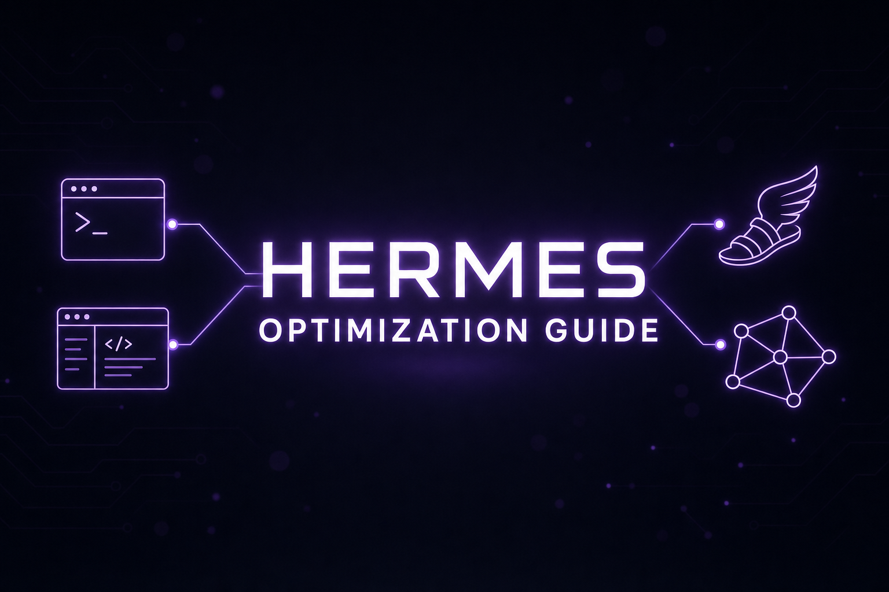

# Hermes 优化指南（中文简版）

<p align="center">
  
</p>

> [English 完整版](./README.md) · 本页是入口摘要，章节正文仍为英文。 · 最后同步：2026-07-03

实用指南 + 可安装制品（Skills、配置模板、基础设施脚本），针对 [NousResearch/hermes-agent](https://github.com/NousResearch/hermes-agent)（当前覆盖到 **v0.18.0 “The Judgment Release”（v2026.7.1）**，含 Mixture-of-Agents 一等模型、基于证据的任务验证、原生桌面应用与 NVIDIA 本地硬件）。

## 一键起步

```bash
# 新建 Debian 12 / Ubuntu 24.04 VPS 上运行
curl -sSL https://raw.githubusercontent.com/OnlyTerp/hermes-optimization-guide/main/scripts/vps-bootstrap.sh | sudo bash
```

或阅读 [docs/quickstart.md](./docs/quickstart.md)（5 分钟 Telegram 机器人）。

## v0.17 / v0.18 新特性速览

**v0.18.0 “Judgment”**（[part26](./part26-moa-verification.md)）：

- **Mixture-of-Agents 成为一等模型** — 每个 MoA 预设都是 `moa` provider 下可直接选择的虚拟模型，各参考模型的推理分块展示，聚合答案实时流式输出；`/moa` 变成一次性快捷方式
- **代理自证工作完成** — 编码任务附带验证证据（真正跑项目检查，而非口头宣称成功）、`/goal` 完成契约、`/goal wait <pid>`、`pre_verify` 钩子
- **`/learn` + `/journey` 自我提升** — 从目录 / URL / 工作流中提炼可复用技能，并在时间线上浏览、编辑、删除代理学到的一切；桌面端新增可交互记忆图谱
- **后台子代理并发扇出** — `delegate_task` 并行派发后台子代理，全部完成后合并为一轮回复，聊天永不阻塞
- **桌面应用变身编码驾驶舱** — 按 profile 的 Projects（侧边栏、编码轨道、评审面板、worktree 管理）、多终端面板、聊天内 PR 风格 diff
- **团队部署** — 网关 scale-to-zero（带排空协调）、`/etc/hermes` 管理员固定作用域、单网关多 profile 复用、cron 续跑
- **Google Vertex AI provider**（自动铸造/刷新 OAuth2 令牌）；Gemini-CLI OAuth provider 已移除，迁移说明见 [part9](./part9-custom-models.md)

**v0.17.0 “Reach”**（[part15](./part15-new-platforms.md) 等）：

- **iMessage via Photon Spectrum，无需 Mac** — `hermes photon login` 即可进蓝色气泡；另有官方 WhatsApp Business Cloud API 适配器与 Raft 代理网络通道
- **后台子代理** — `delegate_task(background=true)` 立即返回句柄，结果完成后自动回到会话
- **桌面应用大升级** — 可重绑快捷键、原生系统通知、子代理实时观察窗、VS Code Marketplace 主题、可调终端面板
- **仪表板成熟** — 浏览器内完整 profile 构建器（模型 + Skills + MCP）、重构的 Skills Hub（预览 + 安全扫描）、加固的仪表板认证
- **`image_generate` 支持图生图**；Automation Blueprints 以引导表单取代裸 cron 语法；`memory` 工具支持原子批量操作
- **Telegram 富消息**（Bot API 10.1，默认开启）、MCP elicitation（工具调用中途可向任意界面发起询问）

## 内容一览

- **27 章正文**（`part1` 到 `part26` + 本 README） — v0.18 MoA / 验证 / `/learn`、v0.17 iMessage（Photon）、v0.16 桌面应用、NVIDIA / DGX Spark 本地运行、多智能体 Swarm、`/undo`、模糊模型选择器、Grok OAuth、`hermes proxy`、Kanban、`/goal`、Checkpoints v2、Curator、TUI、插件、LightRAG、Telegram、MCP、安全、可观测性、远程沙箱
- **13 个可安装 Skill**（`skills/`） — 审计、备份、依赖扫描、成本报告、Telegram 分类、PR 审查、收件箱分类、Hermes 周报、垃圾过滤、会议准备 等
- **5 套生产配置模板**（`templates/config/`） — minimum / telegram-bot / production / cost-optimized / security-hardened
- **基础设施**（`templates/compose/`, `templates/caddy/`, `templates/systemd/`, `scripts/`） — Langfuse 自托管、Caddy 反代、systemd 硬化、VPS 引导脚本
- **Mermaid 架构图**（`diagrams/`）
- **可复现基准测试**（`benchmarks/`） — 13 个模型 × 5 个任务，含方法论
- **生态目录**（[`ECOSYSTEM.md`](./ECOSYSTEM.md)） — MCP 服务器、编码代理、仪表板插件
- **交互式配置向导**（[`docs/wizard/`](./docs/wizard/)） — 浏览器内生成 `config.yaml`

## 推荐阅读顺序

1. 想最快跑通 Telegram 机器人 → [docs/quickstart.md](./docs/quickstart.md)
2. 想了解架构 → [diagrams/architecture.md](./diagrams/architecture.md)
3. 想省钱 → [part20-observability.md](./part20-observability.md) 的 "Cost-routing playbook"
4. 想上生产 → [docs/reference-architectures/](./docs/reference-architectures/) 选一个最接近的
5. 用户面公开部署 → [part19-security-playbook.md](./part19-security-playbook.md) 必看
6. 想要图形界面而非终端 → [part24-desktop-app.md](./part24-desktop-app.md)（Hermes 桌面应用）
7. 想用自己的 GPU 本地运行 → [part25-nvidia-local.md](./part25-nvidia-local.md)（RTX / DGX Spark）
8. 想要多模型合议 + 可验证的任务完成 → [part26-moa-verification.md](./part26-moa-verification.md)（MoA、`/goal` 完成契约、`/learn`）

## 许可与贡献

MIT。欢迎 Issue / PR，详见 [CONTRIBUTING.md](./CONTRIBUTING.md)。
