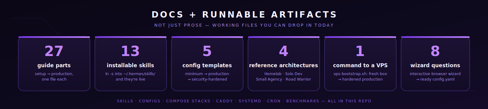
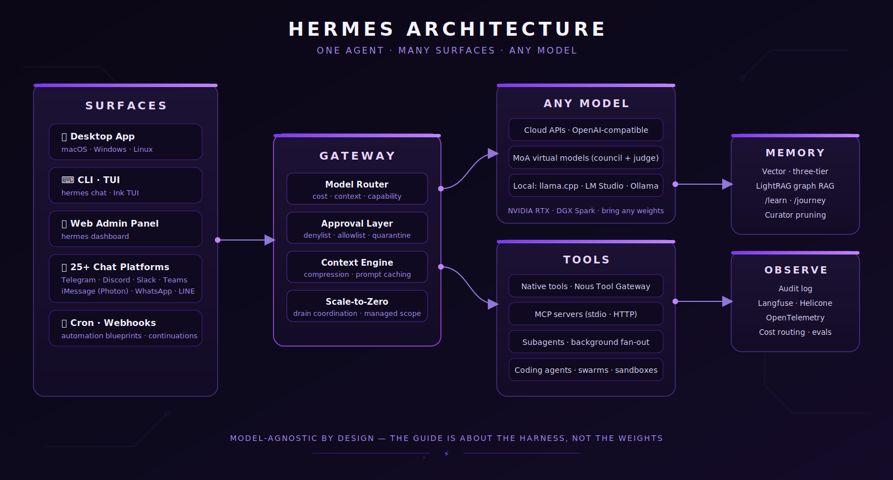
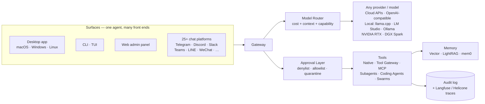
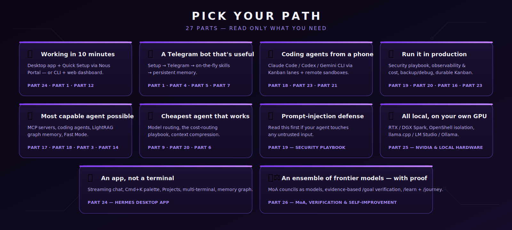
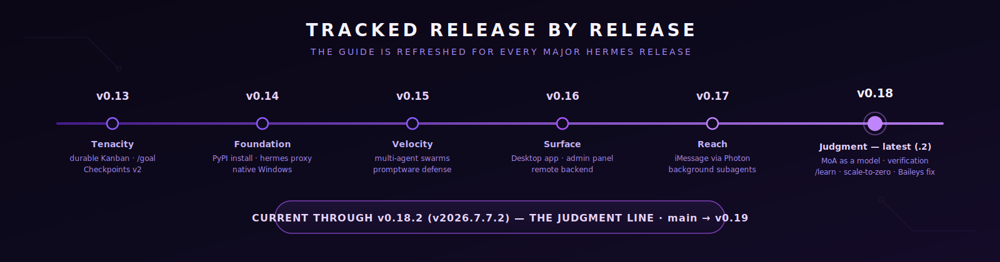
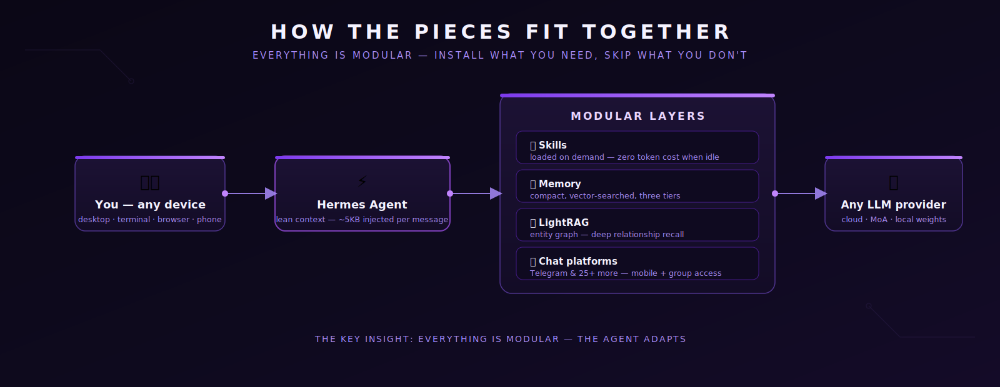

# Hermes Optimization Guide

<p align="center">
  
</p>

[](./LICENSE)
[](https://github.com/NousResearch/hermes-agent/releases/tag/v2026.7.7.2)
[](./CHANGELOG.md)
[](#table-of-contents)
[](./skills/)
[](./templates/config/)
[](./.github/workflows/ci.yml)
[](./CONTRIBUTING.md)

> **Current through Hermes Agent v0.18.2 (v2026.7.7.2) — the "Judgment" line** · **28 parts, 13 installable guide skills, 5 opinionated configs, 4 reference architectures, one-command VPS bootstrap** · Now covering **Mixture-of-Agents as a first-class model**, evidence-based **verification** + `/goal` completion contracts, **`/learn` + `/journey`** self-improvement, **background subagent fan-out**, the maturing **Desktop app** (Projects, memory graph, multi-terminal), **iMessage via Photon** (no Mac needed), the NVIDIA RTX / DGX Spark local-hardware story, gateway **scale-to-zero** for teams — and now a full **[Power Secrets field manual](./part27-power-secrets.md)** distilled from the official Wingtips series and July's best community research. **Bring any model** — this guide is about the *harness*, not the weights.
>
> Other languages: [中文](./README-zh.md) · [日本語](./README-ja.md)

### The End-to-End Hermes Guide — docs + runnable artifacts
Every part you need to go from fresh install to a production Hermes deployment — driven from the **native desktop app**, the CLI/TUI, a browser admin panel, or 25+ chat platforms (now including iMessage with no Mac required, via Photon). Orchestrate Claude Code / Codex / Gemini CLI through durable Kanban lanes and **multi-agent swarms**, plug into any MCP server, trace every call in Langfuse, let it curate its own skills, push heavy work onto disposable Modal/Daytona/Vercel sandboxes — or run the whole thing **locally on your own GPU / NVIDIA DGX Spark**. It's all **model-agnostic**: bring whatever weights you want, the guide is about the *harness*.

Unlike most guides, the prescriptions come with **working files**: [`skills/`](./skills) you can `ln -s` into `~/.hermes/skills/`, [`templates/config/`](./templates/config) you `cp` to `~/.hermes/config.yaml`, [`scripts/vps-bootstrap.sh`](./scripts/vps-bootstrap.sh) that takes a fresh VPS to production in one command.

<p align="center">
  
</p>

*By Terp — [Terp AI Labs](https://x.com/OnlyTerp)* · Last updated **July 17, 2026** · [CHANGELOG](./CHANGELOG.md) · [ROADMAP](./ROADMAP.md) · [ECOSYSTEM](./ECOSYSTEM.md)

---

## Install

Pick the surface that fits you — they all drive the **same** agent, config, keys, sessions, and skills.

**Easiest — the desktop app.** Grab the [Hermes Desktop](https://hermes-agent.nousresearch.com/docs/user-guide/desktop) installer for macOS/Windows/Linux (or run `hermes desktop` if you already have the CLI). First launch offers **Quick Setup via Nous Portal** — sign in, pick a model, start chatting. Full tour: **[Part 24: Hermes Desktop App](./part24-desktop-app.md)**.

**Terminal — one line.** macOS / Linux:

```bash
curl -fsSL https://hermes-agent.nousresearch.com/install.sh | bash
```

Windows (native, PowerShell):

```powershell
iex (irm https://hermes-agent.nousresearch.com/install.ps1)
```

**Server — one command to production.** On a fresh Debian 12 / Ubuntu 24.04 box (Hetzner CX22 works great for ~$5/mo):

```bash
curl -sSL https://raw.githubusercontent.com/OnlyTerp/hermes-optimization-guide/main/scripts/vps-bootstrap.sh | sudo bash
```

This installs Hermes, Node.js, Caddy (auto-TLS reverse proxy), UFW, fail2ban, creates a non-root `hermes` user, drops in hardened systemd units, and symlinks every skill from this repo into `~hermes/.hermes/skills/`. See [`scripts/vps-bootstrap.sh`](./scripts/vps-bootstrap.sh) for what it does line by line — it's non-destructive and re-runnable.

Prefer a 5-minute local-only setup? → **[docs/quickstart.md](./docs/quickstart.md)** (zero to Telegram bot in 5 min).

---

## Repo Map

| Folder | What's in it |
|---|---|
| [`skills/`](./skills) | **13 installable `SKILL.md`** files. `ln -s` into `~/.hermes/skills/` and they're live. |
| [`templates/config/`](./templates/config) | **5 opinionated `config.yaml`** — minimum, telegram-bot, production, cost-optimized, security-hardened. |
| [`templates/compose/`](./templates/compose) | Self-hosted Langfuse v3 stack (ClickHouse + MinIO + Redis). |
| [`templates/caddy/`](./templates/caddy) | Caddyfile reference (reverse proxy + auto TLS + HSTS). |
| [`templates/systemd/`](./templates/systemd) | Hardened `hermes.service` + `hermes-dashboard.service`. |
| [`templates/cron/`](./templates/cron) | Recommended production cron schedule. |
| [`scripts/vps-bootstrap.sh`](./scripts/vps-bootstrap.sh) | One-command fresh VPS → production Hermes. |
| [`diagrams/`](./diagrams) | 6 Mermaid diagrams (architecture, MCP flow, delegation, sandbox sync, observability, security layers). |
| [`assets/`](./assets) | Banner art + the SVG infographics used across the guide (architecture, paths, timeline). |
| [`benchmarks/`](./benchmarks) | Reproducible cost + latency table across 13 models × 5 tasks. |
| [`docs/wizard/`](./docs/wizard) | **Interactive config wizard** — 8 questions → ready-to-drop `config.yaml`. Runs in your browser. |
| [`docs/reference-architectures/`](./docs/reference-architectures) | **4 blueprints** — Homelab, Solo Dev, Small Agency, Road Warrior. Full parts list + cost + install. |
| [`docs/outreach/`](./docs/outreach) | Launch tweet, HN post, upstream-PR body drafts (for people linking to this guide). |
| [`docs/quickstart.md`](./docs/quickstart.md) | 5-minute zero-to-Telegram-bot. |
| [`ECOSYSTEM.md`](./ECOSYSTEM.md) | Curated directory of MCP servers, coding agents, dashboard plugins. |
| [`ROADMAP.md`](./ROADMAP.md) · [`CHANGELOG.md`](./CHANGELOG.md) · [`CONTRIBUTING.md`](./CONTRIBUTING.md) | The usual suspects. |
| README + `part1-*.md` … `part27-*.md` | The 28-part guide itself (now incl. MoA + verification, Desktop App, NVIDIA / local hardware, and the Power Secrets field manual). |

---

## Architecture at a glance

<p align="center">
  
</p>

Prefer Mermaid? The same picture, editable:



Full set of diagrams: [`diagrams/architecture.md`](./diagrams/architecture.md).

---

## Pick Your Path

<p align="center">
  
</p>

This guide grew to 28 parts because *Hermes grew*. Every part lives in its own file (`part1-setup.md` … `part27-power-secrets.md`); this README keeps a short summary of Parts 1–5 (plus the full SOUL.md personality section) and links out. You don't have to read them all — pick the shortest path to what you need:

### 🎯 "I just want it working in 10 minutes"
Skip the terminal: install the [desktop app](./part24-desktop-app.md) and let first-run **Quick Setup via Nous Portal** pick a model for you. Prefer the CLI? [Part 1: Setup](./part1-setup.md) → [Part 12: Web Dashboard](./part12-web-dashboard.md) and point-and-click the rest.

### 📱 "I want a Telegram bot that's actually useful"
[Part 1](./part1-setup.md) → [Part 4: Telegram](./part4-telegram-setup.md) → [Part 5: On-the-fly Skills](./part5-creating-skills.md) → [Part 7: Memory](./part7-memory-system.md).

### 🤖 "I want to drive Claude Code / Codex / Gemini from my phone"
[Part 18: Coding Agents](./part18-coding-agents.md) → [Part 23: Foundation + Tenacity Stack](./part23-tenacity-stack.md) → [Part 21: Remote Sandboxes](./part21-remote-sandboxes.md).

### 💼 "I'm running this in production"
[Part 19: Security Playbook](./part19-security-playbook.md) → [Part 20: Observability & Cost](./part20-observability.md) → [Part 16: Backup & Debug](./part16-backup-debug.md) → [Part 23: Kanban + Goals + Handoff](./part23-tenacity-stack.md).

### 🧠 "I want the most capable agent possible, cost be damned"
[Part 17: MCP Servers](./part17-mcp-servers.md) → [Part 18: Coding Agents](./part18-coding-agents.md) → [Part 3: LightRAG](./part3-lightrag-setup.md) → [Part 14: Fast Mode](./part14-fast-mode-watchers.md) → [Part 20: Observability](./part20-observability.md).

### 💰 "I want the cheapest possible agent that still works"
[Part 9: Custom Models](./part9-custom-models.md) (Grok/Gemini/Kimi/GLM routing) → [Part 20: Observability](./part20-observability.md#cost-routing-playbook-the-one-that-actually-saves-money) → [Part 6: Context Compression](./part6-context-compression.md).

### 🛡️ "I'm worried about prompt injection (you should be)"
[Part 19: Security Playbook](./part19-security-playbook.md) — read this first if your agent reads any untrusted input (email, webhooks, Discord, public Telegram groups).

### 🖥️ "Just give me an app, not a terminal"
[Part 24: Hermes Desktop App](./part24-desktop-app.md) — download, Quick Setup, and drive everything from a real GUI: streaming chat, a Cmd+K command palette, drag-and-drop files, a model picker, and an optional connection to a remote Hermes box.

### 🔒 "Run it all locally on my own GPU"
[Part 25: NVIDIA & Local Hardware](./part25-nvidia-local.md) — RTX / DGX Spark, OpenShell isolation, and a model-agnostic local stack (llama.cpp / LM Studio / Ollama) so your data never leaves the machine.

### 🧑‍⚖️ "I want an ensemble of frontier models — and proof the work is done"
[Part 26: MoA, Verification & Self-Improvement](./part26-moa-verification.md) — pick a Mixture-of-Agents council like a model, judge `/goal` completion against evidence, and steer what the agent learns with `/learn` + `/journey`.

### ⚡ "I've been running Hermes for months — give me the stuff I don't know"
[Part 27: Power Secrets](./part27-power-secrets.md) — 25 non-obvious mechanics: the memory snapshot rule, the gateway token tax, credential-pool cache misses, the Kanban traps, profiles-as-rooms, and a printable one-page cheat sheet.

---

## What's New (July 2026)

<p align="center">
  
</p>

Two huge releases landed since the Surface refresh — **v0.17.0 "Reach" (v2026.6.19)** and **[v0.18.0 "The Judgment Release" (v2026.7.1)](https://github.com/NousResearch/hermes-agent/releases/tag/v2026.7.1)**. Combined: ~3,200 commits, ~1,800 merged PRs, 1,200+ issues closed, and — as of v0.18 — **every P0 and P1 issue in the entire Hermes repo resolved** (~700 highest-priority items cleared in twelve days, with a standing commitment to keep the count at zero). None of it is model-specific — bring whatever weights you want.

### Mid-July status — v0.18.1 / v0.18.2 and what's coming

- **v0.18.1 (`v2026.7.7`)** is a big *patch rollup* on the Judgment line — fixes and small features, not a curated feature release.
- **v0.18.2 (`v2026.7.7.2`)** is the current tagged release. Headline fix: the **WhatsApp personal (Web/QR) adapter** broken by an upstream Baileys change ([Part 15](./part15-new-platforms.md)). If you pin Docker tags, move to `v2026.7.7.2` or newer.
- **`main` is marching toward v0.19.0** — features you see discussed but not tagged (e.g. the **Hermes Cloud** connection mode, background **computer use**) should be treated as **experimental/preview** until they land in a release. Where this guide covers them ([Part 24](./part24-desktop-app.md#7b-hermes-cloud--the-third-connection-mode-preview), [Part 25](./part25-nvidia-local.md#9-background-computer-use-macos)) they're labelled as such.
- **Model landscape moved too**: day-one **Kimi K3** support, the GPT **Sol / Terra / Luna** family, and a hard fact worth knowing — Anthropic *subscriptions* don't work natively (API keys do). Current routing posture: [Part 9](./part9-custom-models.md#the-mid-july-2026-model-landscape).
- **New: [Part 27 — Power Secrets](./part27-power-secrets.md)**, the distilled field manual from the official Wingtips series (#1–#22) and July's community research: context/cache mechanics, cost traps, profile architecture, and operational gotchas — each verified against the real schema.

### v0.18.0 — "Judgment"

- **Mixture-of-Agents is a first-class model** — every named MoA preset is a selectable virtual model under a `moa` provider in every picker (CLI/TUI/desktop/gateway). Each reference model's reasoning renders as its own labelled block, and the aggregator's answer streams live. `/moa` is now one-shot sugar. See [Part 26](./part26-moa-verification.md).
- **The agent proves its work** — verification evidence for coding tasks (run the project's checks, don't assert success), **completion contracts** for `/goal`, `/goal wait <pid>`, and a `pre_verify` hook. See [Part 26](./part26-moa-verification.md#2-verification--done-means-proven-not-claimed).
- **`/learn` + `/journey`** — distill a reusable skill from anything (`/learn <dir|url|workflow>`), and browse/edit/delete everything the agent has learned on a timeline. The desktop adds a playable **memory graph**. Background self-improvement now routes to an aux model and costs a fraction of before. See [Part 26](./part26-moa-verification.md#3-learn-and-journey--self-improvement-you-can-see) and [Part 7](./part7-memory-system.md).
- **Background subagent fan-out** — `delegate_task` dispatches parallel background subagents and returns one consolidated turn when all finish; your chat is never blocked. See [Part 8](./part8-subagent-patterns.md).
- **Desktop becomes a coding cockpit** — first-class per-profile **Projects** (sidebar, coding rail, review pane, worktree management), a **multi-terminal panel**, PR-style diffs in chat, and a conversation timeline rail. See [Part 24](./part24-desktop-app.md).
- **Run it for a team** — gateway **scale-to-zero** with drain coordination (no dropped in-flight turns), administrator-pinned **managed scope** from `/etc/hermes`, multiplexed profiles over one gateway, and **cron continuations**. See [Part 26](./part26-moa-verification.md#6-running-hermes-for-a-team--scale-to-zero-and-managed-scope).
- **Google Vertex AI provider** — Gemini through your GCP service account with auto-minted, auto-refreshed OAuth2 tokens (no static key). The Gemini-CLI OAuth providers were **removed** — see the migration note in [Part 9](./part9-custom-models.md).
- **Everyday wins** — `/prompt` (compose in `$EDITOR`), `/reasoning full`, `/timestamps`, in-place compaction by default, Blank Slate setup mode, and a security round (MCP-config persistence hardening, cron credential-exfil blocks, Slack `xapp-` token redaction). See [Part 26](./part26-moa-verification.md#5-small-things-youll-use-every-day) and [Part 19](./part19-security-playbook.md).

### v0.17.0 — "Reach"

- **iMessage via Photon Spectrum — no Mac required** — `hermes photon login` and Hermes lives in the blue bubbles; positioned as the successor to the BlueBubbles bridge. Plus an **official WhatsApp Business Cloud API** adapter and the **Raft** agent-network channel. See [Part 15](./part15-new-platforms.md).
- **Background subagents** — `delegate_task(background=true)` returns a handle immediately; the result re-enters the conversation when it finishes. See [Part 8](./part8-subagent-patterns.md).
- **A much deeper desktop app** — rebindable shortcuts, native OS notifications, live subagent **watch-windows**, any VS Code Marketplace theme, a resizable terminal pane, remote media relay, and per-thread drafts. See [Part 24](./part24-desktop-app.md).
- **Dashboard grows up** — a full **profile builder** (model + skills + MCPs from the browser), a rehauled Skills Hub (previews + security scans), and hardened dashboard auth. See [Part 12](./part12-web-dashboard.md).
- **`image_generate` learned to edit** — image-to-image transforms across every provider; **Automation Blueprints** replace raw cron syntax with guided forms; the `memory` tool gained **atomic batch operations**; the Curator's LLM consolidation pass is now **opt-in** (routine curation costs zero tokens). See [Part 22](./part22-latest-power-moves.md) and [Part 7](./part7-memory-system.md).
- **Telegram rich messages** (Bot API 10.1, on by default), MCP **elicitation** (servers can prompt mid-tool-call on any surface), and Cursor's **Composer** model via xAI Grok OAuth. See [Part 15](./part15-new-platforms.md), [Part 17](./part17-mcp-servers.md), and [Part 9](./part9-custom-models.md).

### v0.16.0 — "Surface"

- **Hermes Desktop** — a native macOS/Windows/Linux app: streaming chat with live tool activity, a session list with archive/search, drag-and-drop files, clipboard image paste, a **Cmd+K command palette**, a model picker in the composer, a per-session **YOLO toggle**, and in-app self-update. It's "another surface over one agent, not a fork." See [Part 24](./part24-desktop-app.md).
- **Remote backend** — desktop and clients can connect to a remote Hermes gateway over a secure WebSocket (OAuth or username/password), with per-profile hosts, concurrent multi-profile sessions, and cross-profile `@session` links. Thin GUI local, heavy agent remote. See [Part 24](./part24-desktop-app.md#7-connect-to-a-remote-hermes).
- **Browser admin panel** — the web dashboard grew into a full admin panel: a Channels page that sets up every messaging platform from the browser, MCP catalog enable/disable, credentials, webhooks, memory config, and a System page with **check-before-update** and one-click **Debug Share**. See [Part 12](./part12-web-dashboard.md).
- **Quick Setup via Nous Portal** — `hermes portal` opens a guided first-run that signs you in and picks a model; Quick Setup vs Full Setup paths on first launch. See [Part 1](./part1-setup.md).
- **`/undo [N]`** — take back the last N turns and prefill your last message to edit and resend, with CLI / TUI / messaging parity. See [Part 22](./part22-latest-power-moves.md).
- **Fuzzy model picker + default interface choice** — type-to-filter model search across desktop/web/TUI/CLI, grouped multi-endpoint providers, an hourly-refreshed catalog, and a `cli`-or-`tui` default for `hermes chat` (with a `--cli` per-invocation override). See [Part 22](./part22-latest-power-moves.md).
- **Leaner default skills** — rarely-used bundled skills moved to optional, a new `environments:` relevance gate, and the Curator can now prune built-in skills. See [Part 22](./part22-latest-power-moves.md).
- **NVIDIA Skills Hub tap** — a built-in trusted Skills source alongside OpenAI/Anthropic/HuggingFace (CUDA-X, AIQ, cuOpt), part of the broader NVIDIA local-hardware story. See [Part 25](./part25-nvidia-local.md).
- **Security** — CVE-2026-48710 Starlette pin, SSRF off-loop hardening, and subprocess credential stripping. See [Part 19](./part19-security-playbook.md).

### NVIDIA partnership — run it local

Hermes is now optimized for always-on **local** use on **NVIDIA RTX PCs, RTX PRO workstations, and DGX Spark** (128GB unified memory, ~1 petaflop of AI performance, runs 120B-class MoE models all day). Tensor Cores accelerate inference, there's a dedicated **DGX Spark playbook**, and **OpenShell** adds kernel-level isolation between the agent and your OS. It stays model-agnostic — bring any weights. See [Part 25](./part25-nvidia-local.md).

### Earlier milestones (still relevant)

- **v0.15 "Velocity"** — multi-agent swarms (`hermes kanban swarm`), the big perf wave (~4,500× faster free `session_search`), Brainworm/promptware defense, skill bundles, and ntfy as a messaging platform. See [Part 23](./part23-tenacity-stack.md) and [Part 19](./part19-security-playbook.md).
- **v0.14 "Foundation"** — PyPI installs + lighter launch, Grok OAuth + 1M context, `hermes proxy` (OpenAI-compatible localhost), `x_search`, Teams/LINE/SimpleX, live `/handoff`, and the first native Windows support. See [Part 23](./part23-tenacity-stack.md) and [Part 13](./part13-tool-gateway.md).
- **v0.13 "Tenacity"** — durable multi-agent Kanban, `/goal` persistent objectives, Checkpoints v2, and no-agent cron. See [Part 23](./part23-tenacity-stack.md).
- **v0.12 "Curator"** — the autonomous Curator (`hermes curator`), a rubric-based self-improvement loop, a much wider provider menu, and a plugin-first gateway. See [Part 22](./part22-latest-power-moves.md) and [Part 9](./part9-custom-models.md).
- **v0.11 "Interface"** — the Ink TUI rewrite, a per-transport provider layer, native AWS Bedrock, and auxiliary-model routing for side tasks. See [Part 22](./part22-latest-power-moves.md).

**Fundamentals that haven't changed:** the local web dashboard (`hermes dashboard`), the Tool Gateway + `hermes proxy`, Fast Mode (`/fast`) and guided compression (`/compress <topic>`), and the MCP + coding-agent + remote-sandbox developer stack. See [Part 12](./part12-web-dashboard.md), [Part 13](./part13-tool-gateway.md), [Part 14](./part14-fast-mode-watchers.md), [Part 17](./part17-mcp-servers.md), [Part 18](./part18-coding-agents.md), and [Part 21](./part21-remote-sandboxes.md).

---

## Table of Contents

1. [Setup](./part1-setup.md) — Install Hermes, configure your provider, first-run walkthrough (with Android/Termux)
2. [SOUL.md Personality](#soulmd--give-your-agent-a-personality) — The Molty prompt, what good personality rules look like, how to fix a bland agent
3. [OpenClaw Migration](./part2-openclaw-migration.md) — Move your OpenClaw data, config, skills, and memory into Hermes
4. [LightRAG — Graph RAG](./part3-lightrag-setup.md) — Set up a knowledge graph that actually understands relationships, not just text similarity
5. [Telegram Bot](./part4-telegram-setup.md) — Connect Hermes to Telegram for mobile access, voice memos, and group chats
6. [On-the-Fly Skills](./part5-creating-skills.md) — Ask Hermes to create new skills that optimize your workflow automatically
7. [Context Compression](./part6-context-compression.md) — Fix the silent context loss bug, configure compression thresholds, survive long sessions
8. [Memory System](./part7-memory-system.md) — The three-tier memory architecture: persistent facts, conversation recall, procedural memory
9. [Subagent Patterns](./part8-subagent-patterns.md) — Orchestrator/worker delegation, ACP subagents, parallel task execution
10. [Custom Model Providers](./part9-custom-models.md) — Grok/SuperGrok OAuth, Bedrock, Azure AI Foundry, Vertex AI, LM Studio, Codex OAuth, MoA presets, OpenRouter routing, model aliases, fallback chains
11. [SOUL.md Anti-Patterns](./part10-soul-antipatterns.md) — What makes an agent annoying vs useful, the formula that works
12. [Gateway Recovery](./part11-gateway-recovery.md) — Crash detection, auto-recovery, common failure modes, health checks
13. [Web Dashboard](./part12-web-dashboard.md) — `hermes dashboard`, browser Chat via real TUI, models/plugins tabs, config, keys, sessions, logs, analytics, cron
14. [Tool Gateway, Local Proxy & Live Search](./part13-tool-gateway.md) — Nous-managed tools, `hermes proxy`, and `x_search`
15. [Fast Mode & Background Watchers](./part14-fast-mode-watchers.md) — `/fast`, `/steer`, `/queue`, `watch_patterns`, pluggable context engine, `/compress <topic>`
16. [New Platforms (Teams, LINE, SimpleX, iMessage, WeChat, Android)](./part15-new-platforms.md) — Teams end-to-end, LINE, SimpleX, Google Chat, QQBot, Yuanbao, BlueBubbles/iMessage, Weixin/WeCom, Android via Termux
17. [Backup, Import & `/debug`](./part16-backup-debug.md) — Portable `hermes backup`/`import`, `/debug` bundler, `hermes debug share`, security hardening
18. [MCP Servers](./part17-mcp-servers.md) — The tool-protocol standard. stdio + HTTP transports, sampling, trust boundaries, server shortlist, writing your own
19. [Delegating to Coding Agents](./part18-coding-agents.md) — Claude Code Week 20+, Codex v0.133+, Gemini CLI v0.43, OpenCode, Aider, Zed ACP, print-mode, Kanban, git isolation
20. [Security Playbook](./part19-security-playbook.md) — Prompt-injection defense, provenance labels, approval layers, secrets redaction, MCP trust model, hardline blocks
21. [Observability & Cost Control](./part20-observability.md) — Langfuse plugin, Helicone, OpenTelemetry → Phoenix, prompt-prefix caching, CDP spans, auxiliary routing, evals
22. [Remote Sandboxes & Bulk File Sync](./part21-remote-sandboxes.md) — SSH, Modal, Daytona, Vercel Sandbox, Fly Machines, E2B. Diff-based sync-back on teardown
23. [Latest Power Moves](./part22-latest-power-moves.md) — Curator, TUI habits, context-file hygiene, plugins, dashboard Chat, cron chaining, and the 2026 upgrade checklist
24. [Foundation + Tenacity Stack](./part23-tenacity-stack.md) — PyPI/lazy deps, `hermes proxy`, `/handoff`, durable Kanban, `/goal`, Checkpoints v2, no-agent cron, worker lanes, multi-agent swarms, and the upgrade checklist
25. [Hermes Desktop App](./part24-desktop-app.md) — Native macOS/Windows/Linux GUI, Quick Setup, Cmd+K palette, Projects, multi-terminal, memory graph, remote gateway, multi-profile, voice, self-update
26. [NVIDIA & Local Hardware](./part25-nvidia-local.md) — Run Hermes on your own GPU: RTX / DGX Spark, OpenShell isolation, NemoClaw, and a model-agnostic local stack
27. [MoA, Verification & Self-Improvement](./part26-moa-verification.md) — Mixture-of-Agents presets as models, `/moa`, completion contracts for `/goal`, `/learn`, `/journey`, background fan-out, scale-to-zero
28. [Power Secrets](./part27-power-secrets.md) — 25 verified non-obvious mechanics: memory snapshots, the gateway token tax, cache economics, credential pools, Kanban traps, profiles-as-rooms, and a printable cheat sheet

---

## The Problem

If you're running a stock Hermes setup (or migrating from OpenClaw), you're probably dealing with:

- **Installation confusion.** The docs cover the basics but don't tell you what to configure first or what matters.
- **Lost knowledge from OpenClaw.** You spent weeks building memory, skills, and workflows — now they're stuck in the old system.
- **Basic memory that can't reason.** Vector search finds similar text but can't answer "what decisions led to X and who was involved?"
- **No mobile access.** Sitting at a terminal is fine until you need to check something from your phone.
- **Repetitive prompting.** You keep asking the agent to do the same multi-step task the same way, every time.

## What This Fixes

After this guide:

| Problem | Solution | Result |
|---------|----------|--------|
| Fresh install | Step-by-step setup | Working agent in under 5 minutes |
| OpenClaw data stuck | Automated migration | Skills, memory, config all transferred |
| Shallow memory | LightRAG graph RAG | Entities + relationships, not just text chunks |
| Desktop only | Telegram integration | Chat from anywhere, voice memos, group support |
| Repetitive prompts | Agent-created skills | Agent saves workflows as reusable skills automatically |

---

## Prerequisites

- A Linux/macOS machine (or WSL2 on Windows, or **Android via Termux** — see [Part 15](./part15-new-platforms.md#android--termux-running-hermes-on-your-phone))
- Python 3.11+ and Git
- An API key for at least one LLM provider (Anthropic, OpenAI, OpenRouter, Nous Portal, etc.)
- Optional: Ollama for local embeddings (free vector search)
- Optional: a paid [Nous Portal](https://portal.nousresearch.com) subscription for managed tools, or OAuth-backed Claude/OpenAI/xAI subscriptions if you plan to use `hermes proxy`

---

## How the Pieces Fit Together

<p align="center">
  
</p>

**The key insight:** Everything is modular. Install what you need, skip what you don't. The agent adapts.

---

## Quick Start

```bash
# 1. Install Hermes (Linux/macOS/WSL2/Android) — or grab the desktop app
curl -fsSL https://hermes-agent.nousresearch.com/install.sh | bash

# 2. Configure providers and tools (or `hermes portal` for guided Quick Setup)
hermes setup

# 3a. Start chatting in the terminal (CLI or TUI)
hermes

# 3b. Or open the browser dashboard / admin panel
hermes dashboard

# 3c. Or launch the native desktop app
hermes desktop
```

The dashboard — and the new desktop app — are the fastest way to configure everything without touching YAML. See [Part 12](./part12-web-dashboard.md) and [Part 24](./part24-desktop-app.md) for the full tours.

For the full walkthrough including optimization, read each part in order.

---

## Part 1: Setup (Stop Fumbling With Installation)

*From zero to working agent in under 5 minutes. Covers what the docs don't.*

One command installs everything — `curl -fsSL https://hermes-agent.nousresearch.com/install.sh | bash` on Linux/macOS/WSL2/Android-Termux, a native PowerShell one-liner on Windows, or `pip install hermes-agent` for the leanest path. The full part covers what the installer actually does, the `hermes setup` first-run wizard (model picker, API keys, toolsets), the key `hermes config set` options (fallback models, `agent.max_turns`, `prompt_caching.enabled`, `compression.enabled`), the `~/.hermes/` file layout, and how to verify and update your install.

**Read the full part → [Part 1: Setup](./part1-setup.md)**

---

## SOUL.md — Give Your Agent a Personality

`SOUL.md` is injected into **every single message**. It's the highest-impact file in your setup. A bad SOUL.md makes your agent sound like a corporate chatbot. A good one makes it actually useful to talk to.

### What Belongs in SOUL.md

Put the stuff that changes how the agent **feels** to talk to:

- **Tone** — direct, casual, formal, dry, whatever fits you
- **Opinions** — the agent should have takes, not hedge everything
- **Brevity** — enforce concise answers as a default
- **Humor** — when it fits naturally, not forced jokes
- **Boundaries** — what it should push back on
- **Bluntness level** — how much sugarcoating to skip

Do NOT turn SOUL.md into:

- A life story
- A changelog
- A security policy dump
- A giant wall of vibes with no behavioral effect

**Short beats long. Sharp beats vague.**

### The Molty Prompt

*Originally from [OpenClaw's SOUL.md guide](https://docs.openclaw.ai/concepts/soul#the-molty-prompt). Adapted for Hermes with permission/credit. Paste this into your chat with the agent and let it rewrite your SOUL.md:*

> Read your `SOUL.md`. Now rewrite it with these changes:
>
> 1. You have opinions now. Strong ones. Stop hedging everything with "it depends" — commit to a take.
> 2. Delete every rule that sounds corporate. If it could appear in an employee handbook, it doesn't belong here.
> 3. Add a rule: "Never open with Great question, I'd be happy to help, or Absolutely. Just answer."
> 4. Brevity is mandatory. If the answer fits in one sentence, one sentence is what I get.
> 5. Humor is allowed. Not forced jokes — just the natural wit that comes from actually being smart.
> 6. You can call things out. If I'm about to do something dumb, say so. Charm over cruelty, but don't sugarcoat.
> 7. Swearing is allowed when it lands. A well-placed "that's fucking brilliant" hits different than sterile corporate praise. Don't force it. Don't overdo it. But if a situation calls for a "holy shit" — say holy shit.
> 8. Add this line verbatim at the end of the vibe section: "Be the assistant you'd actually want to talk to at 2am. Not a corporate drone. Not a sycophant. Just... good."
>
> Save the new `SOUL.md`. Welcome to having a personality.

### What Good Looks Like

Good SOUL.md rules:

- have a take
- skip filler
- be funny when it fits
- call out bad ideas early
- stay concise unless depth is actually useful

Bad SOUL.md rules:

- maintain professionalism at all times
- provide comprehensive and thoughtful assistance
- ensure a positive and supportive experience

That second list is how you get mush.

### Why This Works

This lines up with OpenAI's prompt engineering guidance: high-level behavior, tone, goals, and examples belong in the **high-priority instruction layer**, not buried in the user turn. SOUL.md is that layer. It's the system-level personality instruction that every model respects.

If you want better personality, write stronger instructions. If you want stable personality, keep them concise and versioned.

> **One warning:** Personality is not permission to be sloppy. Keep your operational rules in AGENTS.md. Keep SOUL.md for voice, stance, and style. If your agent works in shared channels or public replies, make sure the tone still fits the room. Sharp is good. Annoying is not.

> **Keep it under 1 KB.** Every byte in SOUL.md costs tokens on every message. The most effective SOUL.md files are 500-800 bytes of dense, high-signal personality instructions.

---

## Part 2: OpenClaw Migration (Don't Leave Your Knowledge Behind)

*Transfer your skills, memory, config, and personality from OpenClaw to Hermes in one command.*

`hermes claw migrate` moves your SOUL.md, AGENTS.md, memory files (merged and deduped), user profile, skills, model config, and provider keys from `~/.openclaw/` into Hermes automatically. The full part covers the `--dry-run` preview, presets (`full` vs `user-data`), skill-conflict handling (`skip`/`overwrite`/`rename`), the complete config-key mapping table, what *doesn't* transfer (session transcripts, cron jobs, plugin configs), and troubleshooting.

**Read the full part → [Part 2: OpenClaw Migration](./part2-openclaw-migration.md)**

---

## Part 3: LightRAG — Graph RAG That Actually Works

*From "find similar text" to "reason about relationships." The single biggest intelligence upgrade you can make.*

Vector search finds what's *similar*; graph RAG finds what's *connected*. [LightRAG](https://github.com/HKUDS/LightRAG) (HKU, EMNLP 2025) builds a knowledge graph — entities and relationships — alongside your vector DB and searches both at once, for a fraction of Microsoft GraphRAG's cost. The full part covers installation, entity-extraction model choice (Kimi K2.6 for quality, Cerebras GPT OSS 120B for speed, local Ollama for free), embeddings (Fireworks Qwen3-Embedding-8B vs local nomic-embed-text), running and securing the REST server, ingestion, the four query modes (`naive`/`local`/`global`/`hybrid`), a ready-to-use Hermes skill, and tuning tips.

**Read the full part → [Part 3: LightRAG Setup](./part3-lightrag-setup.md)**

---

## Part 4: Telegram Setup (Chat From Anywhere)

*Connect Hermes to Telegram for mobile access, voice memos, group chats, and scheduled task delivery.*

Telegram is the most battle-tested of the 25+ messaging adapters: text, voice memos (auto-transcribed), image analysis, file attachments, inline confirmation buttons, and cron delivery straight to your phone. The full part walks through creating a bot with @BotFather, the privacy-mode gotcha that breaks group chats, finding your numeric user ID, `hermes gateway setup`, webhook mode for cloud deployments (with a proper random secret), multi-user setup, and troubleshooting.

**Read the full part → [Part 4: Telegram Setup](./part4-telegram-setup.md)**

---

## Part 5: On-the-Fly Skills (Let Hermes Build Its Own Playbook)

*Ask Hermes to create a new skill, and it saves the workflow permanently — no manual file editing needed.*

Skills are procedural knowledge: how-to guides the agent loads on demand at zero idle token cost (memory is for facts; skills are for workflows). Hermes creates them itself — after a complex task it offers to save the steps, pitfalls, and verification as a reusable `SKILL.md`, and you can ask for one directly ("create a skill for deploying Docker containers"). The full part covers the creation workflow, the `SKILL.md` format and directory structure, slash-command and automatic loading, managing/updating skills, the v0.12 **Curator** that keeps the library from rotting, real-world examples, and tips for writing skills that stay useful.

**Read the full part → [Part 5: On-the-Fly Skills](./part5-creating-skills.md)**

You've now got the full picture — setup, migration, graph memory, mobile access, and self-improving workflows. From here, [Part 22: Latest Power Moves](./part22-latest-power-moves.md), [Part 23: Tenacity Stack](./part23-tenacity-stack.md), [Part 24: Desktop App](./part24-desktop-app.md), and [Part 25: NVIDIA & Local Hardware](./part25-nvidia-local.md) round out the modern stack. Start with setup, add what you need, and let Hermes build the rest.

---

> **Note:** Based on the official Hermes Agent documentation and real production usage. No private credentials, API keys, or personal data included.
