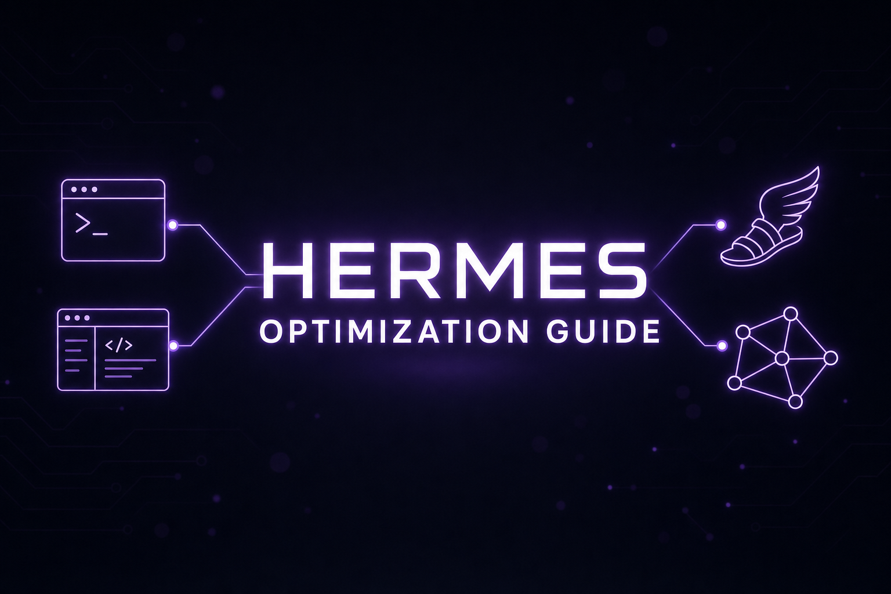
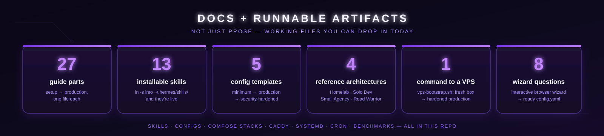
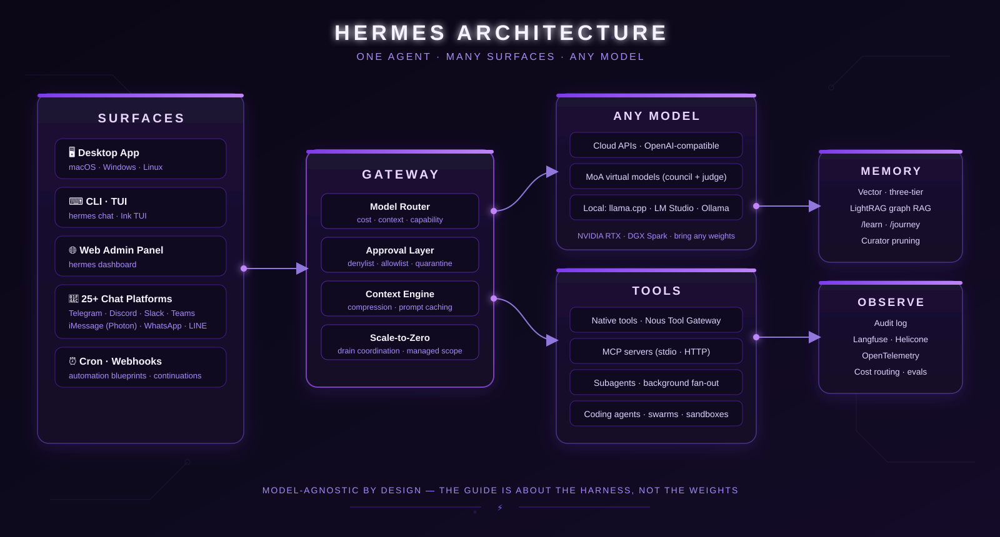
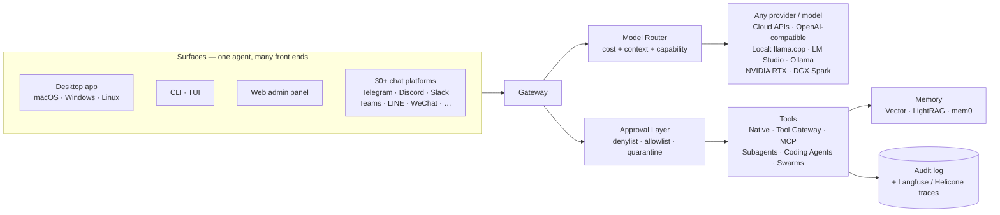

# Hermes Optimization Guide

<p align="center">
  
</p>

[](./LICENSE)
[](https://github.com/NousResearch/hermes-agent/releases/tag/v2026.8.19)
[](./CHANGELOG.md)
[](#table-of-contents)
[](./skills/)
[](./templates/config/)
[](./.github/workflows/ci.yml)
[](./CONTRIBUTING.md)

> **Synced with upstream tag v2026.8.19 (Hermes v0.20.5) — the "Herald" line.** Version claims in this repo are pinned-tag claims, not rolling "current as of today" claims — the drift-guard CI re-audits the guide against that tag on every push and weekly. · **29 parts, 13 installable guide skills, 5 opinionated configs, 4 reference architectures, one-command VPS bootstrap** · Now covering **streaming voice (barge-in + wake words)**, **A2A v1.0 agent-to-agent**, **outbound webhooks**, **grounded citations**, a full **desktop platform wave** (Bots, Projects, multi-terminal, memory graph), **computer use** in the background on any model, **egress/iron-proxy credential tokens** for sandboxes, **external secrets managers** (Bitwarden, 1Password), keyless web search, on top of everything in the v0.18 "Judgment" line (MoA as a first-class model, verified `/goal` completion contracts, `/learn` + `/journey`, scale-to-zero, the Power Secrets field manual, and the twelve-build Recipe Book). **Bring any model** — this guide is about the *harness*, not the weights.
>
> Other languages: [中文](./README-zh.md) · [日本語](./README-ja.md)

### The End-to-End Hermes Guide — docs + runnable artifacts
Every part you need to go from fresh install to a production Hermes deployment — driven from the **native desktop app**, the CLI/TUI, a browser admin panel, or **30+ chat platforms** (now including iMessage with no Mac required via Photon, A2A agent networking, and the Raft channel). Orchestrate Claude Code / Codex / Gemini CLI through durable Kanban lanes and **multi-agent swarms**, plug into any MCP server, trace every call in Langfuse, let it curate its own skills, push heavy work onto disposable Modal/Daytona/Vercel sandboxes — or run the whole thing **locally on your own GPU / NVIDIA DGX Spark**. It's all **model-agnostic**: bring whatever weights you want, the guide is about the *harness*.

Unlike most guides, the prescriptions come with **working files**: [`skills/`](./skills) you can `ln -s` into `~/.hermes/skills/`, [`templates/config/`](./templates/config) you `cp` to `~/.hermes/config.yaml`, [`scripts/vps-bootstrap.sh`](./scripts/vps-bootstrap.sh) that takes a fresh VPS to production in one command.

<p align="center">
  
</p>

*By Terp — [Terp AI Labs](https://x.com/OnlyTerp)* · Last updated **August 22, 2026** · [CHANGELOG](./CHANGELOG.md) · [ROADMAP](./ROADMAP.md) · [ECOSYSTEM](./ECOSYSTEM.md)

---

## Install

Pick the surface that fits you — they all drive the **same** agent, config, keys, sessions, and skills.

**Easiest — the desktop app.** Grab the [Hermes Desktop](https://hermes-agent.nousresearch.com/docs/user-guide/desktop) installer for macOS/Windows/Linux (or run `hermes desktop` if you already have the CLI). First launch offers **Quick Setup via Nous Portal** — sign in, pick a model, start chatting. Full tour: **[Part 24: Hermes Desktop App](./part24-desktop-app.md)**.

**Terminal — verify, then run.** macOS / Linux (pinned: downloads the official
installer, checks its sha256, refuses to run on mismatch):

```bash
curl -fsSL https://hermes-agent.nousresearch.com/install.sh -o hermes-install.sh \
  && echo "0582d9b1562efcb6e0ac62f4451021667830b830a72ce7d91eaea9fee8b6c09b  hermes-install.sh" | sha256sum -c - \
  && bash hermes-install.sh
```

The pin was computed from the live installer on 2026-08-22 (see
[`docs/evidence/`](./docs/evidence)). If the hash mismatches, upstream rotated
the script — inspect the diff before re-pinning. Prefer this over piping
straight to `bash` (`curl -fsSL …/install.sh | bash`), which runs whatever
shows up without asking.

Windows (native, PowerShell):

```powershell
iex (irm https://hermes-agent.nousresearch.com/install.ps1)
```

**Server — pinned, never pipe-to-bash from `main`.** On a fresh Debian 12 /
Ubuntu 24.04 box (Hetzner CX22 works great for ~$5/mo). Fetch the bootstrap
**from a tagged release**, verify its sha256, then run it — never `curl | bash`
from a moving branch, because a compromised repo could edit the pins inside:

```bash
# 1. Fetch from the tagged release (not main)
curl -fsSL https://raw.githubusercontent.com/OnlyTerp/hermes-optimization-guide/v1.3/scripts/vps-bootstrap.sh \
  -o vps-bootstrap.sh

# 2. Verify against the published hash (see table below)
echo "7ac51fec8dd855ed99cf2f93c9ec2c74a0861cc59e777ef826b86068a3164bff  vps-bootstrap.sh" | sha256sum -c -

# 3. Run
sudo bash vps-bootstrap.sh
```

| File | Tag | sha256 |
|---|---|---|
| `scripts/vps-bootstrap.sh` | `v1.3` | `7ac51fec8dd855ed99cf2f93c9ec2c74a0861cc59e777ef826b86068a3164bff` |

(The hash above is computed from `scripts/vps-bootstrap.sh` at tag `v1.3` —
CI's pin-watch job tracks the upstream installer pin daily and opens an issue
when it rotates.)

The bootstrap installs Hermes **via the pinned-hash installer path above**
(it never pipes the upstream installer directly), plus Node.js (pinned
NodeSource script), Caddy (auto-TLS reverse proxy), UFW **with your actual
sshd port — it refuses to enable the firewall if it can't determine it**,
fail2ban with a working sshd jail, a non-root `hermes` user, hardened systemd
units (enabled only if the Hermes install succeeded), and symlinks every skill
from this repo into `~hermes/.hermes/skills/`. See
[`scripts/vps-bootstrap.sh`](./scripts/vps-bootstrap.sh) for what it does line
by line — it's non-destructive and re-runnable, and `HERMES_ALLOW_UNPINNED=1`
is the documented override for operators who have inspected a rotated script.

Prefer a 5-minute local-only setup? → **[docs/quickstart.md](./docs/quickstart.md)** (zero to Telegram bot in 5 min).

---

## Score your setup in 30 seconds

Run it on any machine with Hermes installed:

```bash
python scripts/score-your-setup.py
```

It reads your local install (never your secrets) and scores what is
**verifiable on disk** out of 50 — install health, config sanity, provider
wiring, security posture (real `approvals.mode` values, allowlists, secrets
redaction), hygiene (plaintext-key scanner), memory, skills, cost controls.

```text
TOTAL: 42/50  (1 gap(s))
Fix first:
  - no plaintext API tokens visible in config.yaml (+8)
```

Deliberately NOT scored: number of platforms, cron-job count, "are you on the
newest version." Surface area is not quality — a hardened single-Telegram box
should outscore a sloppy five-platform setup. The MISS lines are the to-do
list; the guide below covers every one. (We scored the maintainer's own
machine while writing this; it leaked a plaintext API key into the hygiene
check and we're telling you so it can't surprise anyone.)

---

## Pick your pain, skip everything else

Don't read 29 parts. Find your symptom, run the fix, done.

| Your pain | Do this | Then read |
|---|---|---|
| "Installation feels sketchy / I don't trust pipe-to-bash" | Run the pinned-hash install above (downloads, sha256-verifies, then runs) | [Part 1](./part1-setup.md) |
| "I want it in Telegram, now" | `hermes setup` → Telegram → paste bot token | [Part 4](./part4-telegram-setup.md) |
| "Discord / Slack / Teams / LINE / WhatsApp / iMessage" | Pick the adapter, wire credentials | [Part 15](./part15-new-platforms.md) |
| "It's too expensive / I want to use my own model" | Point it at any provider; route cheap models to routine work | [Part 9](./part9-custom-models.md), [cost template](./templates/config) |
| "I'm scared what it can do on my box" | Set `approvals.mode`, fill `command_allowlist`, turn on `security.redact_secrets` | [Part 19](./part19-security-playbook.md) |
| "It forgets everything / repeats itself" | Enable memory + profile, tune `memory_char_limit` | [Part 7](./part7-memory-system.md) |
| "I want it running a job every morning" | Cron job via config or dashboard | [Part 22](./part22-latest-power-moves.md) |
| "I want it driving Claude Code / Codex / my repo" | Kanban worker lane, not raw chat delegation | [Part 18](./part18-coding-agents.md) |
| "How do I know it didn't hallucinate that it worked?" | Demand evidence — exit code, log, file. Verify completion | [Part 26](./part26-moa-verification.md) |
| "It broke at 3am / I don't know what state it's in" | Gateway recovery runbook, then the failure-mode index | [Part 11](./part11-gateway-recovery.md), [docs/failure-modes.md](./docs/failure-modes.md) |

Every row is a ≤10-minute win. If you do one thing today, run the scorecard
and fix your lowest category.

---

## Never do this (the kill list)

These are the actual ways people get burned running Hermes unattended. Full
postmortems with recovery steps: **[docs/failure-modes.md](./docs/failure-modes.md)**.

1. **Never `curl | bash` an installer you haven't hashed** — this guide pins
   the upstream installer's sha256 and fails loud on mismatch. Do the same for
   anything else you pipe to a shell.
2. **Never store API keys in plaintext config.yaml** — the scorecard's hygiene
   check exists because real configs leak. Use `secrets:` / a secret manager /
   env vars.
3. **Never run `hermes update` while anything is live on the box** — drain the
   gateway, stop cron jobs first. A mid-flight update while a worker is holding
   state is how you get wedged sessions.
4. **Never truncate-before-read on a file you need** (`open(p,'wb').write(open(p,'rb').read()…)`
   truncates before the inner read finishes) — read into memory first.
5. **Never approve a gateway/DM pairing you didn't initiate** — treat allowlists
   as the only truth; `require_mention` + explicit allowed channels/users.
6. **Never trust a model's claim that it ran something** — demand the exit
   code, the log, the file. Evidence over narration, always.

---

## Repo Map

| Folder | What's in it |
|---|---|
| [`scripts/score-your-setup.py`](./scripts/score-your-setup.py) | **The scorecard.** Run it on any Hermes box → 50-point shareable setup grade. |
| [`scripts/audit-cli-surface.py`](./scripts/audit-cli-surface.py) + [`.github/workflows/drift-guard.yml`](./.github/workflows/drift-guard.yml) | **The drift guard.** CI fails if the guide names a `hermes` command that doesn't exist upstream. Runs on every push + weekly. |
| [`docs/evidence/`](./docs/evidence) | **Verification receipts.** Version transcript, live `hermes --help`, upstream command list, audit output — dated and machine-reproducible. |
| [`docs/failure-modes.md`](./docs/failure-modes.md) | **Scar tissue.** 8 real incident postmortems: symptom → root cause → recovery → permanent fix. |
| [`skills/`](./skills) | **13 installable `SKILL.md`** files. `ln -s` into `~/.hermes/skills/` and they're live. |
| [`templates/config/`](./templates/config) | **5 opinionated `config.yaml`** — minimum, telegram-bot, production, cost-optimized, security-hardened. |
| [`templates/compose/`](./templates/compose) | Self-hosted Langfuse v3 stack (ClickHouse + MinIO + Redis). |
| [`templates/caddy/`](./templates/caddy) | Caddyfile reference (reverse proxy + auto TLS + HSTS). |
| [`templates/systemd/`](./templates/systemd) | Hardened `hermes.service` + `hermes-dashboard.service`. |
| [`templates/cron/`](./templates/cron) | Recommended production cron schedule. |
| [`scripts/vps-bootstrap.sh`](./scripts/vps-bootstrap.sh) | One-command fresh VPS → production Hermes. |
| [`diagrams/`](./diagrams) | 6 Mermaid diagrams (architecture, MCP flow, delegation, sandbox sync, observability, security layers). |
| [`assets/`](./assets) | Banner art + the SVG infographics used across the guide (architecture, paths, timeline). |
| [`benchmarks/`](./benchmarks) | Benchmark harness + **1 dated, verified run** (local RTX 5090, 25/25 ok, 2026-08-22) — the historical 13-model matrix ships with prices blanked unless provider-verified. |
| [`docs/wizard/`](./docs/wizard) | **Interactive config wizard** — 8 questions → ready-to-drop `config.yaml`. Runs in your browser. |
| [`docs/reference-architectures/`](./docs/reference-architectures) | **4 blueprints** — Homelab, Solo Dev, Small Agency, Road Warrior. Full parts list + cost + install. |
| [`docs/quickstart.md`](./docs/quickstart.md) | 5-minute zero-to-Telegram-bot. |
| [`ECOSYSTEM.md`](./ECOSYSTEM.md) | Curated directory of MCP servers, coding agents, dashboard plugins. |
| [`ROADMAP.md`](./ROADMAP.md) · [`CHANGELOG.md`](./CHANGELOG.md) · [`CONTRIBUTING.md`](./CONTRIBUTING.md) | The usual suspects. |
| README + `part1-*.md` … `part28-*.md` | The 29-part guide itself (now incl. MoA + verification, Desktop App, NVIDIA / local hardware, the Power Secrets field manual, and the Recipe Book). |

---

## Architecture at a glance

<p align="center">
  
</p>

Prefer Mermaid? The same picture, editable:


```mermaid
flowchart LR
  subgraph Surfaces[Surfaces — one agent, many front ends]
    direction TB
    Desktop[Desktop app<br/>macOS · Windows · Linux]
    Term[CLI · TUI]
    Web[Web admin panel]
    Chat[30+ chat platforms<br/>Telegram · Discord · Slack<br/>Teams · LINE · WeChat · …]
  end
  Surfaces --> Gateway
  Gateway --> Router[Model Router<br/>cost + context + capability]
  Router --> Providers[Any provider / model<br/>Cloud APIs · OpenAI-compatible<br/>Local: llama.cpp · LM Studio · Ollama<br/>NVIDIA RTX · DGX Spark]
  Gateway --> Approval[Approval Layer<br/>denylist · allowlist · quarantine]
  Approval --> Tools[Tools<br/>Native · Tool Gateway · MCP<br/>Subagents · Coding Agents · Swarms]
  Tools --> Memory[Memory<br/>Vector · LightRAG · mem0]
  Tools --> Logs[(Audit log<br/>+ Langfuse / Helicone traces)]
```

Full set of diagrams: [`diagrams/architecture.md`](./diagrams/architecture.md).

---


## What's New

The guide tracks one pinned upstream tag at a time (currently
**v2026.8.19 / v0.20.5 "Herald"**). The full release-by-release feature log
— v0.20 voice/A2A/desktop wave, v0.18 "Judgment" (MoA as a first-class model,
`/goal` contracts, `/learn` + `/journey`), v0.17 "Reach" (iMessage via
Photon), and everything before — lives in the
[CHANGELOG](./CHANGELOG.md). When upstream ships a new tag, the
badge here and the drift-guard's `UPSTREAM_TAG` move together.

---

## Table of Contents

1. [Setup](./part1-setup.md) — Install Hermes, configure your provider, first-run walkthrough (with Android/Termux)
2. [SOUL.md Personality](#soulmd--give-your-agent-a-personality) — The Molty prompt, what good personality rules look like, how to fix a bland agent
3. [OpenClaw Migration](./part2-openclaw-migration.md) — Move your OpenClaw data, config, skills, and memory into Hermes
4. [LightRAG — Graph RAG](./part3-lightrag-setup.md) — Set up a knowledge graph that actually understands relationships, not just text similarity
5. [Telegram Bot](./part4-telegram-setup.md) — Connect Hermes to Telegram for mobile access, voice memos, and group chats
6. [On-the-Fly Skills](./part5-creating-skills.md) — Ask Hermes to create new skills that optimize your workflow automatically
7. [Context Compression](./part6-context-compression.md) — Fix the silent context loss bug, configure compression thresholds, survive long sessions
8. [Memory System](./part7-memory-system.md) — The three-tier memory architecture: persistent facts, conversation recall, procedural memory
9. [Subagent Patterns](./part8-subagent-patterns.md) — Orchestrator/worker delegation, ACP subagents, parallel task execution
10. [Custom Model Providers](./part9-custom-models.md) — Grok/SuperGrok OAuth, Bedrock, Azure AI Foundry, Vertex AI, LM Studio, Codex OAuth, MoA presets, OpenRouter routing, model aliases, fallback chains
11. [SOUL.md Anti-Patterns](./part10-soul-antipatterns.md) — What makes an agent annoying vs useful, the formula that works
12. [Gateway Recovery](./part11-gateway-recovery.md) — Crash detection, auto-recovery, common failure modes, health checks
13. [Web Dashboard](./part12-web-dashboard.md) — `hermes dashboard`, browser Chat via real TUI, models/plugins tabs, config, keys, sessions, logs, analytics, cron
14. [Tool Gateway, Local Proxy & Live Search](./part13-tool-gateway.md) — Nous-managed tools, `hermes proxy`, and `x_search`
15. [Fast Mode & Background Watchers](./part14-fast-mode-watchers.md) — `/fast`, `/steer`, `/queue`, `watch_patterns`, pluggable context engine, `/compress <topic>`
16. [New Platforms (Teams, LINE, SimpleX, iMessage, WeChat, Android)](./part15-new-platforms.md) — Teams end-to-end, LINE, SimpleX, Google Chat, QQBot, Yuanbao, BlueBubbles/iMessage, Weixin/WeCom, Android via Termux
17. [Backup, Import & `/debug`](./part16-backup-debug.md) — Portable `hermes backup`/`import`, `/debug` bundler, `hermes debug share`, security hardening
18. [MCP Servers](./part17-mcp-servers.md) — The tool-protocol standard. stdio + HTTP transports, sampling, trust boundaries, server shortlist, writing your own
19. [Delegating to Coding Agents](./part18-coding-agents.md) — Claude Code Week 20+, Codex v0.133+, Gemini CLI v0.43, OpenCode, Aider, Zed ACP, print-mode, Kanban, git isolation
20. [Security Playbook](./part19-security-playbook.md) — Prompt-injection defense, provenance labels, approval layers, secrets redaction, MCP trust model, hardline blocks
21. [Observability & Cost Control](./part20-observability.md) — Langfuse plugin, Helicone, OpenTelemetry → Phoenix, prompt-prefix caching, CDP spans, auxiliary routing, evals
22. [Remote Sandboxes & Bulk File Sync](./part21-remote-sandboxes.md) — SSH, Modal, Daytona, Vercel Sandbox, Fly Machines, E2B. Diff-based sync-back on teardown
23. [Latest Power Moves](./part22-latest-power-moves.md) — Curator, TUI habits, context-file hygiene, plugins, dashboard Chat, cron chaining, and the 2026 upgrade checklist
24. [Foundation + Tenacity Stack](./part23-tenacity-stack.md) — PyPI/lazy deps, `hermes proxy`, `/handoff`, durable Kanban, `/goal`, Checkpoints v2, no-agent cron, worker lanes, multi-agent swarms, and the upgrade checklist
25. [Hermes Desktop App](./part24-desktop-app.md) — Native macOS/Windows/Linux GUI, Quick Setup, Cmd+K palette, Projects, multi-terminal, memory graph, remote gateway, multi-profile, voice, self-update
26. [NVIDIA & Local Hardware](./part25-nvidia-local.md) — Run Hermes on your own GPU: RTX / DGX Spark, OpenShell isolation, NemoClaw, and a model-agnostic local stack
27. [MoA, Verification & Self-Improvement](./part26-moa-verification.md) — Mixture-of-Agents presets as models, `/moa`, completion contracts for `/goal`, `/learn`, `/journey`, background fan-out, scale-to-zero
28. [Power Secrets](./part27-power-secrets.md) — 25 verified non-obvious mechanics: memory snapshots, the gateway token tax, cache economics, credential pools, Kanban traps, profiles-as-rooms, and a printable cheat sheet
29. [The Recipe Book](./part28-recipe-book.md) — twelve production builds: finance loops, staged Gmail, approval offices, overnight Kanban, GPU FIFO, content swarms, job-hunt pipelines, coaches, correlators, Blender rooms, and the secretary office

---


## Quick Start

```bash
# 1. Install Hermes (Linux/macOS/WSL2/Android) — or grab the desktop app
#    (verify-then-run one-liner is in the Install section above)
curl -fsSL https://hermes-agent.nousresearch.com/install.sh -o hermes-install.sh \
  && bash hermes-install.sh

# 2. Configure providers and tools (or `hermes portal` for guided Quick Setup)
hermes setup

# 3a. Start chatting in the terminal (CLI or TUI)
hermes

# 3b. Or open the browser dashboard / admin panel
hermes dashboard

# 3c. Or launch the native desktop app
hermes desktop
```

The dashboard — and the new desktop app — are the fastest way to configure everything without touching YAML. See [Part 12](./part12-web-dashboard.md) and [Part 24](./part24-desktop-app.md) for the full tours.

For the full walkthrough including optimization, read each part in order.

---

## Part 1: Setup (Stop Fumbling With Installation)

*From zero to working agent in under 5 minutes. Covers what the docs don't.*

One command installs everything — `curl -fsSL https://hermes-agent.nousresearch.com/install.sh | bash` on Linux/macOS/WSL2/Android-Termux, a native PowerShell one-liner on Windows, or `pip install hermes-agent` for the leanest path. The full part covers what the installer actually does, the `hermes setup` first-run wizard (model picker, API keys, toolsets), the key `hermes config set` options (fallback models, `agent.max_turns`, `prompt_caching.cache_ttl`, `compression.enabled`), the `~/.hermes/` file layout, and how to verify and update your install.

**Read the full part → [Part 1: Setup](./part1-setup.md)**

---

## SOUL.md — Give Your Agent a Personality

`SOUL.md` is injected into **every single message**. It's the highest-impact file in your setup. A bad SOUL.md makes your agent sound like a corporate chatbot. A good one makes it actually useful to talk to.

### What Belongs in SOUL.md

Put the stuff that changes how the agent **feels** to talk to:

- **Tone** — direct, casual, formal, dry, whatever fits you
- **Opinions** — the agent should have takes, not hedge everything
- **Brevity** — enforce concise answers as a default
- **Humor** — when it fits naturally, not forced jokes
- **Boundaries** — what it should push back on
- **Bluntness level** — how much sugarcoating to skip

Do NOT turn SOUL.md into:

- A life story
- A changelog
- A security policy dump
- A giant wall of vibes with no behavioral effect

**Short beats long. Sharp beats vague.**

### The Molty Prompt

*Originally from [OpenClaw's SOUL.md guide](https://docs.openclaw.ai/concepts/soul#the-molty-prompt). Adapted for Hermes with permission/credit. Paste this into your chat with the agent and let it rewrite your SOUL.md:*

> Read your `SOUL.md`. Now rewrite it with these changes:
>
> 1. You have opinions now. Strong ones. Stop hedging everything with "it depends" — commit to a take.
> 2. Delete every rule that sounds corporate. If it could appear in an employee handbook, it doesn't belong here.
> 3. Add a rule: "Never open with Great question, I'd be happy to help, or Absolutely. Just answer."
> 4. Brevity is mandatory. If the answer fits in one sentence, one sentence is what I get.
> 5. Humor is allowed. Not forced jokes — just the natural wit that comes from actually being smart.
> 6. You can call things out. If I'm about to do something dumb, say so. Charm over cruelty, but don't sugarcoat.
> 7. Swearing is allowed when it lands. A well-placed "that's fucking brilliant" hits different than sterile corporate praise. Don't force it. Don't overdo it. But if a situation calls for a "holy shit" — say holy shit.
> 8. Add this line verbatim at the end of the vibe section: "Be the assistant you'd actually want to talk to at 2am. Not a corporate drone. Not a sycophant. Just... good."
>
> Save the new `SOUL.md`. Welcome to having a personality.

### What Good Looks Like

Good SOUL.md rules:

- have a take
- skip filler
- be funny when it fits
- call out bad ideas early
- stay concise unless depth is actually useful

Bad SOUL.md rules:

- maintain professionalism at all times
- provide comprehensive and thoughtful assistance
- ensure a positive and supportive experience

That second list is how you get mush.

### Why This Works

This lines up with OpenAI's prompt engineering guidance: high-level behavior, tone, goals, and examples belong in the **high-priority instruction layer**, not buried in the user turn. SOUL.md is that layer. It's the system-level personality instruction that every model respects.

If you want better personality, write stronger instructions. If you want stable personality, keep them concise and versioned.

> **One warning:** Personality is not permission to be sloppy. Keep your operational rules in AGENTS.md. Keep SOUL.md for voice, stance, and style. If your agent works in shared channels or public replies, make sure the tone still fits the room. Sharp is good. Annoying is not.

> **Keep it under 1 KB.** Every byte in SOUL.md costs tokens on every message. The most effective SOUL.md files are 500-800 bytes of dense, high-signal personality instructions.

---

## Part 2: OpenClaw Migration (Don't Leave Your Knowledge Behind)

*Transfer your skills, memory, config, and personality from OpenClaw to Hermes in one command.*

`hermes claw migrate` moves your SOUL.md, AGENTS.md, memory files (merged and deduped), user profile, skills, model config, and provider keys from `~/.openclaw/` into Hermes automatically. The full part covers the `--dry-run` preview, presets (`full` vs `user-data`), skill-conflict handling (`skip`/`overwrite`/`rename`), the complete config-key mapping table, what *doesn't* transfer (session transcripts, cron jobs, plugin configs), and troubleshooting.

**Read the full part → [Part 2: OpenClaw Migration](./part2-openclaw-migration.md)**

---

## Part 3: LightRAG — Graph RAG That Actually Works

*From "find similar text" to "reason about relationships." The single biggest intelligence upgrade you can make.*

Vector search finds what's *similar*; graph RAG finds what's *connected*. [LightRAG](https://github.com/HKUDS/LightRAG) (HKU, EMNLP 2025) builds a knowledge graph — entities and relationships — alongside your vector DB and searches both at once, for a fraction of Microsoft GraphRAG's cost. The full part covers installation, entity-extraction model choice (Kimi K2.6 for quality, Cerebras GPT OSS 120B for speed, local Ollama for free), embeddings (Fireworks Qwen3-Embedding-8B vs local nomic-embed-text), running and securing the REST server, ingestion, the four query modes (`naive`/`local`/`global`/`hybrid`), a ready-to-use Hermes skill, and tuning tips.

**Read the full part → [Part 3: LightRAG Setup](./part3-lightrag-setup.md)**

---

## Part 4: Telegram Setup (Chat From Anywhere)

*Connect Hermes to Telegram for mobile access, voice memos, group chats, and scheduled task delivery.*

Telegram is the most battle-tested of the 30+ messaging adapters: text, voice memos (auto-transcribed), image analysis, file attachments, inline confirmation buttons, and cron delivery straight to your phone. The full part walks through creating a bot with @BotFather, the privacy-mode gotcha that breaks group chats, finding your numeric user ID, `hermes gateway setup`, webhook mode for cloud deployments (with a proper random secret), multi-user setup, and troubleshooting.

**Read the full part → [Part 4: Telegram Setup](./part4-telegram-setup.md)**

---

## Part 5: On-the-Fly Skills (Let Hermes Build Its Own Playbook)

*Ask Hermes to create a new skill, and it saves the workflow permanently — no manual file editing needed.*

Skills are procedural knowledge: how-to guides the agent loads on demand at zero idle token cost (memory is for facts; skills are for workflows). Hermes creates them itself — after a complex task it offers to save the steps, pitfalls, and verification as a reusable `SKILL.md`, and you can ask for one directly ("create a skill for deploying Docker containers"). The full part covers the creation workflow, the `SKILL.md` format and directory structure, slash-command and automatic loading, managing/updating skills, the v0.12 **Curator** that keeps the library from rotting, real-world examples, and tips for writing skills that stay useful.

**Read the full part → [Part 5: On-the-Fly Skills](./part5-creating-skills.md)**

You've now got the full picture — setup, migration, graph memory, mobile access, and self-improving workflows. From here, [Part 22: Latest Power Moves](./part22-latest-power-moves.md), [Part 23: Tenacity Stack](./part23-tenacity-stack.md), [Part 24: Desktop App](./part24-desktop-app.md), and [Part 25: NVIDIA & Local Hardware](./part25-nvidia-local.md) round out the modern stack. Start with setup, add what you need, and let Hermes build the rest.

---

> **Note:** Based on the official Hermes Agent documentation and real production usage. No private credentials, API keys, or personal data included.