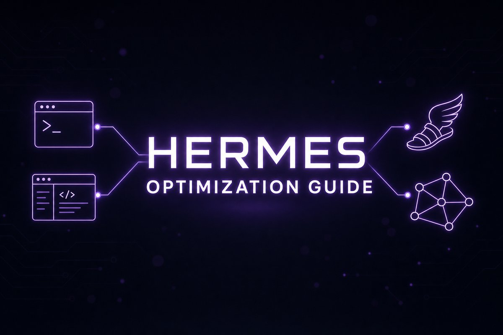

# The Hermes Optimization Guide

<p align="center">
  
</p>

<p align="center">
  <a href="https://github.com/NousResearch/hermes-agent/releases/tag/v2026.9.21"></a>
  <a href="./.github/workflows/drift-guard.yml"></a>
  <a href="./LICENSE"></a>
</p>

**Run [Hermes Agent](https://github.com/NousResearch/hermes-agent) well: cheaper, faster, safer, and actually getting better over time.**

Hermes does a lot out of the box. The [official docs](https://hermes-agent.nousresearch.com/docs/) tell you everything it *can* do. This guide tells you what to *do*: which settings matter, what they cost, what breaks, and the fixes that have been confirmed to work. Where it says something costs 2,311 tokens, that number was measured on a real install.

> **Verified against Hermes Agent v0.21.4** (tag `v2026.9.21`, released 2026-09-21). Every command, flag, slash command, config key, and official-docs link in this repo is checked against that release by CI. Hermes ships fast; when it moves, the [drift guard](#how-this-guide-stays-accurate) opens an issue.

---

## Start here

| If you are… | Read |
|---|---|
| **New to Hermes** | [01 How it works](./guide/01-how-hermes-works.md) → [02 Install](./guide/02-install.md) → [03 Models](./guide/03-models.md) → [05 Cost & speed](./guide/05-token-budget.md) |
| **Using it every day** | [05 Cost & speed](./guide/05-token-budget.md) → [06 Personality](./guide/06-personality-and-context.md) → [07 Memory](./guide/07-memory.md) → [08 Skills](./guide/08-skills.md) |
| **Running it 24/7 or for other people** | [13 Security](./guide/13-security.md) → [14 Running 24/7](./guide/14-production.md) → [10 Messaging](./guide/10-messaging.md) → [15 Troubleshooting](./guide/15-troubleshooting.md) |
| **Something is broken right now** | [15 Troubleshooting](./guide/15-troubleshooting.md) |

## The ten changes that matter most

Each one is a few minutes' work. Together they cover most of the gap between a default install and a well-run one.

1. **Measure what every call costs.** `hermes prompt-size` shows the fixed prefix sent with *every* model call: about 13,000 tokens on a default install, three quarters of it tool schemas. → [05](./guide/05-token-budget.md#measure-before-you-cut)
2. **Move side tasks off your main model.** Compression, titles, approvals, and the background memory review all run on your *main* model by default (`auxiliary.*: auto`). Point them at a cheap one, but leave vision alone if your main model can see images. → [05](./guide/05-token-budget.md#lever-3-put-side-tasks-on-a-cheap-model)
3. **Drop toolsets you don't use, per platform.** Disabling `browser` and `tts` alone saves about 2,300 tokens on every call. → [05](./guide/05-token-budget.md#lever-1-send-fewer-tool-schemas)
4. **Protect the prompt cache.** Switching models mid-session re-reads the whole conversation at full price. Use `/btw`, `/bg`, or a subagent for side work instead. → [05](./guide/05-token-budget.md#lever-2-keep-the-prompt-cache-warm)
5. **Keep always-on instructions short.** A 32 KB `AGENTS.md` measured **+8,600 tokens per call**. → [06](./guide/06-personality-and-context.md)
6. **Lock down who can talk to your bot.** Use allowlists or DM pairing, and never allow everyone on an agent with a shell. → [10](./guide/10-messaging.md#access-control), [13](./guide/13-security.md#layer-1-who-can-talk-to-it)
7. **Run the gateway as a service.** Cron only fires while the gateway runs, and a user service dies at logout unless lingering is on. → [14](./guide/14-production.md#what-the-native-service-gives-you)
8. **Put subagents and cron jobs on cheaper models.** `delegation.model` and `cron.model`. → [05](./guide/05-token-budget.md#lever-6-cheaper-models-for-work-that-doesnt-need-the-best)
9. **Give local models 64K context, set on the server.** Hermes refuses anything smaller, and Ollama's default is far below that. → [04](./guide/04-local-models.md#the-64k-rule)
10. **Update deliberately.** `hermes update --check` and `--plan` first. Anything older than v0.21.2 should update for `state.db` safety. → [02](./guide/02-install.md#updating-without-breaking-things)

## The guide

**Foundations**

| # | Chapter | You'll learn |
|---|---|---|
| 01 | [How Hermes Works](./guide/01-how-hermes-works.md) | The mental model: surfaces, where state lives, what's in every request, the learning loop |
| 02 | [Install & First Run](./guide/02-install.md) | A supported install, a first chat that works, and updates that don't break things |
| 03 | [Models & Providers](./guide/03-models.md) | Choosing and routing models, reasoning effort, fallbacks, credential pools, MoA |
| 04 | [Local Models](./guide/04-local-models.md) | Ollama, LM Studio, llama.cpp, vLLM, the managed local runtime, and the 64K rule |

**Make it cheap and smart**

| # | Chapter | You'll learn |
|---|---|---|
| 05 | [Cost & Speed: The Token Budget](./guide/05-token-budget.md) | Every lever on what a call costs, measured, plus guardrails against runaway spend |
| 06 | [Personality & Context Files](./guide/06-personality-and-context.md) | `SOUL.md`, `AGENTS.md`, personalities, per-channel prompts, and what each costs |
| 07 | [Memory](./guide/07-memory.md) | Built-in memory, session search, external providers, and memory hygiene |
| 08 | [Skills](./guide/08-skills.md) | Finding, writing, and curating skills: the part of Hermes that improves with use |

**Make it useful**

| # | Chapter | You'll learn |
|---|---|---|
| 09 | [Tools, MCP & Plugins](./guide/09-tools-mcp-plugins.md) | Toolsets, terminal backends, browser and web, MCP done right, the plugin catalog |
| 10 | [Messaging: Chat From Anywhere](./guide/10-messaging.md) | The gateway, Telegram end to end, Discord, Slack, WhatsApp, Signal, and more |
| 11 | [Automation](./guide/11-automation.md) | Cron, webhooks, `/goal`, loops, hooks, and scripting Hermes |
| 12 | [Delegation & Multi-Agent](./guide/12-multi-agent.md) | Subagents, coding agents, Kanban, profiles, Bot Mode, and agent-to-agent |

**Make it solid**

| # | Chapter | You'll learn |
|---|---|---|
| 13 | [Security](./guide/13-security.md) | A threat model for an agent with a shell, the controls that matter, and a hardened config |
| 14 | [Running 24/7](./guide/14-production.md) | Services, Docker, remote backends, backups, `state.db` care, monitoring |
| 15 | [Troubleshooting](./guide/15-troubleshooting.md) | A diagnostic ladder and confirmed fixes, each with its source |

**Put it together**

| # | Chapter | You'll learn |
|---|---|---|
| 16 | [Recipes](./guide/16-recipes.md) | Seven complete builds: briefings, zero-token watchdogs, PR reviews, a team bot, safe coding, research |
| — | [Cheat Sheet](./guide/cheatsheet.md) | The commands and settings you'll actually use, on one page |

## Also in this repo

| Path | What it is |
|---|---|
| [`templates/config/`](./templates/config) | Drop-in `config.yaml` fragments, each validated against v0.21.4: **lean** (cost), **local** (own hardware), **messaging-bot** (a shared chat bot), **hardened** (security) |
| [`skills/`](./skills) | Example skills you can install into `~/.hermes/skills/`, written to the current `SKILL.md` spec |
| [`scripts/drift_guard.py`](./scripts/drift_guard.py) | The checker that keeps this guide honest (see below) |

## How this guide stays accurate

Hermes ships several releases a month, and guides rot. This one is pinned to a single upstream release and checked against it mechanically:

- [`scripts/drift_guard.py`](./scripts/drift_guard.py) installs the pinned Hermes release, captures its real command tree, slash commands, config schema, and docs pages, and fails CI if the guide mentions anything that doesn't exist, from a `hermes` subcommand or flag to a config key or a docs link and its `#anchor`.
- Numbers such as token counts and prompt sizes were measured on a real v0.21.4 install. The chapters say how, so you can reproduce them on yours.
- Fixes in [troubleshooting](./guide/15-troubleshooting.md) come from the official docs, merged upstream fixes, or release notes, each linked. Known-unsolved problems are listed as unsolved.
- A weekly job opens an issue when Hermes releases a version newer than the pin.

Run the check yourself:

```bash
git clone --depth 1 --branch v2026.9.21 https://github.com/NousResearch/hermes-agent.git /tmp/hermes-agent
python3 -m venv /tmp/venv && /tmp/venv/bin/pip install -e /tmp/hermes-agent pyyaml
/tmp/venv/bin/python scripts/drift_guard.py extract --upstream /tmp/hermes-agent --out /tmp/surface.json
/tmp/venv/bin/python scripts/drift_guard.py check --surface /tmp/surface.json
```

## Contributing

Corrections are the most valuable contribution: when Hermes changes and the guide is wrong, open an issue or a PR. See [CONTRIBUTING.md](./CONTRIBUTING.md) for the (short) rules: verify against the pinned release, measure instead of guessing, and cite fixes.

## Credits

Written and maintained by **Terp** ([Terp AI Labs](https://x.com/OnlyTerp)). Hermes Agent is built by [Nous Research](https://nousresearch.com). This is an independent community guide, not affiliated with or endorsed by Nous Research. The Molty prompt in [chapter 06](./guide/06-personality-and-context.md#the-molty-prompt) is from [OpenClaw's docs](https://docs.openclaw.ai/concepts/soul#the-molty-prompt), credited there.

Licensed under [MIT](./LICENSE). Earlier editions of this guide (the 30-part v1 series) remain in the git history; see the [CHANGELOG](./CHANGELOG.md) for what moved where.
