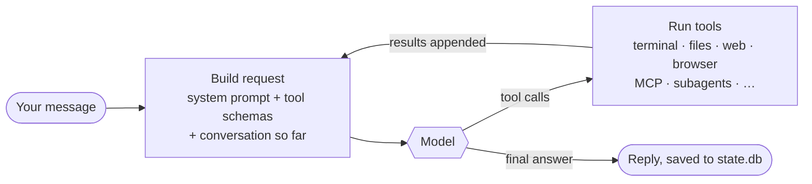

# 01 · How Hermes Works

> The mental model behind every tuning decision in this guide: what runs, where state lives, and what gets sent to the model on every single call.

**TL;DR**
- Hermes is one agent loop with many front ends: terminal, desktop app, web dashboard, 30-plus messaging platforms, IDEs, and an OpenAI-compatible API. Within a profile they share one config, one memory, one skill library, and one session store.
- All state lives in one directory, `~/.hermes` (`%LOCALAPPDATA%\hermes` on native Windows). A profile is a complete second copy of that layout. Back the directory up and you have backed up the agent.
- Every model call starts with a fixed prefix of system prompt plus tool schemas. On a default v0.21.4 install that is about **13,000 tokens** before your first word, and tool schemas are three quarters of it.
- Cost work comes down to three moves: shrink the prefix, keep it byte-identical between calls so the provider cache can reuse it, and keep the conversation lean. [Chapter 05](./05-token-budget.md) does all three.
- Hermes improves itself through memory, skills, session search, and the curator. Each one costs something and each has a switch.

## One agent, many front doors

Every surface below drives the same `AIAgent` loop with the same configuration. Pick whichever fits the moment. They are not separate products.

| Surface | Start it | Best for |
|---|---|---|
| Classic CLI | `hermes` | Daily driving in a terminal. Fastest to start, full slash-command set. |
| TUI | `hermes --tui` | Same agent in a richer full-screen terminal UI. |
| Desktop app | Desktop installer, or `hermes desktop` | A native window with projects, a session sidebar, voice, and Bot Mode. |
| Web dashboard | `hermes dashboard` | Configuration, keys, sessions, logs, analytics, and cron in a browser. |
| Messaging gateway | A background service that `hermes setup` installs (`hermes gateway install` to redo it), or `hermes gateway run` in the foreground | Telegram, Discord, Slack, WhatsApp, Signal, email, Matrix, Teams, and two dozen more. |
| One-shot | `hermes -z "prompt"` | Scripts, pipes, CI. It prints only the final answer. |
| IDE agent (ACP) | `hermes acp` | VS Code, Zed, and JetBrains over the Agent Client Protocol. |
| Backend server | `hermes serve` | Headless backend for the desktop app and remote connections. |
| OpenAI-compatible API | `API_SERVER_ENABLED=true` in `.env`, then run the gateway | Open WebUI, LibreChat, and any other OpenAI-format client. |
| MCP server | `hermes mcp serve` | Exposing Hermes conversations to other MCP-capable agents. |

The practical consequence: **configure once**. A skill created in the terminal is available in Telegram, and a memory saved from Discord shows up in the desktop app, as long as both run under the same [profile](#profiles-separate-agents-on-one-machine). The main things that *do* differ per surface are the enabled toolsets (`hermes tools --summary` shows them per platform), display settings, and the per-platform formatting hint Hermes adds to the system prompt.

## What happens on one turn

A "turn" is everything between your message and the agent's final reply. It is usually several model calls, not one.



Each trip around that loop re-sends the **entire** request: the fixed prefix plus the whole conversation, including every tool result so far. A task with ten tool calls sends the prefix eleven times. Three consequences follow, and the rest of the guide builds on them:

1. **The fixed prefix is multiplied by the number of calls.** Trimming 2,000 tokens from it saves 2,000 tokens on *every* call, not once per session.
2. **Prompt caching is what makes the loop affordable.** Providers that cache bill a re-sent prefix at a steep discount, but only when it is byte-for-byte identical to a recent call. Anything that changes the start of the request forces a full-price re-read.
3. **Tool output is conversation.** A 40 KB log dumped by one command rides along on every later call until compression prunes it.

## What's in every request

Hermes assembles the system prompt in three tiers (stable, context, volatile), then appends the tool schemas. On a default install the prefix breaks down like this.

| Layer | What it holds | Default size (v0.21.4) | Tune it in |
|---|---|---|---|
| Identity | `SOUL.md` (a 667-byte starter is seeded on first run) | < 1 KB | [06](./06-personality-and-context.md) |
| Guidance + platform hint | Tool-use rules and per-surface formatting ("you're in a terminal, avoid Markdown") | ~5.5 KB | [06](./06-personality-and-context.md) (`platform_hints`) |
| Project context | **One** of `.hermes.md`, `AGENTS.md`, `CLAUDE.md`, `.cursorrules` from the working directory | 0 to tens of KB | [06](./06-personality-and-context.md) |
| Skills index | One short line per installed skill | 5.4 KB for the 58 bundled skills | [08](./08-skills.md) |
| Memory + profile | `MEMORY.md` (≤ 2,200 chars) and `USER.md` (≤ 1,375 chars) snapshots | 0 to ~3.6 KB | [07](./07-memory.md) |
| Runtime line | Time, session, model, host, working directory | < 1 KB | none |
| **Tool schemas** | JSON definitions of every enabled tool | **42 KB for 24 tools** | [05](./05-token-budget.md), [09](./09-tools-mcp-plugins.md) |
| Conversation | Your messages, replies, tool calls and results | Grows every call | [05](./05-token-budget.md) (compression) |

The same numbers as tokens, counted with the `o200k_base` tokenizer (GPT-4o/GPT-5 family; other tokenizers land within roughly 15%). The prompts were built exactly as `hermes prompt-size` builds them, on a fresh v0.21.4 install with the 58 bundled skills:

| Setup | System prompt | Tool schemas | Fixed prefix per call |
|---|---|---|---|
| Defaults, no project context file | 3,005 tokens | 9,992 tokens | **≈ 13,000 tokens** |
| `browser` and `tts` toolsets disabled | 3,005 tokens | 7,681 tokens | ≈ 10,700 tokens |
| Defaults, run inside a repo with a 31.9 KB `AGENTS.md` | 11,614 tokens | 9,992 tokens | ≈ 21,600 tokens |

Two things surprise most people. First, the tool list costs three times more than all your instructions combined. Second, a big `AGENTS.md` in whatever directory you start Hermes from quietly adds thousands of tokens to every call.

**Measure your own install.** It runs offline and makes no API call:

```bash
hermes prompt-size                     # the CLI's fixed budget
hermes prompt-size --platform telegram # what a Telegram turn carries
hermes prompt-size --json              # machine-readable, for scripts
```

Inside a live session, `/context` shows the same breakdown in real tokens for your current model, plus conversation size and compression stats.

> [!NOTE]
> The tiers are frozen for the whole session. When the agent saves a memory mid-conversation, the write hits disk immediately but the system prompt keeps the snapshot it started with. That keeps the prefix cache-stable. The new memory appears in the next session, or after the next compression, which rebuilds the prompt.

## Where everything lives

```text
~/.hermes/                      # %LOCALAPPDATA%\hermes on native Windows; override with HERMES_HOME
├── config.yaml                 # behavior: model, tools, compression, approvals, platforms…
├── .env                        # secrets: API keys, bot tokens
├── SOUL.md                     # identity and voice, injected into every request
├── memories/
│   ├── MEMORY.md               # the agent's notes about its environment and work
│   └── USER.md                 # what it has learned about you
├── skills/                     # installed skills (58 bundled ones are seeded on first run)
├── state.db                    # SQLite: every session and message, full-text indexed
├── sessions/                   # session artifacts
├── cron/                       # scheduled jobs and their run output
├── logs/                       # agent.log, errors.log, gateway.log, …
├── hooks/  pairing/  cache/    # shell hooks, DM pairing state, caches
├── hermes-agent/               # the code itself, for per-user installs
└── profiles/<name>/            # each profile is a complete copy of this layout
```

Two files do almost all the work:

- **`config.yaml`** holds behavior. Edit it with `hermes config edit`, or change single values without opening it: `hermes config set compression.threshold 0.8`. After hand-edits, `hermes config check` catches missing or outdated options. The full annotated reference is upstream's [`cli-config.yaml.example`](https://github.com/NousResearch/hermes-agent/blob/v2026.9.21/cli-config.yaml.example).
- **`.env`** holds secrets. Setup flows write it for you, and `hermes config env-path` prints its location. Keep secrets out of `config.yaml`, and never commit either file.

`hermes config show` prints the resolved configuration, and `hermes status` shows every component at a glance.

## Profiles: separate agents on one machine

A profile is a separate Hermes home under `~/.hermes/profiles/<name>/`, with its own config, keys, `SOUL.md`, memory, skills, sessions, and cron jobs.

```bash
hermes profile create work      # new profile; also installs a `work` command alias
work setup                      # configure it (same as: hermes -p work setup)
work chat                       # talk to it
hermes profile use work         # make it the sticky default
hermes profile list             # see them all
```

Use profiles to keep a work agent from learning your personal life, or to give a team bot a different model and tighter permissions than your own. A profile separates *state*, not the filesystem: on the default `local` terminal backend, every profile can reach everything your user account can. Isolation comes from a sandboxed terminal backend or a separate OS user ([chapter 13](./13-security.md)). The one hard rule, straight from the docs: **never point two running agents at the same profile.** Both write memory automatically, and each loads the other's writes at session start. Agents that need shared knowledge should share an [external memory provider](./07-memory.md), not a home directory.

One gateway process serves every profile on the host. Since v0.21.4 that's the only supported layout, and `gateway.multiplex_profiles: false` is ignored. If a boot-time safety check finds a conflict, such as two profiles sharing one bot token, the gateway logs the blocker and serves only the default profile until you run `hermes gateway migrate --multiplex`. A second profile doesn't mean a second always-on process. [Chapter 12](./12-multi-agent.md) covers profiles as a multi-agent tool, and [chapter 14](./14-production.md) covers running several on one server.

## The learning loop

Hermes doesn't only answer. It keeps notes, writes procedures, and prunes what it has written. Four mechanisms, each with a cost and a switch:

| Mechanism | What it does | What it costs | The switch |
|---|---|---|---|
| **Memory** | Saves durable facts about you and your environment to `MEMORY.md` / `USER.md`, which are loaded at session start. | Up to ~3.6 KB of prefix, plus the background review below. | `memory.*` ([07](./07-memory.md)) |
| **Skills** | Turns procedures that worked into reusable `SKILL.md` files. Only a one-line index entry is always loaded; the body loads when the skill is used. | ~90 bytes of prefix per skill, plus the full file when used. | `skills.*`, `hermes skills` ([08](./08-skills.md)) |
| **Session search** | Full-text search (SQLite FTS5) over every past conversation, so the agent can look things up instead of asking again. | Nothing until it's called. No LLM involved. | `sessions.*` retention ([07](./07-memory.md)) |
| **Curator** | Every 7 days, when idle, marks unused agent-created skills stale (14 days) and archives them (30 days). It never deletes. | The deterministic pass costs nothing. The optional LLM consolidation pass (`curator.consolidate`) costs auxiliary tokens. | `curator.*`, `hermes curator` ([08](./08-skills.md)) |

The engine behind memory and skill capture is the **background review**. Every few turns (`memory.nudge_interval` and `skills.creation_nudge_interval`, both 10 by default), Hermes forks a reviewer that replays the conversation and decides what's worth saving. By default it runs on your main model, where it is cheap because it reuses the warm cache. The docs note that it "can burn a meaningful share of total tokens on busy hosts". [Chapter 05](./05-token-budget.md#the-background-review) shows how to route it to a cheaper model or cap it.

## What you control, and where

| You want to… | Main levers | Chapter |
|---|---|---|
| Pay less per call | toolsets per platform, tool search, prompt caching, compression, auxiliary models | [05](./05-token-budget.md) |
| Pick and route models | `hermes model`, `/model`, auxiliary tasks, fallbacks, credential pools | [03](./03-models.md) |
| Run on your own hardware | Ollama, LM Studio, llama.cpp, vLLM, the managed local runtime | [04](./04-local-models.md) |
| Change how it talks | `SOUL.md`, personalities, platform hints, project context files | [06](./06-personality-and-context.md) |
| Make it remember the right things | memory limits, approval gate, external providers, hygiene | [07](./07-memory.md) |
| Make it better at your recurring work | skills, `/learn`, bundles, curator | [08](./08-skills.md) |
| Give it more abilities | toolsets, MCP servers, plugins, terminal backends | [09](./09-tools-mcp-plugins.md) |
| Talk to it from your phone | gateway, Telegram and friends, pairing, voice | [10](./10-messaging.md) |
| Have it work unattended | cron, webhooks, `/goal`, `/loop`, hooks | [11](./11-automation.md) |
| Split big work across agents | subagents, Kanban, coding agents, profiles, Bot Mode | [12](./12-multi-agent.md) |
| Keep it from hurting you | approvals, allowlists, sandboxes, secrets, egress | [13](./13-security.md) |
| Run it 24/7 | services, Docker, backups, updates, monitoring | [14](./14-production.md) |

## Verify it

```bash
hermes --version          # Hermes Agent v0.21.4 (2026.9.21) or newer
hermes status             # every component: model, keys, platforms, cron, gateway
hermes prompt-size        # your fixed per-call budget
hermes tools --summary    # enabled tools per platform
hermes config path        # which config.yaml is actually in use (profile-aware)
```

If `hermes config path` doesn't print the file you've been editing, you're in a different profile than you think. `hermes profile list` shows which profile is active.

## Gotchas

- **The launch directory matters.** Hermes reads the project context file from the directory you start it in. Launching from `~` with a stray `AGENTS.md` there, or from inside a large repo, changes every call's cost. See [06](./06-personality-and-context.md).
- **Only one project context file loads.** `.hermes.md` beats `AGENTS.md`, which beats `CLAUDE.md`, which beats `.cursorrules`. Hermes doesn't warn when one shadows another.
- **Memory edits don't apply mid-session.** That's by design, for caching. Start a new session (`/new`) to pick them up.
- **Two agents on one profile corrupt each other's memory.** Use one profile per running agent.
- **A profile is not a sandbox.** It gets its own config, keys and memory, but its shell sees the same files you do.

## Go deeper

- Official: [Architecture](https://hermes-agent.nousresearch.com/docs/developer-guide/architecture) · [Prompt Assembly](https://hermes-agent.nousresearch.com/docs/developer-guide/prompt-assembly) · [Agent Loop](https://hermes-agent.nousresearch.com/docs/developer-guide/agent-loop) · [Profiles](https://hermes-agent.nousresearch.com/docs/user-guide/profiles) · [Configuration](https://hermes-agent.nousresearch.com/docs/user-guide/configuration)
- Next in this guide: [02 · Install & First Run](./02-install.md)

---
[← Guide index](../README.md#the-guide) · [Next: 02 · Install & First Run →](./02-install.md)
