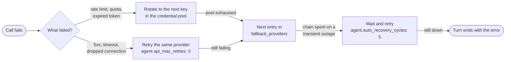

# 03 · Models & Providers

> Pick a main model that can actually drive the agent loop, pay for it the cheapest sensible way, and keep it answering when a provider falls over.

**TL;DR**
- **Choose the main model for tool calling, not for chat.** It needs reliable tool calls, a large context window (Hermes refuses anything under 64K), and prompt caching. Nous Research's own Hermes 4 is a chat model; don't make it the agent.
- **Start with one provider.** Nous Portal is the one-login route (`hermes setup --portal`). OpenRouter or a vendor's own API key is the pay-per-token route. Add more later with `hermes model`.
- **`/model` is session-only by default.** `--global` persists the change and `--once` covers a single turn. Every switch re-reads the whole conversation uncached, so change models between sessions, not inside long ones.
- **Leave reasoning effort at the `medium` default.** Raise it per model with `agent.reasoning_overrides`, or for one turn with `/model <name> --once --reasoning high`.
- **Add one fallback on a different provider** with `hermes fallback add`. Credential pools exist for rate limits, not for everyday rotation.
- **Treat Mixture of Agents as a tool for hard turns** (`/moa <prompt>`), not as your default model.

## What makes a good main model for Hermes

The main model runs every step of the tool loop ([chapter 01](./01-how-hermes-works.md#what-happens-on-one-turn)). A model that writes great prose but fumbles tool calls makes a bad agent. Judge candidates on four things:

| Requirement | Why it matters in Hermes | How to check |
|---|---|---|
| Reliable tool calling | A turn is a chain of tool calls. A model that *describes* the command instead of calling the tool stalls the loop. | Give it a real task in a short session and watch whether tools actually run |
| 64K context minimum, much more preferred | Hermes rejects windows under 64,000 tokens. The fixed prefix alone is ~13,000 tokens, and compression fires at 75% of any window under 512K. | The `Context limit` line at startup, or `/context` |
| Prompt caching | Every call re-sends the prefix and the conversation. The docs put cached reads at a ~75–90% discount. | The status bar's `cache_hit` field ([chapter 05](./05-token-budget.md#lever-2-keep-the-prompt-cache-warm)) |
| Price and speed per call | One turn is several calls. A cheap model that needs twice as many calls isn't cheap. | `hermes insights --days 7`, `display.show_cost: true` |

Hermes already compensates for the model families it has seen slip. With the default `agent.tool_use_enforcement: auto`, model names containing `gpt`, `codex`, `gemini`, `gemma`, `grok`, `glm`, `qwen`, `deepseek` or `muse` get extra "call the tool, don't describe it" guidance. `agent.execution_guidance: auto` adds a verification-discipline block for a similar list. Claude gets neither, because the docs say it doesn't need them ([Tool-Use Enforcement](https://hermes-agent.nousresearch.com/docs/user-guide/configuration#tool-use-enforcement)). That help isn't free: measured on v0.21.4, a Qwen-family model name grows the system prompt from 3,011 to 4,028 tokens (o200k tokenizer, default toolsets).

> [!WARNING]
> Don't run the agent on Hermes 4 (Hermes-4-70B, Hermes-4-405B). The Portal docs are explicit: they're hybrid-reasoning *chat* models, "not recommended for use inside Hermes Agent", and they struggle with multi-step tool loops. Hermes prints a warning if you pick one. Use them through [`hermes proxy`](#use-your-subscription-outside-hermes-hermes-proxy) from other tools instead.

### Model classes (as of September 2026)

Names churn monthly, so choose a class first and then a current model from `/model`. The examples below come from the model catalog that ships with v2026.9.21. Hermes re-fetches the picker lists once they're older than 20 minutes (`model_catalog.ttl_minutes`), and `hermes model --refresh` forces a fresh fetch.

| Class | Use it for | Examples in the catalog |
|---|---|---|
| Frontier | The main model for long, hard, multi-step work. MoA aggregators. | `anthropic/claude-opus-5`, `openai/gpt-6-astra` |
| Everyday workhorse | The main model for everyday agent work at lower cost | `moonshotai/kimi-k3` (tagged *recommended* in the OpenRouter picker), `z-ai/glm-5.2` (the picker's silent default, which upstream describes as "deliberately a capable low-cost model") |
| Fast and cheap | Auxiliary tasks, subagents, cron jobs | `google/gemini-3.8-flash`, `deepseek/deepseek-v4.1-flash`, `openai/gpt-5.4-mini` |
| Free (`:free` on OpenRouter) | Experiments and background side tasks | `nvidia/nemotron-3-ultra-550b-a55b:free`, `z-ai/glm-5.2:free` |

Set a model explicitly. If you configure OpenRouter or Nous Portal but no model, Hermes silently lands on the catalog's default (`z-ai/glm-5.2` today), chosen on purpose so a missing setting never bills the priciest flagship.

The same model can have a different window depending on who serves it. The docs' example is `claude-opus-4.6`: 1M tokens on Anthropic direct, 128K through GitHub Copilot. Check `/context` after switching providers, not the vendor's spec sheet.

## Pick a provider route

`hermes model` is the setup wizard for every route below. It runs OAuth, prompts for keys, writes `model.provider` and `model.default`, and then asks for a reasoning effort.

| Route | Set it up | You pay with | Pick it when | Watch for |
|---|---|---|---|---|
| **Nous Portal** | `hermes setup --portal` on a fresh install, or `hermes model` → Nous Portal | A Nous subscription | You want one login for 300+ models *and* the Tool Gateway (web search, image generation, TTS, cloud browser), with no API keys on disk | Portal routes each model itself and ignores `provider_routing` |
| **OpenRouter** | `OPENROUTER_API_KEY` in `~/.hermes/.env`, or `hermes auth add openrouter --type oauth` (browser login that mints a key) | Per-token credits | You want the widest catalog, `:free` models, and control over which upstream serves you | A 400 or 402 on the first call usually means a wrong model ID or no credits |
| **Vendor API key** | `ANTHROPIC_API_KEY`, `OPENAI_API_KEY` (provider `openai-api`), `GOOGLE_API_KEY` (`gemini`), `DEEPSEEK_API_KEY`, `XAI_API_KEY`, and many more | Per token, per vendor | You want first-party features. Fast mode only reaches first-party endpoints. | One account and one bill per vendor |
| **Subscription OAuth** | `hermes model` → ChatGPT/Codex, GitHub Copilot, xAI Grok OAuth, MiniMax OAuth, Qwen OAuth, or Anthropic OAuth | A plan you already pay for | You already have the plan | What each plan actually covers varies. See the next table. |
| **Custom endpoint** | `hermes model` → Custom endpoint, or a `providers:` entry | Whatever the endpoint charges | LiteLLM, Together, Groq, corporate gateways, anything OpenAI-compatible | Use `key_cmd` when the gateway issues short-lived tokens |
| **Your own hardware** | [Chapter 04](./04-local-models.md) | Electricity | Privacy, offline work, predictable cost | The 64K floor |

Recent additions to the first-class list include Tencent TokenPlan (`tencent-tokenplan`), Nebius Token Factory (`nebius-token-factory`) and Ramp Router (`router`, key `RAMP_ROUTER_API_KEY`). The [providers page](https://hermes-agent.nousresearch.com/docs/integrations/providers) has every ID and environment variable.

### What a subscription plan actually pays for

This is the most common billing surprise. Here is the docs' [subscription table](https://hermes-agent.nousresearch.com/docs/integrations/providers#subscription-plans-what-your-plan-pays-for) in short, plus Copilot:

| Plan | Usable in Hermes? | What gets spent | Gotcha |
|---|---|---|---|
| Claude **Max** via Anthropic OAuth | Yes, with purchased extra-usage credits | **Only** the extra-usage credits, never the base Max allowance | All Hermes usage bills as extra usage while your included allowance sits untouched |
| Claude **Pro** | No | Nothing | Use an `ANTHROPIC_API_KEY` instead |
| ChatGPT plan via Codex OAuth (`openai-codex`) | Yes | Plan-quota semantics aren't documented | Most Codex models get a 272K window on this route. `hermes usage` shows the 5-hour and weekly windows. |
| SuperGrok / X Premium+ (`xai-oauth`) | Yes | Subscription quota for X Search. Inference quota semantics aren't documented. | Some tiers get `HTTP 403` after a successful login. That's an xAI entitlement limit; switch to `XAI_API_KEY`. |
| GitHub Copilot (`copilot`) | Yes | Your Copilot subscription | Classic `ghp_` personal access tokens don't work. Log in through `hermes model` or use a fine-grained token. |
| Gemini consumer plans (Google AI Pro/Ultra) | No documented path | Only API-key quota | Free-tier keys can run dry after a handful of agent turns |

> [!WARNING]
> Hermes borrows your Codex CLI and Claude Code logins when it has none of its own (`auth.adopt_external_logins: true`, new default in v0.21.4). Their refresh tokens are single-use, so two programs on one login can log each other out: "I logged in once in the terminal and Hermes keeps failing." If you run those CLIs alongside Hermes, give Hermes its own login (`hermes auth add openai-codex`, `hermes auth add anthropic`) and set `auth.adopt_external_logins: false` ([Borrowed CLI logins](https://hermes-agent.nousresearch.com/docs/user-guide/security#borrowed-cli-logins)).

Organizations that disable the Codex device-code grant can use `hermes auth add openai-codex --browser`, a PKCE login on `localhost:1455`. On a remote host, that port needs an SSH tunnel.

> [!NOTE]
> The code contains a Nous "free tier" (a single `nous/welcome` model, reached with `/login` or `hermes auth upgrade`). At v0.21.4 it's pre-release and stays off unless a launch flag (`HERMES_GUEST_ONBOARDING=1`) is set. Plan on a real account.

## Switching models without wasting money

Two commands, two jobs:

- **`hermes model`** runs in your shell. It adds providers, runs OAuth, stores keys, and sets the default for new sessions.
- **`/model`** runs inside a session. It switches between providers you've *already* configured and can't add new ones.

What each form of the switch does:

| You type | Scope |
|---|---|
| `/model <name>` | This session only (the default) |
| `/model <name> --global` | This session, and the default in `config.yaml` |
| `/model <name> --once` | The next turn only, then it restores the previous model, even after an error |
| `/model <name> --provider openrouter` | Switches backend too. Session-only unless you add `--global`. |
| `/model <name> --reasoning high` | Model and effort in one step, with the same scope |
| `/model --refresh` | Re-fetches the live model lists |
| `hermes chat -m <model> --provider <provider>` | One run from the shell (`hermes -z … -m <model>` for one-shots) |

Two exceptions to "session-only". The very first pick on a fresh profile persists, so it doesn't evaporate on restart. And `model.persist_switch_by_default: true` brings back the old persist-by-default behavior.

**Every mid-session switch costs one uncached re-read of the whole conversation**, because provider caches are keyed to the model and account ([chapter 05](./05-token-budget.md#lever-2-keep-the-prompt-cache-warm)). `--once` costs two, switching out and switching back. On a 150K-token session that re-read can cost more than the difference between the two models. Hermes asks for confirmation before switching a live session that holds more than 100,000 tokens (`model.switch_context_confirm_tokens`, `0` disables the prompt). Better options:

- Need a different model for a new task? Start a new session: `/new`, then `/model`.
- Need a different model for one side job? Delegate it. `delegation.model` gives subagents their own model and their own context ([chapter 12](./12-multi-agent.md)).
- Need a quick second opinion on the current conversation? `/btw <question>` runs on the auxiliary route and leaves the main cache alone.

Where a config change takes effect: the CLI on its next start, the gateway on each chat's next *new* session (or after `hermes gateway restart`), and a dashboard chat on its next new chat. Running sessions keep their model.

### Aliases for models you switch to often

```yaml
model_aliases:
  deep:
    model: anthropic/claude-opus-5
    provider: openrouter
  cheap:
    model: z-ai/glm-5.2
    provider: openrouter
```

Then `/model deep` in any session, or `hermes chat --model cheap` at startup. Your aliases shadow the built-in short names such as `sonnet` and `opus`. An alias that points at its own endpoint can carry `base_url` plus `key_env`, and its key is never borrowed from whichever provider you were on before.

## Reasoning effort

Thinking tokens bill as output, so effort is a direct cost lever. The levels are `none`, `minimal`, `low`, `medium`, `high`, `xhigh`, `max` and `ultra`. Unset means `medium`. `ultra` is a Hermes-internal step that each route clamps to its strongest real level.

Set it at the narrowest scope that does the job:

| Scope | How |
|---|---|
| Global default | `/reasoning low --global` (writes `agent.reasoning_effort`) |
| Per model | `agent.reasoning_overrides` in `config.yaml` (below) |
| This session | `/reasoning high` |
| One run | `hermes chat --reasoning none …`, or `hermes -z "…" --reasoning none` |
| One turn on a stronger model | `/model <name> --once --reasoning xhigh` |
| One side task | `auxiliary.<task>.reasoning_effort` (for example `low` for compression) |
| Subagents, cron, MoA | `delegation.reasoning_effort`, `hermes cron create … --reasoning-effort low`, and a per-slot `reasoning_effort` in MoA presets |

```yaml
agent:
  reasoning_effort: medium            # global default; empty also means medium
  reasoning_overrides:                # spelling-tolerant: dots or dashes, provider prefix optional
    "anthropic/claude-opus-5": high   # the expensive model only thinks hard when it's the one running
    "z-ai/glm-5.2": low
```

Resolution order: a session-level `/reasoning` change, then the per-model override, then `agent.reasoning_effort`, then the provider default. Overrides follow the model wherever it runs: fallback activation, `/model` switches, cron, resumed sessions.

Two things worth knowing:

- **Hermes sends `medium` to OpenAI-compatible endpoints when you set nothing**, including custom and local ones, unless the model is known not to reason. It doesn't leave the endpoint's own default in charge, because some hosted models default to their ceiling. The docs' example is kimi-k3, whose own default is `max`, about 3× the reasoning tokens of `medium`.
- **`/reasoning show` and `/reasoning hide`** control whether you *see* the thinking. They don't change what it costs.

**Fast mode** (`/fast normal|fast|auto|cold`) is the other speed and price dial. It buys priority processing at a premium, and only on first-party OpenAI/Codex, Anthropic and xAI endpoints. [Chapter 05](./05-token-budget.md#speed) covers when it's worth it.

## Side tasks: auxiliary models

Hermes runs compression, vision, titles, approval classification, the background memory review and more than a dozen smaller jobs as separate "auxiliary" calls. **Every one defaults to `provider: auto`, and `auto` means your main model.** On a frontier main model, your session titles are billed at frontier prices. [Chapter 05](./05-token-budget.md#lever-3-put-side-tasks-on-a-cheap-model) has the cost-routing config. The model-routing facts to know:

- `hermes model` → **Configure auxiliary models** is the interactive per-task picker, including the effort step. Its **Delegation** row writes `delegation.provider` and `delegation.model`.
- `provider: main` means "whatever the main agent uses", and it's only valid inside auxiliary and fallback entries, never as `model.provider`.
- An `auto` task that can't reach the main route tries its own `auxiliary.<task>.fallback_chain`, then your `fallback_providers`, and otherwise **skips the task with a warning**. It never bills a provider you didn't configure. `hermes doctor` resolves every routed auxiliary block and reports the broken ones.
- `auxiliary.free_only: true` makes Hermes refuse any OpenRouter auxiliary model that isn't a `:free` SKU, a hard guarantee that background side traffic never lands on paid credits.
- **Leave `auxiliary.vision` on `auto` if your main model can see.** Any explicit vision backend (a provider other than `auto`, or a `model` or `base_url`) sends every image, browser screenshots included, through a text describer instead of native pixels ([Image Routing](https://hermes-agent.nousresearch.com/docs/user-guide/features/vision#image-routing-vision-capable-vs-text-only-models)). Route vision only for a text-only main model.
- **The compression model's window must be at least as large as your compression trigger.** Hermes refuses a summarizer under 64K. When the summarizer's window is smaller than the main session's trigger, Hermes *lowers the session's trigger* to fit it (`agent/conversation_compression.py`). A 64K summarizer behind a 1M-context main model makes you compact at 64K ([Auxiliary feasibility](https://hermes-agent.nousresearch.com/docs/developer-guide/context-compression-and-caching#auxiliary-feasibility-and-tail-retention)).

## Staying up: retries, fallbacks and recovery

When a call fails, Hermes works down a ladder:



Auth failures (401, 403) and 404s skip the retries and go straight to the fallback chain. The final wait-and-retry step only runs for transient outages (5xx, overloaded, timeouts) before any answer text has reached you. It uses a jittered 15/30/60/60/60-second schedule, honors a provider's `Retry-After` up to 120 seconds, and stops when you press Esc or send `/stop`. Auth, billing, bad-request and content-policy errors never enter it.

**Add a fallback:**

```bash
hermes fallback add      # same picker as `hermes model`; appends to the chain
hermes fallback list     # show the chain in order
hermes fallback remove   # pick an entry to delete
```

That writes a top-level list you can also edit by hand:

```yaml
model:
  provider: nous
  default: anthropic/claude-sonnet-5
fallback_providers:
  - provider: openrouter            # a different provider AND a different vendor
    model: moonshotai/kimi-k3
fallback:
  min_switch_reset_seconds: 120     # rate limit clears within 2 minutes? wait instead of switching
agent:
  api_max_retries: 1                # hand off to the fallback sooner (default 3)
```

How it behaves:

- **Fallback is turn-scoped.** Each new message starts on the primary again, and within one turn the switch happens at most once.
- **It's reset-aware.** When the primary reports a rate-limit reset time, such as a subscription's 5-hour window, Hermes stays on the fallback until then instead of bouncing back each turn. A primary that gives no reset time is benched on an exponential backoff from 60 seconds up to 4 hours.
- **It inherits widely.** Cron jobs, auxiliary tasks on `auto`, and unpinned subagents use the same chain. `delegation.fallback_providers` gives subagents their own chain, and `[]` turns it off for them.
- **It costs a cache miss.** The fallback has no cached prefix for your conversation, and neither does the first call back on the primary. That's the price of staying alive, and the reason to fix a flaky primary rather than live on the fallback.

Pick the fallback for *independence*: a different provider, ideally a different vendor. Falling back from `anthropic` to OpenRouter's copy of the same Claude model survives an Anthropic account problem but may not survive an Anthropic outage. A local model is a documented last entry that keeps working when the internet doesn't ([chapter 04](./04-local-models.md#hybrid-setups)). A MoA preset can be an entry too (`provider: moa`, `model: <preset>`).

## Credential pools: several keys for one provider

A pool holds several API keys or OAuth logins for the **same** provider and rotates between them on rate limits (429), billing errors (402) and expired tokens (401). Pools are tried first. Only when every key is exhausted does the fallback provider take over.

```bash
hermes auth add openrouter                           # add another key (prompted securely)
hermes auth add anthropic --type oauth               # add an OAuth login (Claude Max + extra usage)
hermes auth list                                     # every pool; ← marks the active credential
hermes auth reset openrouter                         # clear cooldowns after topping up
hermes auth priority openai-codex 1 99               # demote credential #1 to the back of the queue
```

Keys already in `.env` join their pool automatically, and numbered siblings (`OPENROUTER_API_KEY_2`, `_3`, …) each become their own entry without the secret being written to `auth.json`. Pick the rotation order per provider:

```yaml
credential_pool_strategies:
  openrouter: round_robin   # fill_first (default) | round_robin | least_used | random
```

Use pools for what they're good at: a shared bot that hits per-key rate limits, or a subscription seat you want to save. `hermes auth priority` moves a Codex login you use interactively to the back, so the gateway spends it last. Don't use pools to spread load for fun. **Every rotation costs a full uncached re-read**, because caches are per account. Two more rules from the docs: two `openai-codex` logins of the *same* OpenAI account share one token family and add no quota, and a login whose refresh token dies is marked `dead` and logged once until you run `hermes auth add <provider>` again.

## OpenRouter provider routing

OpenRouter serves most models from several upstream providers. `provider_routing` picks among them:

```yaml
provider_routing:
  sort: throughput             # price (default) | throughput | latency
  data_collection: deny        # skip upstreams that may store or train on your data
  ignore: ["deepinfra"]        # never use these
  models:                      # per-model pins; unset keys fall through to the flat values
    "anthropic/claude-fable-5.1":
      only: ["anthropic"]      # never let a reseller serve this one
```

The `:nitro` suffix on a model name is a shortcut for throughput sorting, and `:floor` for price. Routing applies to the main agent only. Auxiliary tasks need their own `auxiliary.<task>.extra_body.provider` block, and Nous Portal ignores all of it because it routes centrally. Edit per-model pins in YAML: model IDs contain dots, which `hermes config set` reads as nesting. For coding-heavy work, OpenRouter's experimental `openrouter/pareto-code` router picks the cheapest model above a quality bar that you set with `openrouter.min_coding_score` (default 0.65).

## Mixture of Agents: several models, one answer

Mixture of Agents (MoA) is a virtual provider. Each **preset** has reference models that advise and an **aggregator** that acts. The aggregator writes the reply and makes the tool calls. The references see only the user and assistant text, without the system prompt or tool transcript, so they're cheap calls.

```text
/moa design a rollback plan for this migration
```

`/moa <prompt>` runs that one prompt through the default preset and then restores your model. To stay on a preset, pick it like any model: `/model default --provider moa`, or the *Mixture of Agents* row in `hermes model`.

The shipped default preset asks `openai-codex:gpt-5.5` and `openrouter:deepseek/deepseek-v4-pro` for advice and lets `openrouter:anthropic/claude-opus-4.8` act. Make your own:

```bash
hermes moa list              # presets, and who pays
hermes moa configure review  # create or edit a preset interactively
hermes moa delete review
```

```yaml
moa:
  presets:
    review:
      reference_models:
        - provider: openrouter
          model: openai/gpt-6-astra
          reasoning_effort: high
        - provider: openrouter
          model: deepseek/deepseek-v4-pro
      aggregator:
        provider: openrouter
        model: anthropic/claude-opus-5
      fanout: user_turn       # default: advisors run once per user turn, not per tool step
```

What decides whether it's worth it:

- **The aggregator pays for almost everything.** It runs every step of the tool loop. If your main model is on a subscription but the aggregator isn't, the run bills the aggregator's provider, and `hermes moa list` says so.
- **Advisors are cheap by default.** With `fanout: user_turn` they advise once per message. `per_iteration` re-runs them on every tool step and multiplies their cost. `every_n:3` is the middle ground.
- **The quality lift is real on hard tasks.** On upstream's HermesBench, `claude-opus-4.8` aggregating over a `gpt-5.5` reference scored 0.8202, against 0.7607 and 0.7412 for either model alone ([benchmarks](https://hermes-agent.nousresearch.com/docs/user-guide/features/mixture-of-agents#benchmarks)).
- **It doesn't break the cache beyond a normal switch.** MoA keeps the conversation prefix byte-stable, but selecting a preset and switching back each cost what any `/model` switch costs. `/moa` in a long session pays that twice.

Use it for architecture decisions, hard debugging and reviewing a risky plan. Skip it for routine tool grinding, cron jobs and anything latency-sensitive.

## Use your subscription outside Hermes: `hermes proxy`

`hermes proxy` turns a Hermes-managed OAuth login into a local OpenAI-compatible endpoint for other apps, such as Open WebUI, Karakeep or OpenViking. It serves raw model inference, not the agent. For the agent as an API, use the gateway's API server ([chapter 10](./10-messaging.md)).

```bash
hermes proxy providers                   # nous and xai at v0.21.4
hermes proxy start                       # http://127.0.0.1:8645/v1, Nous Portal by default
hermes proxy start --provider xai        # your SuperGrok / Premium+ login instead
hermes proxy status                      # is each upstream logged in and ready?
```

Point the app at `http://127.0.0.1:8645/v1` with any API key string, because the proxy attaches the real credential. It has **no authentication of its own**, so `--host 0.0.0.0` lets anyone on your network spend your subscription. Keep it on loopback or put real auth in front of it. Port 8645 is also the default for the BlueBubbles (iMessage) webhook and the WeCom callback, so if the gateway runs either one, start the proxy with a different `--port`.

## Recommended setups

Every piece below is a documented option at v0.21.4. Model names are examples from the September 2026 catalog.

| You want | Provider setup | Main model | Side tasks | Fallback |
|---|---|---|---|---|
| **One subscription, zero API keys** | `hermes setup --portal` | An agentic model from the Portal list, for example `anthropic/claude-sonnet-5` or `moonshotai/kimi-k3` | A flash-class Portal model (`provider: nous`, `google/gemini-3.8-flash`) | An OpenRouter key if you have one |
| **Best quality, pay per token** | OpenRouter key, or the vendor's own key | Frontier class: `anthropic/claude-opus-5`, `openai/gpt-6-astra`. Pin `high` effort per model. | Flash class through **Configure auxiliary models** | A frontier model from another vendor on another provider |
| **Cheapest that still works** | OpenRouter key | `z-ai/glm-5.2` or `deepseek/deepseek-v4.1-flash` at `low` or `medium` effort | `:free` models, plus `auxiliary.free_only: true` | A second cheap model from another vendor |
| **A plan you already pay for** | `hermes model` → ChatGPT/Codex, Copilot, xAI Grok OAuth, or Claude Max + extra usage | What the plan offers | A cheap model on a *different* provider, so side tasks don't eat the plan | A pay-per-token key, and `hermes usage` to watch the windows |
| **Privacy first** | Your own hardware ([chapter 04](./04-local-models.md)) | A local model served with at least 64K context | Local, which is the default (`auto` = main) | A cloud model only if your data policy allows it |

In every row, "side tasks" means compression, titles, approval and the background review. Leave `auxiliary.vision` on `auto` unless the main model is text-only.

## Verify it

```bash
hermes status                        # provider, model and keys at a glance
hermes config get model --json       # exactly what new sessions will start on
hermes fallback list                 # the chain, in order
hermes auth list                     # pooled credentials; ← marks the one in use
hermes usage                         # plan windows or credits for the configured provider
hermes -z "Reply with exactly: OK"   # one real call through the whole path
```

`hermes usage` covers Codex 5-hour and weekly windows, Anthropic OAuth windows and OpenRouter credits. Add `--provider openai-codex` to pick one, or `--json` for scripts. It exits `1` when no credential is configured. On Nous Portal, `hermes portal info` confirms you're logged in and actually routing through the Portal. Inside a session, `/status` shows the model you're *actually* on, `/usage` shows tokens plus rate limits, and `/reasoning` alone shows the effort in force.

## Gotchas

- **`hermes config set agent.reasoning_effort low` warns "not a recognized config key".** It still saves, and the key is real: it's what `hermes model` and `/reasoning --global` write. The warning is a validator gap at v0.21.4 (reproduced locally), and `model_aliases.*` triggers the same warning. Use `/reasoning low --global`, and edit aliases in `config.yaml`.
- **`/model` can't add a provider.** If the picker lists only one, quit and run `hermes model` ([FAQ](https://hermes-agent.nousresearch.com/docs/reference/faq#model-only-shows-one-provider--cant-switch-providers)).
- **"It got dumber" is often the wrong model.** A plain `/model` switch doesn't persist, and a dashboard change only affects new sessions. `/status` settles it ([troubleshooting guide](https://hermes-agent.nousresearch.com/docs/guides/troubleshooting-agent-quality#1-check-which-model-the-session-is-actually-using)).
- **Discounted `-contributor` models fail closed in cron and Kanban.** The vendor may train on your prompts, so unattended runs refuse them until you set `security.allow_data_training_tiers_noninteractive: true` ([docs](https://hermes-agent.nousresearch.com/docs/user-guide/configuring-models#unattended-data-training-tiers)).
- **The Claude billing classifier used to trip on Hermes' tool names.** v0.21.1 fixed it by aliasing them on the OAuth wire ([PR #100173](https://github.com/NousResearch/hermes-agent/pull/100173)). If "out of extra usage" errors persist on a current build, you're out of extra-usage credits.
- **An auxiliary override that "didn't take effect"** is usually still on `auto`, pointed at a provider with no credentials, or being checked in a session that started before the change ([docs](https://hermes-agent.nousresearch.com/docs/user-guide/configuring-models#auxiliary-override-didnt-take-effect)).

More symptom-by-symptom fixes live in [chapter 15](./15-troubleshooting.md#models-and-providers).

## Go deeper

- Official: [Configuring Models](https://hermes-agent.nousresearch.com/docs/user-guide/configuring-models) · [AI Providers](https://hermes-agent.nousresearch.com/docs/integrations/providers) · [Nous Portal](https://hermes-agent.nousresearch.com/docs/integrations/nous-portal) · [Reasoning effort](https://hermes-agent.nousresearch.com/docs/user-guide/configuration#reasoning-effort) · [Fallback Providers](https://hermes-agent.nousresearch.com/docs/user-guide/features/fallback-providers) · [Credential Pools](https://hermes-agent.nousresearch.com/docs/user-guide/features/credential-pools) · [Provider Routing](https://hermes-agent.nousresearch.com/docs/user-guide/features/provider-routing) · [Mixture of Agents](https://hermes-agent.nousresearch.com/docs/user-guide/features/mixture-of-agents) · [Subscription Proxy](https://hermes-agent.nousresearch.com/docs/user-guide/features/subscription-proxy) · [Model Catalog](https://hermes-agent.nousresearch.com/docs/reference/model-catalog)
- In this guide: [04 · Local Models](./04-local-models.md) · [05 · The Token Budget](./05-token-budget.md) · [11 · Automation](./11-automation.md) (per-job cron models) · [12 · Delegation & Multi-Agent](./12-multi-agent.md) (subagent models)

---
[← Previous: 02 · Install & First Run](./02-install.md) · [Guide index](../README.md#the-guide) · [Next: 04 · Local Models →](./04-local-models.md)
