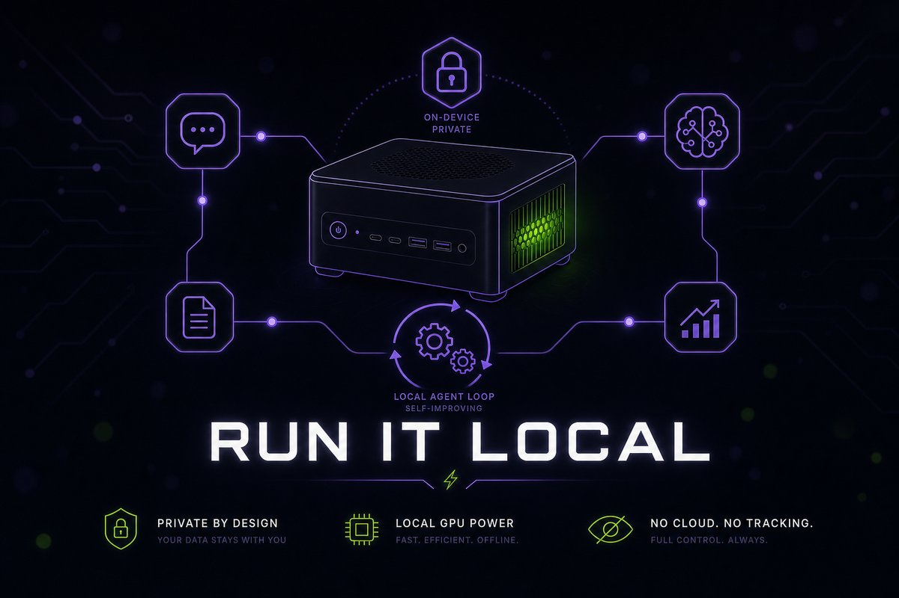

# 04 · Local Models



> Run Hermes on your own GPU or Mac with a model that actually calls tools, a context window Hermes accepts, and a prefix small enough to prefill quickly.

**TL;DR**
- **Local is for privacy, offline work and always-on jobs, not for the hardest reasoning.** Pair a local main model with a cloud fallback for the difficult cases.
- **Serve at least 64K of context, and set it on the server.** Hermes refuses anything smaller. `model.context_length` only tells Hermes what to expect; it can't make the server allocate more.
- **Turn on tool calling on the server**: `--jinja` for llama.cpp, `--enable-auto-tool-choice --tool-call-parser …` for vLLM, and a tools-capable model on Ollama.
- **Trim the prefix for small models.** A `terminal,file` toolset measured about 5,100 tokens per call to prefill, against about 14,000 on defaults.
- **Desktop users can skip the plumbing.** The managed runtime (`hermes desktop --local`) downloads, sizes and serves models for you.
- **Mind the single slot.** The background memory review, session titles and subagents all queue on the same local server as your chat.

## When local makes sense

| Local is a good fit | Cloud is the better fit |
|---|---|
| Private data. Nothing leaves the machine unless *you* add cloud side tasks, web tools or a cloud fallback. | The hardest multi-step reasoning. The docs are blunt: 70B+ or frontier cloud models are "noticeably better". |
| Offline machines and flaky networks | Long contexts. Cloud models offer 100K–1M tokens, while local memory caps you far lower. |
| Always-on gateways and cron jobs where per-token billing adds up | Speed without a GPU. On CPU, a 9B model gives ~10 tokens/s and a 31B model 2–5 tokens/s, 30–120 seconds per response (docs). |
| No rate limits, no provider outages | Reliable memory writes. The docs warn that models under ~30B often *claim* they saved a memory without calling the tool. |

The upstream advice, and the right default: **local for everyday work, a cloud fallback for the hard cases** ([hybrid setups](#hybrid-setups)).

## Hardware reality

Every model call re-sends the fixed prefix, which the server must prefill before it writes a word ([chapter 01](./01-how-hermes-works.md#whats-in-every-request)). On a default v0.21.4 install that's about 13,000 tokens. With a Qwen-family model it's about 14,000, because Hermes adds ~1,000 tokens of tool-use and verification guidance for model families that tend to narrate instead of calling tools. On a slow GPU or CPU, that prefill is the "silent first turn" people report.

Memory is **weights + KV cache + runtime buffers**, and the KV cache grows with the context window. The docs' Mac numbers for a 9B model at 128K context: about 16 GB of KV cache at f16, 8 GB at q8_0 and 4 GB at q4_0, on top of ~5 GB of 4-bit weights.

The managed runtime's catalog (shipped with v2026.9.21) shows what current agent-grade models cost to hold:

| Catalog model | 4-bit download | Notes from the catalog |
|---|---|---|
| Qwen3.8 27B | 16.5 GB | "Best all-round agent model; sees images; long context stays fast" |
| Qwen3.6 35B-A3B | 22.7 GB | "Bigger mixture-of-experts with multi-token prediction; sees images". The only entry marked hardware-validated. |
| Qwen3.8 Flash Next | 111.3 GB | "Frontier-scale model; needs a very large GPU to run well" |
| DeepSeek V4 Flash | 155.1 GB | "Frontier-class model for machines with 128GB+ memory" |

The official sizing: a GPU with 8 GB+ runs the small catalog models comfortably, and 16 GB+ runs the 27–35B models at high quality. When a model outgrows the GPU, the managed runtime spills expert weights to system RAM first and never the attention cache, which costs speed but protects the context window.

**How much context to aim for:** 64K is the floor, not the target. Upstream measured 161 real agentic sessions: 66% finished without compression inside 64K, 82% inside 96K, and 91% inside 144K (`hermes_cli/local_runtime/context_policy.py`). If memory allows, serve 128K.

## Pick a runtime

| Runtime | Best for | Hermes `model.provider` | Default URL | Context is set by | Tool calls need |
|---|---|---|---|---|---|
| Managed runtime (llama.cpp) | Desktop users who want no knobs | `llamacpp` | Picks a free port | Hermes, automatically (≥64K) | Nothing |
| Ollama | The easiest manual setup | `custom` | `http://localhost:11434/v1` | `OLLAMA_CONTEXT_LENGTH` or a Modelfile `num_ctx` | A tools-capable model |
| LM Studio | GUI model management | `lmstudio` | `http://localhost:1234/v1` | The model's settings, or `lms load --context-length` | LM Studio 0.3.6+ and a native-tools model |
| llama.cpp `llama-server` | Full control on Macs, CPUs and consumer GPUs | `custom` | `http://localhost:8080/v1` | `-c` | `--jinja` |
| vLLM | NVIDIA GPU servers, throughput, multi-GPU | `custom` | `http://localhost:8000/v1` | `--max-model-len` | `--enable-auto-tool-choice --tool-call-parser <name>` |
| SGLang | Multi-turn serving with prefix caching | `custom` | `http://localhost:30000/v1` | `--context-length` | `--tool-call-parser <name>` |

`provider: custom` covers any OpenAI-compatible server, and the names `ollama`, `vllm` and `llamacpp` are accepted as aliases. LM Studio is a first-class provider with its own key and URL variables (`LM_API_KEY`, `LM_BASE_URL`).

## Set up the server

### The managed runtime (desktop app)

Hermes can download the official llama.cpp build for your hardware, pick the best 4-bit-or-better build of each model that fits, and run one supervised `llama-server` for you. No account, no key, no context or GPU-layer settings.

```bash
hermes desktop --local   # at v0.21.4 the Local Models UI only appears with this launch flag
```

Then **Settings → Providers → Local Models → Install runtime**, pick a model (each row shows whether it fits your GPU, spills to RAM, or is too big), **Download**, and **Use**. **Find more models** searches Hugging Face with the same fit check, and **Add model file** links a `.gguf` you already have without copying it.

What you get for free:

- Each model starts at the largest window that fits your GPU, never below 64K, and grows toward its native maximum as a conversation needs it. "Context window grown" in the status feed is that happening, not an error.
- Idle models unload after 15 minutes and reload on the next message.
- The background memory review waits until the machine is idle instead of fighting your next prompt for the GPU (`auxiliary.background_review.defer: auto`, which applies to the managed runtime only).

The **Use** button writes the config for you. For headless reference:

```yaml
local_runtime:
  enabled: true          # start the managed llama-server with Hermes
  backend: auto          # auto = CUDA on NVIDIA, Metal on macOS, Vulkan on other GPUs, else CPU
  models_max: 4          # models resident at once
  port: 0                # 0 = any free port (deliberately never 8080)
  detect_ports: [8081]   # extra ports to probe for a llama-server you run yourself; 8080 is always probed
model:
  provider: llamacpp
  default: "<model-id>"  # as the Local Models page lists it
```

Runtime builds and models live under your Hermes home (`runtimes/llamacpp/` and `models/`). If a `llama-server` of your own is already running on 8080, Hermes detects it and uses it instead of starting one. Model downloads happen in the desktop app. On a headless server, run one of the servers below yourself.

### Ollama

```bash
ollama pull gemma4:31b                        # the docs' pick for reliable local tool calling
OLLAMA_CONTEXT_LENGTH=65536 ollama serve      # at least 64000; Ollama's default is far lower on most GPUs
ollama ps                                     # CONTEXT column must show your value
```

For the systemd service, put both settings in a drop-in (`sudo systemctl edit ollama.service`), then `sudo systemctl daemon-reload && sudo systemctl restart ollama`:

```ini
[Service]
Environment="OLLAMA_CONTEXT_LENGTH=65536"
Environment="OLLAMA_KEEP_ALIVE=24h"
```

`OLLAMA_KEEP_ALIVE=24h` stops Ollama from unloading the model after 5 idle minutes, which would add a full reload before the next prefill. To bake the context into one model instead, use a Modelfile:

```bash
printf 'FROM gemma4:31b\nPARAMETER num_ctx 65536\n' > Modelfile
ollama create gemma4-64k -f Modelfile
```

Then point Hermes at it with `hermes model` → **Custom endpoint** (URL `http://localhost:11434/v1`, no key), or in `config.yaml`:

```yaml
model:
  provider: custom
  base_url: http://localhost:11434/v1
  default: gemma4:31b
  ollama_num_ctx: 65536   # the window Ollama really serves; Hermes budgets and compresses against it
```

Set `model.ollama_num_ctx` to match the server. Hermes sizes the window from Ollama's `/api/show`, which reports a Modelfile `num_ctx` if there is one and otherwise the model's *maximum*. A server-wide `OLLAMA_CONTEXT_LENGTH` doesn't show up there. Hermes also sends a `num_ctx` hint with each request, but the docs say plainly that the OpenAI-compatible API can't set Ollama's context, so the server setting is the one that counts.

### LM Studio

```bash
lms server start                                          # http://localhost:1234/v1
lms load <model> --context-length 65536 --estimate-only   # will it fit?
lms load <model> --context-length 65536                   # load it at a size Hermes accepts
hermes model                                              # choose "LM Studio", then pick the model
```

In the GUI, the same setting is the gear icon next to the model → **Context Length** → reload the model. How Hermes treats LM Studio's context:

- **A model that's already loaded keeps its context.** Hermes uses whatever LM Studio reports.
- **On a cold load, Hermes lets LM Studio apply its own per-model setting**, unless you set `model.context_length`. Then Hermes asks LM Studio to load at exactly that size.
- If you rely on LM Studio's just-in-time loading and auto-evict, stop Hermes preloading: `hermes config set model.lmstudio_load_mode jit`.

Set `LM_API_KEY` in `.env` if you turned on server authentication, and `LM_BASE_URL` if LM Studio runs on another machine.

### llama.cpp (`llama-server`)

```bash
llama-server -m ~/models/<model>-Q4_K_M.gguf \
  --jinja \
  -c 65536 \
  -np 1 \
  -ngl 99 \
  -fa on \
  --host 127.0.0.1 --port 8080
```

- `--jinja` is **required** for tool calling. Without it, llama-server ignores the tools and the model prints tool JSON as text. `curl http://localhost:8080/props` should show a `chat_template`.
- `-c` is the *total* context, divided across `-np` parallel slots. `-c 64000 -np 4` gives each slot 16K, below Hermes' minimum. Recent builds default `-c` to the model's training context, which can run out of memory on 128K+ models, so always set it.
- `-ngl 99` offloads every layer to the GPU. `-fa on` enables flash attention.

Connect with `hermes model` → **Custom endpoint** → `http://localhost:8080/v1`, leaving the model name blank to auto-detect a single loaded model. `/model custom` does the same auto-detection inside a session.

### vLLM and SGLang

```bash
vllm serve <model> --port 8000 \
  --max-model-len 65536 \
  --enable-auto-tool-choice \
  --tool-call-parser hermes \
  --gpu-memory-utilization 0.95        # default 0.9; squeezes more context into VRAM
```

- **Pick the parser for your model family**: `hermes` (Qwen 2.5, Hermes 2/3), `llama3_json`, `mistral`, `deepseek_v3`, `deepseek_v31`, `xlam` or `pythonic`. Without both flags, tool calls come back as plain text.
- `--max-model-len auto` finds the largest window that fits, and `--tensor-parallel-size 2` splits a model across two GPUs.
- SGLang: `python -m sglang.launch_server --model <model> --port 30000 --context-length 65536 --tool-call-parser qwen` (or `llama3`, `llama4`, `deepseekv3`, `mistral`, `glm`). SGLang defaults to **128 output tokens**, so raise `--default-max-tokens` or replies get cut mid-sentence. Hermes has no output-token setting of its own.

## The 64K rule

Hermes refuses any main model whose window is under 64,000 tokens, at session start, on `/model` switches and in cron jobs. It also refuses a compression model under 64K. The reason is arithmetic: ~13,000 tokens of fixed prefix plus a working conversation plus the compression tail doesn't fit in less.

Three different numbers get confused here:

| Number | Who controls it | What it does |
|---|---|---|
| The window the **server** allocates | Your server's settings | The real limit. A request that exceeds it is truncated or rejected. |
| `model.context_length` | You, in `config.yaml` | Tells Hermes the window to budget against. It's a pin that wins over detection, and it's dropped when you switch model, provider or base URL. |
| `model.ollama_num_ctx` | You, in `config.yaml` | The window a local server really serves. At 64K or more it satisfies the floor even when model metadata says less. |

The fixes Hermes itself prints when it refuses a local model:

| Server | Remedy |
|---|---|
| Ollama | `OLLAMA_CONTEXT_LENGTH=64000 ollama serve` or a Modelfile `num_ctx`, or set `model.ollama_num_ctx` to the window it really serves |
| llama.cpp | `-c 64000` (per slot: mind `-np`) |
| vLLM | `--max-model-len` of at least 64000 |
| LM Studio | Raise **Context Length** in the model settings and reload the model |
| A hosted server that under-reports | Set `model.context_length` to the real window (still at least 64K) |

The startup banner's `Context limit` line shows what Hermes believes. `(pinned)` next to it means it came from `model.context_length`. On a running gateway, edits to `model.context_length` apply from the next message, with no restart. LM Studio is the one exception to the floor: an explicit `model.context_length` there is accepted below 64K. Don't use it unless you know exactly why.

## Make tool calling reliable

Work through these in order. Most "the model won't use tools" reports stop at step 1.

1. **Server-side tool calling is on.** That means the flags in the runtime sections above. The symptom when it's off: `{"name": "web_search", …}` printed as a message ([docs table](https://hermes-agent.nousresearch.com/docs/integrations/providers#tool-calls-appear-as-text-instead-of-executing)).
2. **The model was trained for tools.** On Ollama, `ollama show <model>` lists its capabilities. The docs' own table marks `gemma2` and `llama3.2:3b` as unable to call tools, and LM Studio shows a tool badge on models with native support.
3. **Hermes coaches it.** `agent.tool_use_enforcement: auto` only adds tool-use guidance for names containing `gpt`, `codex`, `gemini`, `gemma`, `grok`, `glm`, `qwen`, `deepseek` or `muse`. A Llama or Mistral model that keeps saying "I would run…" gets it with `agent.tool_use_enforcement: true`, which measured about 175 tokens of extra prefix. `agent.execution_guidance: true` adds the longer verification-discipline block (about 830 tokens) for models that declare work done without checking.
4. **Streaming isn't mangling tool calls.** Some self-hosted servers break tool calls only when streaming. vLLM with `--tool-call-parser qwen3_xml` plus a reasoning parser can leak tool markup into plain text, so delegated tasks silently do nothing ([#72901](https://github.com/NousResearch/hermes-agent/issues/72901)). The escape hatch is `model.streaming: false`, which forces non-streaming for the session and, since the fix in [#100937](https://github.com/NousResearch/hermes-agent/pull/100937), its subagents too.
5. **Reasoning output isn't swallowing the answer.** If a Qwen reasoning parser in vLLM leaves `content` empty, turn thinking off for that endpoint through a named provider's `extra_body`:

```yaml
providers:
  local-vllm:
    api: http://localhost:8000/v1
    default_model: "<model>"
    extra_body:
      chat_template_kwargs:
        enable_thinking: false   # final answer lands in `content` again
model:
  provider: custom:local-vllm
  default: "<model>"
```

6. **Tool search suits the model.** By default, rarely used tools hide behind three bridge tools and the model *searches* for them. The docs note that smaller models write worse search queries. With a small toolset there's little to defer anyway, so `tools.tool_search.enabled: off` makes every tool direct. Measured with `terminal,file`: 4,800 tokens of prefix with it off, against 5,100 with it on.

Some local tool-calling problems are open upstream with no confirmed fix, such as Qwen 3.5 on Ollama printing tool calls as text. [Chapter 15](./15-troubleshooting.md#known-open-problems-no-confirmed-fix) tracks them.

## Tune Hermes for a small model

Everything in this section, in one mergeable file: [`templates/config/local.yaml`](../templates/config/local.yaml).

### Send fewer tools

Every enabled tool schema is prefilled on every call. Measured offline on v0.21.4 with a Qwen-family model name (58 bundled skills, o200k tokenizer):

| Toolsets enabled | Tools sent | Fixed prefix per call |
|---|---|---|
| Defaults (17 toolsets) | 24 | ≈ 14,000 tokens |
| `terminal`, `file`, `web`, `skills`, `memory`, `session_search`, `todo`, `clarify` | 15 | ≈ 9,900 tokens |
| The same without `skills` (drops the skills index too) | 12 | ≈ 7,000 tokens |
| `terminal`, `file`, `web` | 10 | ≈ 5,600 tokens |
| `terminal`, `file` | 8 | ≈ 5,100 tokens |

Try a set for one run, then make it stick:

```bash
hermes chat -t terminal,file,web             # this session only; nothing is saved
hermes tools disable browser tts image_gen computer_use delegation cronjob code_execution connections vision
hermes prompt-size                           # confirm what every call now carries
```

That `disable` line leaves the eight-toolset row above. Keep `vision` if your model sees images, and `code_execution` if you batch work in scripts (+750 tokens). `web` sends your search queries to outside search services, so drop it for a truly offline agent. Running a local model next to a cloud setup? Put it in its own profile (`hermes profile create local`) so trimming it doesn't touch your main agent.

### Cap what tools can dump

The defaults assume a 128K+ window. One 50,000-character terminal dump is about 12–15K tokens, roughly a fifth of a 64K window. Halve the caps:

```yaml
tool_output:
  max_bytes: 25000          # terminal output kept per call (default 50000)
  max_lines: 1000           # read_file page size (default 2000)
file_read_max_chars: 50000  # one read_file call (default 100000)
```

For tighter windows, the docs' small-model example goes further: 20,000 / 500 / 30,000.

### Compression, reviews and the single slot

- **Compression fires at 75% of a small window**, so at 48K on a 64K model ([chapter 05](./05-token-budget.md#lever-4-compression-that-fires-when-you-think-it-does)). The summary runs on your main model by default, and on slow hardware that one call can take minutes. The managed runtime grows the window instead of compressing when it has room.
- **The background memory review replays the conversation on the same server.** Outside the managed runtime nothing defers it, so on a single-slot server (LM Studio, Ollama, `-np 1`) it can collide with your next prompt. The symptom is "The model server rejected this request as too large, but this conversation is only about N tokens…" with `thread=bg-review` in `logs/agent.log`. The documented fix is to wait and `/retry` ([FAQ](https://hermes-agent.nousresearch.com/docs/reference/faq#context-length-exceeded)). For a permanent fix, give llama-server two slots with double the context (`-c 131072 -np 2` is 64K each), route the review elsewhere, or set `auxiliary.background_review.enabled: false` and run `/refine` when you want a review.
- **Session titles are already safe.** On a custom provider, Hermes sends the title request *after* the reply finishes, so a single-slot server never answers your turn with a title.
- **Subagents queue on the same server.** `delegation.max_concurrent_children` defaults to 10. On one GPU, keep it at 1–2, or route subagents to a cloud model with `delegation.provider` and `delegation.model`.
- **Timeouts relax themselves.** For local endpoints Hermes raises the stream read timeout to 1,800 seconds and the stale-stream ceiling to 900 seconds (`agent.local_stream_stale_timeout`). If a very slow CPU box still times out during prefill, raise `HERMES_STREAM_READ_TIMEOUT` and `HERMES_API_TIMEOUT` above their 1,800-second values in `~/.hermes/.env`.

## Hybrid setups

Mixing local and cloud is where local pays off. Pick a pattern by what must stay private.

**1. Cloud main model, local side tasks.** Offload the high-volume, low-stakes calls to your GPU and keep the cloud bill for the conversation:

```yaml
auxiliary:
  title_generation:
    provider: ollama                  # also vllm or llamacpp; routes through the custom endpoint
    base_url: http://127.0.0.1:11434  # a bare host:port gets /v1 appended
    model: gemma4:31b
  background_review:
    provider: ollama
    base_url: http://127.0.0.1:11434
    model: gemma4:31b
```

Keep **compression** on a cloud model unless your local window is at least the cloud model's compression trigger. A smaller summarizer makes Hermes lower the whole session's trigger to fit it, so a 64K local summarizer behind a 200K cloud model compacts at 64K instead of 150K ([chapter 03](./03-models.md#side-tasks-auxiliary-models)).

**2. Local main model, cloud fallback.** The documented "free for everyday work, paid only when needed" setup:

```yaml
model:
  provider: custom
  base_url: http://localhost:11434/v1
  default: gemma4:31b
  ollama_num_ctx: 65536
fallback_providers:
  - provider: openrouter
    model: moonshotai/kimi-k3
```

Fallback fires on *errors* (server down, overloaded, unreachable), not on weak answers, and each new turn tries the local model first again. To escalate one hard question on purpose, use `/model moonshotai/kimi-k3 --provider openrouter --once`. Either way, that turn's conversation goes to the cloud.

**3. Local main model, cloud helpers.** Summaries on your GPU too slow? Send only compression to the cloud:

```yaml
auxiliary:
  compression:
    provider: openrouter
    model: google/gemini-3-flash-preview   # the docs' example of a fast, cheap model
```

A small local window keeps the trigger low (48K on 64K), so any cloud summarizer with 64K or more fits. The trade-off: the summarizer sees your whole conversation.

Route `auxiliary.vision` to the cloud **only if your local model can't see images.** Any explicit vision backend (a provider other than `auto`, or a `model` or `base_url`) sends every image, browser screenshots included, through a text describer instead of giving the main model the pixels ([Image Routing](https://hermes-agent.nousresearch.com/docs/user-guide/features/vision#image-routing-vision-capable-vs-text-only-models)). With a vision-capable local model, leave it on `auto`: the managed runtime asks the server whether the model sees, and for your own server `model.supports_vision: true` tells Hermes to send images natively.

```yaml
auxiliary:
  vision:                                  # text-only local model ONLY
    provider: openrouter
    model: google/gemini-3-flash-preview
```

**Fully local** needs no auxiliary config at all, because every side task defaults to `auto`, which is the local main model. Check what else leaves the machine: `web` tools, Tool Gateway backends, and any MCP servers you add.

## Apple Silicon notes

- The managed runtime picks Metal automatically (`backend: auto`).
- Unified memory holds the model, the KV cache and everything else you run. The docs' guidance: a 9B model is the sweet spot for 8–16 GB, and 27–35B models need 32 GB or more.
- Quantizing the KV cache is the big lever for llama.cpp on a Mac. It cuts KV memory by about 75% versus f16:

```bash
brew install llama.cpp
llama-server -m ~/models/<model>-Q4_K_M.gguf --jinja -ngl 99 -c 131072 -np 1 -fa on \
  --cache-type-k q4_0 --cache-type-v q4_0 --host 127.0.0.1
```

- **MLX** (served by the omlx app on `http://127.0.0.1:8000`) is the other option. In the docs' M5 Max benchmark with the same 9B model, llama.cpp reached the first token in 67 ms against MLX's 289 ms, while MLX generated faster, 96 tokens/s against 70. Agent loops re-send a large prefix on every call, so don't judge on generation speed alone.
- On an 8 GB Mac, use `q4_0` KV cache and a small model that still fits 64K. If it still doesn't fit, switch to a smaller model or quantization rather than shrinking the window below 64K.

## NVIDIA notes

- The managed runtime uses CUDA builds on NVIDIA GPUs on Windows and Linux. AMD GPUs get Vulkan builds (`backend: vulkan`; `hip` is also accepted).
- Ollama offloads to the GPU automatically. When a model doesn't fit, it splits layers between GPU and CPU (the docs' example: a 31B model on a 12 GB card runs ~40 layers on the GPU). `ollama ps` shows the split.
- vLLM is the multi-GPU and high-throughput option: `--tensor-parallel-size` across cards, `--gpu-memory-utilization` for headroom.
- NVIDIA NIM speaks the same API as build.nvidia.com, so a local NIM or DGX Spark is one variable away: `NVIDIA_BASE_URL=http://localhost:8000/v1 hermes chat --provider nvidia --model <model>`.
- Running Hermes in WSL2 against a server on the Windows side? `localhost` inside WSL2 isn't Windows. Use mirrored networking (Windows 11 22H2+), or the host IP with the server bound to `0.0.0.0` (`OLLAMA_HOST=0.0.0.0` for Ollama). The [WSL2 section](https://hermes-agent.nousresearch.com/docs/integrations/providers#wsl2-networking-windows-users) has the firewall rule.

## Verify it

```bash
curl -s http://localhost:11434/v1/models    # the server answers (use your server's port)
ollama ps                                   # Ollama: CONTEXT ≥ 64000, and how much sits on the GPU
hermes -z "Reply with exactly: OK"          # Hermes reaches the model
hermes -z "Run 'echo tool-ok' with the terminal tool and reply with its output" -t terminal
hermes prompt-size                          # what every call has to prefill
```

The fourth command is the real test. `tool-ok` in the reply means a tool call made the round trip. Raw JSON means server-side tool calling is off. When you start `hermes` interactively, the `Context limit` line should show the window you configured, not 2,048 or the model's 256K maximum.

## Gotchas

- **`model.context_length` doesn't resize the server.** It only tells Hermes. Ollama's context must be set server-side or in a Modelfile ([Ollama section](https://hermes-agent.nousresearch.com/docs/integrations/providers#ollama--local-models-zero-config)).
- **Tutorials that set `OLLAMA_CONTEXT_LENGTH=32768` no longer work.** v0.21.4 refuses anything under 64,000 (`MINIMUM_CONTEXT_LENGTH` in `agent/model_metadata.py`).
- **"Context limit: 2048" at startup** means detection failed or the server reported a tiny window. Fix the server, then pin `model.context_length` ([docs](https://hermes-agent.nousresearch.com/docs/integrations/providers#context-limit-2048-tokens-at-startup)).
- **`provider 'ollama' has no endpoint configured`** means `--provider ollama` found no URL. Hermes refuses to fall back to a cloud key. Add `providers.ollama.base_url: http://localhost:11434/v1` ([docs](https://hermes-agent.nousresearch.com/docs/guides/local-ollama-setup#provider-ollama-has-no-endpoint-configured)).
- **The model "remembered" something that isn't in `MEMORY.md`.** Small models often confirm a save without calling the tool. Check the file, ask explicitly ("use the memory tool to save…"), or do setup on a stronger model ([memory docs](https://hermes-agent.nousresearch.com/docs/user-guide/features/memory#troubleshooting-i-told-it-to-remember-and-the-next-session-it-forgot)).
- **No Local Models page in the desktop app.** At v0.21.4 it's behind a launch flag: start the app with `hermes desktop --local` (`apps/desktop/src/store/local-models-flag.ts`).
- **Replies stop mid-sentence** because the server's own output cap is too low (SGLang defaults to 128 tokens) or the context filled up. Raise the server default ([docs](https://hermes-agent.nousresearch.com/docs/integrations/providers#responses-get-cut-off-mid-sentence)).

## Go deeper

- Official: [Local Models](https://hermes-agent.nousresearch.com/docs/user-guide/local-models) · [Run Hermes Locally with Ollama](https://hermes-agent.nousresearch.com/docs/guides/local-ollama-setup) · [Run Local LLMs on Mac](https://hermes-agent.nousresearch.com/docs/guides/local-llm-on-mac) · [Custom & self-hosted providers](https://hermes-agent.nousresearch.com/docs/integrations/providers#custom--self-hosted-llm-providers) · [Troubleshooting local models](https://hermes-agent.nousresearch.com/docs/integrations/providers#troubleshooting-local-models) · [Tool-Use Enforcement](https://hermes-agent.nousresearch.com/docs/user-guide/configuration#tool-use-enforcement) · [Disabling API streaming](https://hermes-agent.nousresearch.com/docs/user-guide/configuration#disabling-api-streaming)
- In this guide: [03 · Models & Providers](./03-models.md) · [05 · The Token Budget](./05-token-budget.md) · [15 · Troubleshooting](./15-troubleshooting.md)

---
[← Previous: 03 · Models & Providers](./03-models.md) · [Guide index](../README.md#the-guide) · [Next: 05 · Cost & Speed →](./05-token-budget.md)
