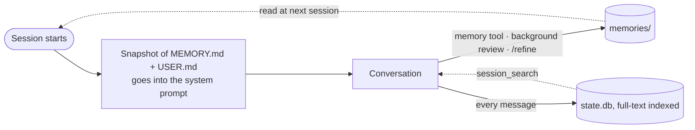

# 07 · Memory

> Make Hermes remember what matters, forget what doesn't, and find anything you discussed months ago, without hauling a bloated prompt into every call.

**TL;DR**
- **Built-in memory is two small files**, `MEMORY.md` (2,200 characters) and `USER.md` (1,375), copied into the system prompt at session start. Keep them for durable facts. Procedures belong in skills and project rules in `AGENTS.md`.
- **Check what it actually saved.** `hermes journey list` shows every entry. Prune monthly, and turn on `memory.write_approval` for shared or production agents.
- **End sessions on purpose.** Memory and session search only pay off across a session boundary, and chat platforms never create one for you. When a task is done, run `/refine`, then `/new`.
- **Past conversations are searchable for free** through `session_search`, but ended sessions are deleted after 90 days by default. Pin the ones you'll want with `hermes sessions pin <id>`.
- **Add an external memory provider only for a specific need**, such as memory shared across profiles or a separate model of each user on a team bot. Only one can be active.
- **Never store secrets in memory.** It goes to your model provider on every call.

## What built-in memory is

Two plain-text files per profile, in `~/.hermes/memories/`:

| File | What it holds | Limit | Typical size |
|---|---|---|---|
| `MEMORY.md` | The agent's own notes: machines, paths, conventions, tool quirks, lessons | 2,200 chars (`memory.memory_char_limit`) | 8–15 entries |
| `USER.md` | Who you are: name, role, timezone, how you like answers | 1,375 chars (`memory.user_char_limit`) | 5–10 entries |

At session start, Hermes renders both into the system prompt. This is the exact block from a v0.21.4 install:

```text
══════════════════════════════════════════════
MEMORY (your personal notes) [11% — 255/2,200 chars]
══════════════════════════════════════════════
Homelab: Proxmox host pve1 (192.168.1.10), Debian 12 VMs. Compose stacks in /srv/stacks, one file per app.
§
Staging (staging.internal) takes SSH on port 2222 with key ~/.ssh/staging_ed25519.
§
Backups: restic to B2 nightly at 02:30 (restic-backup.timer).
══════════════════════════════════════════════
USER PROFILE (who the user is) [6% — 91/1,375 chars]
══════════════════════════════════════════════
Sam, platform engineer, Europe/Berlin. Prefers the answer first, no preamble, metric units.
```

Five properties explain almost every "why did it do that" question:

- **It's a frozen snapshot.** A save hits disk immediately, but the running session keeps the prompt it started with. The new entry shows up in the next new session, or after the next compaction, which reloads memory from disk. Resuming an old session (`hermes -c`, `/resume`) reuses that session's stored prompt, so it doesn't pick up new memory either. That's what keeps the prompt cache warm ([chapter 05](./05-token-budget.md#lever-2-keep-the-prompt-cache-warm)).
- **It's loaded whole, every call.** There is no relevance filtering for built-in memory. (The FAQ's line that memories are "retrieved automatically based on relevance" describes external providers, not these files.)
- **It's bounded, not compacted.** When a write would overflow, the `memory` tool returns an error along with the current entries, and the agent must merge or remove something in the same turn. Nothing is dropped silently. Batched edits apply all-or-nothing and are checked against the final size.
- **It's scanned.** Entries that match prompt-injection or exfiltration patterns are rejected, and a poisoned entry already on disk is replaced by a `[BLOCKED: …]` marker in the prompt.
- **It's per profile.** `hermes -p work` reads `~/.hermes/profiles/work/memories/`. Two profiles never see each other's notes, and two agents must never share one profile: both write memory, and each loads the other's writes at its next session start.

### How entries get written

1. **The agent decides mid-conversation.** The `memory` tool tells the model to save only facts that apply to *every* future session. Lessons tied to one kind of task go into that task's skill instead, and progress logs are skipped.
2. **The background review.** Every 10 user turns (`memory.nudge_interval`), Hermes forks a reviewer that replays the conversation and saves what's worth keeping. Its cost and how to cap it are in [chapter 05](./05-token-budget.md#the-background-review). Cron jobs skip it entirely.
3. **You ask.** "Remember that the NAS is at 10.0.0.5." With weaker models, be explicit: "use the memory tool to save…".
4. **`/refine [focus]`.** Runs the review right now, in a background fork against a snapshot of the conversation. Your live session and its cache are untouched.



## What belongs in memory

Memory is a sticky note that rides along on every call. Everything else has a better home:

| Information | Where it goes |
|---|---|
| Stable facts about your machines, accounts, and projects | `MEMORY.md` |
| Who you are and how you like answers | `USER.md` |
| How to do a recurring task, including your preferences for that task | A skill ([chapter 08](./08-skills.md)) |
| Rules for one repository | `AGENTS.md` ([chapter 06](./06-personality-and-context.md)) |
| Tone, bluntness, personality | `SOUL.md` ([chapter 06](./06-personality-and-context.md)) |
| What you worked on last Tuesday | Nowhere. `session_search` finds it. |
| API keys and passwords | `.env` or a secret manager ([chapter 13](./13-security.md)). Never memory. |

### Hygiene rules

1. **Facts, not orders.** "Prefers bullet lists over paragraphs" is a preference the agent weighs against the situation. "ALWAYS use bullet points" is a standing instruction, and standing instructions belong in `SOUL.md` or `AGENTS.md`, files you write and can see. Memory is written by the agent.
2. **Dense and concrete.** One entry per topic, holding the actual values: host, port, path, command. A vague entry costs characters and changes nothing.
3. **True for months.** If it will change next week, it's not memory.
4. **One source of truth.** Don't repeat what `AGENTS.md` or `SOUL.md` already says. The duplicate costs tokens and drifts out of sync.
5. **No secrets.** The scanner blocks injection patterns, not credentials. A test on v0.21.4 accepted a plaintext password without complaint, and from then on it would go out in every request.
6. **Keep headroom.** The docs suggest consolidating once a store passes 80%. The percentage is in the block header.

| Bad entry | What's wrong | Better |
|---|---|---|
| "User has a project." | Too vague to act on | "~/code/shop: Next.js 15 + Postgres 16. Tests: `pnpm test`." |
| "On Jan 5 the user asked me to look at their API and I discovered it uses Go 1.22 and…" | A story, not a fact | "~/code/api: Go 1.22, sqlc, chi. `make test`. CI on GitHub Actions." |
| "ALWAYS use bullet points!" | An order | In `USER.md`: "Prefers bullet lists over paragraphs." |
| "Fixed the nginx 502 by raising proxy_read_timeout." | A task log | A pitfall line in your deploy skill |
| "Deploy: 1) build 2) push 3) ssh in and…" | A procedure | A skill: `/learn how I just deployed staging` |
| "NAS password is hunter2" | A secret, sent to the provider on every call | `.env`, plus a skill that says which variable to use |
| "Currently debugging the login bug" | Ephemeral | Nothing. `session_search` has it. |

> [!NOTE]
> The official memory page still lists "completed work" as something to save. The `memory` tool's own description, which is what the model actually reads, says to skip completed-work logs. Follow the tool.

## Keep it clean

### See what it saved

```bash
hermes journey list                  # every memory entry and learned skill, with node ids
cat ~/.hermes/memories/MEMORY.md ~/.hermes/memories/USER.md
hermes prompt-size                   # memory and user-profile block sizes
```

In the classic CLI and the TUI, `/journey` opens the same learning timeline, and the desktop app shows it as the Star Map panel. It isn't available on messaging platforms.

### Fix or remove entries

```bash
hermes journey edit <node>           # open one entry in $EDITOR
hermes journey delete <node> -y      # remove a memory entry (a skill node is archived instead)
hermes memory reset --target user    # wipe USER.md only (--target memory | all)
```

Or tell the agent directly: "replace the Python 3.9 note, we're on 3.12 now", or "clean up your memory". It edits with the same tool it writes with.

You can edit the files by hand if you keep the format. Entries are separated by a line containing only `§`, with no blank lines around it. If a hand edit breaks that format, the agent's replace and remove calls are refused until the file is clean again, and Hermes saves a `.bak` copy of what it found. A hand-edited file that's over the character limit still loads, but new additions are blocked until it's back under. For one-off fixes, `hermes journey edit` is the safer path.

### Gate what gets written

On a shared bot, a production agent, or a small local model that "learns" wrong things, review writes before they land:

```yaml
memory:
  write_approval: true             # CLI: prompts inline. Chat, scripts, background review: staged.
display:
  memory_notifications: verbose    # off | on (default) | verbose — gateway notice when the review saves
```

Then review from the CLI or any chat:

```text
/memory pending          # staged writes; ones from the background review are tagged [auto]
/memory approve all      # or approve one by id
/memory reject <id>
/memory approval off     # turn the gate off again (the setting is saved)
```

The gate also covers the background review, which is where most unprompted saves come from. `display.memory_notifications` only changes what the gateway tells you. Reviews still run and write with it set to `off`. You can set it per platform under `display.platforms`.

### Capture lessons on purpose

The best time to save is the end of a productive session. Run `/refine` (optionally with a focus, like `/refine save the deploy steps as a skill`), wait for the result line, then `/new`. The next session starts with the updated snapshot and a short, cheap context.

### A monthly routine

1. `hermes journey list` and read every memory entry.
2. Delete anything stale, wrong, or duplicated: `hermes journey delete <node> -y`.
3. Move procedures into skills and project rules into `AGENTS.md`.
4. `hermes prompt-size`: both blocks should sit comfortably under their limits.

## What memory costs

| Part | Measured on v0.21.4 | Paid |
|---|---|---|
| A full `MEMORY.md` block | 2,500 bytes, ≈ 794 tokens | Every call |
| A full `USER.md` block | 1,726 bytes, ≈ 373 tokens | Every call |
| The `memory` tool schema plus its guidance | ≈ 4.6 KB, roughly 1,000 tokens, even with empty files | Every call |
| The background review | Varies with conversation length | Every 10 user turns ([chapter 05](./05-token-budget.md#the-background-review)) |

Tokens were counted with `o200k_base`. The tool-and-guidance figure comes from switching both stores off, which removed 3,537 bytes of tool schema and 1,051 bytes of guidance text. Because the blocks are frozen for the session, providers that cache bill them at the cached rate after the first call.

Two practical consequences:

- **Don't raise the limits to fix a full memory.** A bigger `memory.memory_char_limit` is a bigger prefix on every call. Consolidate instead.
- **Turn memory off where it adds nothing**, such as a cron-only profile or a public bot that shouldn't learn about its users:

```yaml
memory:
  memory_enabled: false         # both false: no memory tool, no guidance, no snapshot
  user_profile_enabled: false
```

To drop it on one surface only, use `hermes tools disable --platform telegram memory`. Putting `memory` in `agent.disabled_toolsets` turns it off everywhere and also hides any external provider's tools.

## Sessions: recall and retention

### Make boundaries

A Telegram or Discord chat is one continuous session until you send `/new` (or `/reset`). Restarting the gateway or the machine doesn't end it. Memory is read at session start, and the recall habit of "forget, then search past sessions" only kicks in once old context is gone. So a chat that runs for months barely uses either, and every turn drags a long, repeatedly compacted history behind it. Start a new session when a task is finished, the topic changes, or the day starts. On the CLI, every fresh `hermes` is already a new session.

### Search past conversations

Every message from every surface is stored in `~/.hermes/state.db` with SQLite full-text search (FTS5). The `session_search` tool queries it directly. No LLM is involved, a query typically takes tens of milliseconds, and it returns the actual messages, not summaries.

- **Four shapes:** search by query, scroll around a message it found, read a whole session, or browse recent sessions.
- **Time bounds (new in v0.21.4):** `after` and `before` accept an ISO date or a relative span like `7d`, `24h`, or `2w`. If an all-words search comes back empty, it retries with any of the words.
- **Query syntax:** `"exact phrase"`, `docker OR kubernetes`, `python NOT java`, `deploy*`.
- **Cost:** nothing until it's used. It's one of the tools deferred behind tool search, so it doesn't even carry a full schema by default ([chapter 05](./05-token-budget.md#tool-search-is-already-working-for-you)).
- **Compaction loses nothing.** Turns summarized away by compression stay in the database and remain searchable.

Just ask: "search our past sessions for the nginx 502 fix from last month." To look yourself, use `hermes sessions list`, `hermes sessions browse`, or `/resume <name>`.

### Keep what you'll need

```yaml
sessions:
  auto_prune: true      # default since v0.21.1
  retention_days: 90    # ended sessions idle this long are deleted at startup
```

- Only **ended** sessions are deleted. A chat on a messaging platform stays open until you `/new`, so it's never pruned. Automation and one-shot CLI sessions left open past the window are closed first, then deleted one full window later.
- **Pinned sessions are exempt.** Pin the conversations you'll want to search later:

```bash
hermes sessions pin 20260910_141503_a1b2c3d4    # unique prefixes work
hermes sessions pinned                          # list them
hermes sessions unpin 20260910_141503_a1b2c3d4
```

- Want a longer history? Raise `sessions.retention_days`. Turning pruning off entirely (`sessions.auto_prune: false`) lets `state.db` grow without bound. The docs report multi-GB databases within weeks on gateway-plus-cron installs.
- Export before sessions age out: `hermes sessions export --format md --older-than 80` writes one Markdown file per ended session to `~/.hermes/session-exports`.

## External memory providers

External providers run **alongside** built-in memory, never instead of it. Only one can be active at a time. Per the docs, an active provider:

1. adds what it knows to the system prompt,
2. fetches relevant memories before each turn,
3. syncs each turn to its backend after the reply,
4. extracts memories when a session ends (where the provider supports it),
5. mirrors built-in memory writes, and
6. adds its own tools for searching and storing.

### When one is worth it

| You need | Consider |
|---|---|
| Several profiles or agents sharing what they know about you | Any provider. This is the docs' answer to shared memory, since profiles are isolated by design. |
| A team bot that keeps a separate picture of each person | Honcho. Its gateway identity mapping can give each chat user their own peer. |
| Semantic recall over more facts than 3,575 characters can hold | Mem0, Hindsight, Supermemory, or RetainDB |
| Everything on your own machine | Holographic (SQLite, no dependencies), ByteRover (local CLI), Mem0 in OSS mode, Hindsight in local mode |
| A browsable knowledge hierarchy | OpenViking |

For one person on one profile, built-in memory plus `session_search` already covers "know me" and "what did we do". Don't add a service to fix a hygiene problem.

### The eight bundled providers

What each one is, according to the official docs (September 2026):

| Provider | Where your data lives | Cost | The docs' "best for" | Tools |
|---|---|---|---|---|
| Honcho | Honcho Cloud or self-hosted | Paid cloud, free self-hosted | Multi-agent systems, cross-session context, user-agent alignment | 5 |
| OpenViking | Self-hosted | Free (AGPL-3.0) | Self-hosted knowledge management with structured browsing | 6 |
| Mem0 | Mem0 Cloud, your own Mem0 server, or in-process (OSS) | Paid cloud, free self-hosted | Hands-off extraction: Mem0 decides what to keep | 4 |
| Hindsight | Hindsight Cloud or local embedded PostgreSQL | Paid cloud, free local | Knowledge-graph recall with entity relationships | 3 |
| Holographic | Local SQLite | Free | Local-only memory, no external dependencies | 2 |
| RetainDB | RetainDB Cloud | Paid | Teams already on RetainDB | 10 |
| ByteRover | Local, optional cloud sync | Free local, paid cloud | Portable, local-first memory with a CLI | 3 |
| Supermemory | Supermemory Cloud or self-hosted | Paid cloud, free self-hosted | Semantic recall with user profiling | 4 |

`hermes memory --help` names only seven. Supermemory ships too, and `hermes memory status` lists all eight as installed. The docs also describe Memori, a separately installed third-party package, and the curated plugin catalog carries more community memory plugins (`hermes plugins search memory`). Read each catalog entry's disclosure line to see where your data goes.

### Set one up

```bash
hermes memory setup            # pick a provider and configure it (or: hermes memory setup honcho)
hermes memory status           # built-in state, the active provider, installed plugins
hermes memory off              # back to built-in only
```

The same choice is a single key, `memory.provider` (for example `holographic`). API keys go in `.env` (`HONCHO_API_KEY`, `MEM0_API_KEY`, `SUPERMEMORY_API_KEY`, …), and behavior settings usually live in the provider's own file under `~/.hermes/`, such as `honcho.json` or `mem0.json`. Everything is per profile.

### What a provider costs

- **More tool schemas on every call**: from 2 (Holographic) to 10 (RetainDB), per the docs' comparison table.
- **A recall block on each turn.** Hermes attaches the fetched memories to your message, not to the system prompt, so the cached prefix survives. On a trivial prompt it skips the fetch.
- **Work on the provider's side.** Honcho's dialectic reasoning and Mem0's fact extraction are LLM calls billed by that service, or to your own key in self-hosted modes.
- **Your conversation leaves the machine** unless the provider is local or self-hosted.

## Knowledge bases

When you want Hermes to know a book, a spec, or your notes, memory is the wrong tool. These load only when needed:

| Approach | What it is | Use it for |
|---|---|---|
| `/learn <path or URL>` | Distills a book, paper stack, or docs folder into a knowledge-base skill: a lean `SKILL.md` with an index, plus one file per topic under `references/`, each loaded on demand | Reference material you'll consult again and again ([chapter 08](./08-skills.md)) |
| The bundled `llm-wiki` skill | Karpathy's "LLM Wiki" pattern. The agent files sources into an interlinked markdown wiki with an index and a log, at `WIKI_PATH` (default `~/wiki`) | A research area you keep adding to |
| The bundled `obsidian` skill | Reads, searches, creates, and edits notes in your vault with the file tools. The vault path comes from `OBSIDIAN_VAULT_PATH`. | Notes you already keep |
| Official optional skills such as `qdrant`, `chroma`, `pinecone` | Vector-database workflows. Install with `hermes skills install official/mlops/qdrant`. | Large corpora that need semantic search |

The two bundled skills cost an index line each until used. Loading `llm-wiki` reads a 20 KB file (about 4,800 tokens), and `obsidian` about 700 tokens.

## Privacy

| Data | Where it goes | Your controls |
|---|---|---|
| Memory entries | Your model provider, inside every request | Keep secrets out. `hermes journey delete`, `hermes memory reset`. |
| Conversation transcripts | `state.db` on your disk, unencrypted | Auto-prune after 90 days. `hermes sessions delete <id>`. `hermes sessions prune` with filters such as `--source telegram`. Any filter drops the default 90-day bound, so run it with `--dry-run` first. |
| The current CLI session | `state.db` | `/quit --delete` exits and permanently deletes that session's history |
| User and chat IDs on messaging platforms | The system prompt | `privacy.redact_pii: true` hashes user IDs, chat IDs, and phone numbers on WhatsApp, Signal, and Telegram. Discord and Slack are excluded because their mentions need real IDs. |
| Exports you make | Files on disk | `hermes sessions export --redact …`, or `/save md notes.md redact` |
| External provider data | The provider's service, unless self-hosted | Pick a local or self-hosted provider, or `hermes memory off` |
| Debug reports | `hermes debug share` posts logs, including user IDs and message text, to a public paste | Run it with `--local` first ([chapter 13](./13-security.md)) |

> [!WARNING]
> **A shared bot has one memory.** Built-in memory is one pair of files per profile, not per chat user. On a team bot, whatever it learns about Alice lands in the same `USER.md` that goes into Bob's prompt. Give your personal agent its own profile ([recipe 5](./16-recipes.md#5-a-team-telegram-assistant) shows a team bot on a separate one), and on the shared profile either set `memory.user_profile_enabled: false`, keep `memory.write_approval: true`, or use Honcho's per-user peers.

## Verify it

```bash
hermes memory status                     # built-in on, provider (if any)
hermes journey list                      # what's actually saved
hermes prompt-size                       # memory and user-profile block sizes
hermes config get sessions.retention_days
hermes sessions pinned
```

Good looks like this: every entry is a fact you'd still want in six months, both blocks sit well under their limits, and the sessions you care about show up as pinned. In a session, `/memory pending` shows anything waiting for approval, and `/context` lists memory as its own category.

## Gotchas

- **"Done, I'll remember that" doesn't mean it was saved.** Small local models (roughly under 30B) and weak tool-callers often write the confirmation without calling the tool. Check the file, and ask explicitly for the memory tool. ([docs](https://hermes-agent.nousresearch.com/docs/user-guide/features/memory#troubleshooting-i-told-it-to-remember-and-the-next-session-it-forgot))
- **A mid-session save isn't in that session's prompt.** It's frozen by design. `/new` picks it up, and the fact is still in the conversation anyway. ([docs](https://hermes-agent.nousresearch.com/docs/guides/troubleshooting-agent-quality))
- **Wrong profile, wrong memory.** A bot running under `-p work` reads that profile's files, not `~/.hermes/memories/`. `hermes profile list` shows what exists. ([docs](https://hermes-agent.nousresearch.com/docs/user-guide/features/memory#troubleshooting-i-told-it-to-remember-and-the-next-session-it-forgot))
- **Staged writes look like forgotten ones.** With `memory.write_approval: true`, nothing reaches the file until `/memory approve`. ([docs](https://hermes-agent.nousresearch.com/docs/user-guide/features/memory#troubleshooting-i-told-it-to-remember-and-the-next-session-it-forgot))
- **Broken `§` format after a hand edit.** Replace and remove are refused until the file round-trips, and a `.bak` is saved next to it. Fix the separators or use `hermes journey edit`. (`tools/memory_tool_store.py` at v0.21.4)
- **"Rejected as too large" on LM Studio or Ollama, though the conversation is short.** On a single-slot local server, another request is usually holding the context, typically a background review (`thread=bg-review` in `agent.log`). Wait, then `/retry`. If it recurs with no other Hermes process running, the server loaded the model with a smaller window than Hermes assumes: raise the server's context or lower `model.context_length`. The managed local runtime already defers reviews until the GPU is idle. ([FAQ](https://hermes-agent.nousresearch.com/docs/reference/faq#context-length-exceeded), [memory docs](https://hermes-agent.nousresearch.com/docs/user-guide/features/memory#local-models-reviews-wait-for-an-idle-gpu-defer))
- **An external provider seems half on.** If the `memory` toolset is disabled for a platform, the provider's tools and its prompt block are withheld there too. `agent.log` says so. (`agent/memory_manager.py` at v0.21.4)
- **Old conversations vanish from search after 90 days** once they've ended. Pin what matters. ([docs](https://hermes-agent.nousresearch.com/docs/user-guide/sessions#automatic-cleanup))

## Go deeper

- Official: [Persistent Memory](https://hermes-agent.nousresearch.com/docs/user-guide/features/memory) · [Memory Providers](https://hermes-agent.nousresearch.com/docs/user-guide/features/memory-providers) · [Honcho](https://hermes-agent.nousresearch.com/docs/user-guide/features/honcho) · [Sessions](https://hermes-agent.nousresearch.com/docs/user-guide/sessions#session-search-tool) · [Which file does what?](https://hermes-agent.nousresearch.com/docs/user-guide/which-file-does-what) · [My agent feels dumber](https://hermes-agent.nousresearch.com/docs/guides/troubleshooting-agent-quality) · [Privacy settings](https://hermes-agent.nousresearch.com/docs/user-guide/configuration#privacy)
- In this guide: [01 · The learning loop](./01-how-hermes-works.md#the-learning-loop) · [05 · The background review](./05-token-budget.md#the-background-review) · [06 · Personality & Context Files](./06-personality-and-context.md) · [08 · Skills](./08-skills.md)

---
[← Previous: 06 · Personality & Context Files](./06-personality-and-context.md) · [Guide index](../README.md#the-guide) · [Next: 08 · Skills →](./08-skills.md)
