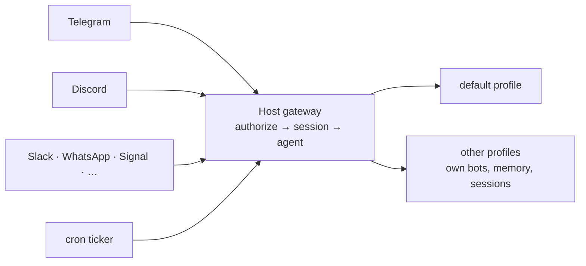

# 10 · Messaging: Chat From Anywhere

> Put your agent in Telegram, and anywhere else you chat, without handing a shell to strangers: one gateway, a tight allowlist, and replies that work well on a phone.

**TL;DR**
- **One gateway process per host serves every profile.** Configure it with `hermes gateway setup`, test it in the foreground with `hermes gateway run`, then `hermes gateway install` so it survives logouts and reboots. Cron jobs only fire while it runs.
- **Start with Telegram:** a BotFather token plus your *numeric* user ID in `TELEGRAM_ALLOWED_USERS`. The dashboard and desktop app's **Create with QR** button sets up both.
- **Access is deny-by-default.** Use allowlists or DM pairing (`hermes pairing approve`). Never turn on allow-all for an agent with a shell.
- **In groups,** turn off BotFather privacy mode (then remove and re-add the bot), require mentions, and keep per-user sessions.
- **Approve risky commands from your phone:** tap **Allow Once**, reply "yes", or send `/approve`. Surfaces nobody watches deny them automatically.
- **Tune each platform.** Trim its toolsets (Telegram's tool schemas drop from about 10,000 to 5,900 tokens per call in [chapter 09](./09-tools-mcp-plugins.md#turn-toolsets-on-and-off)), quiet the tool-progress chatter, and use `/handoff` and `/sethome` to move work between desk and phone.

## How the gateway works

The gateway is one long-running process. It holds a connection to every platform you've configured, keeps one session per chat, runs the agent for each incoming message, and ticks cron every 60 seconds.



Five facts shape everything else in this chapter:

- **One gateway per host serves every profile (v0.21.4).** Each profile brings its own bot tokens. `hermes -p work gateway run` attaches to the running host gateway instead of starting a second one, and `gateway.multiplex_profiles: false` is ignored. If you used to run a gateway per profile, `hermes gateway migrate --dry-run` shows the plan and `hermes gateway migrate` folds them into one. There's no rollback, and the official multi-profile page still describes per-profile gateways and a `--standalone` rollback that v0.21.4 removed.
- **One bot token per profile.** If two profiles configure the same token, the duplicate is parked (`duplicate_credential`) and everything else keeps running. Two *processes* polling one Telegram token produce `409 Conflict` and alternating replies.
- **A chat is one continuous session.** It survives restarts and reboots and ends only when you send `/new` (or `/reset`). Compression stops it from overflowing, but saved memories only reach the agent at a new session, so send `/new` at natural boundaries ([chapter 07](./07-memory.md#make-boundaries)).
- **Replies survive crashes.** Final replies go through a delivery ledger. After a restart, a reply that never went out is re-sent, and one that may have partly arrived is re-sent with a "♻️ Recovered reply" label (up to 3 attempts within 24 hours).
- **In groups, each person gets their own session** (`group_sessions_per_user: true`, the default), so one person's long task doesn't bloat or interrupt anyone else's. Threads stay separate from their parent channel.

## Set it up

```bash
hermes gateway setup     # pick platforms, paste tokens, set allowlists; then it offers to start
                         # the gateway and install it as a service (both default to yes)
hermes gateway status    # running? which platforms connected?
hermes logs gateway -f   # watch the adapters connect while you send a test message
```

- **The service is the normal path.** `hermes gateway setup` ends by offering to start the gateway and install it as a service: systemd on Linux, launchd on macOS, a Scheduled Task on Windows. The first-run `hermes setup` does both without asking, because cron needs a running gateway. After a config change, `hermes gateway restart` lets in-flight replies finish first.
- **Foreground only for debugging.** `hermes gateway run` refuses to start while a service supervises the profile, because two dispatchers would corrupt shared state. To watch it in a terminal, stop the service first (`hermes gateway stop`), or answer no to both service questions and run `hermes gateway install` when you're done.
- **On Linux it's a user service** with lingering, so it survives logout. Want a boot-time system unit instead? Remove the user service first (`hermes gateway uninstall`), or the two will fight over the same bot tokens. [Chapter 14](./14-production.md#or-run-it-as-a-system-service) has the steps.
- The dashboard (`hermes dashboard`) and desktop app have a Messaging page per profile. "Saved" there means the credentials are stored, not that the gateway is running.

## Telegram, end to end

Telegram is the best-supported platform: voice, files, topics, reactions, inline buttons, and streaming all work.

### 1. Create the bot

**Fastest:** Messaging → Telegram → **Create with QR** in the dashboard or desktop app. Scan the code in Telegram. Hermes creates the bot, detects your user ID, writes `TELEGRAM_BOT_TOKEN` and `TELEGRAM_ALLOWED_USERS` to the profile's `.env`, and restarts the gateway.

**By hand:**

1. Message [@BotFather](https://t.me/BotFather), send `/newbot`, and choose a display name and a username ending in `bot`.
2. Copy the token it returns (`123456789:ABC…`). Anyone holding it controls your bot. If it leaks, `/revoke` it in BotFather.
3. Get your **numeric** user ID from [@userinfobot](https://t.me/userinfobot). Your @username won't work.

### 2. Lock it to you, then start it

```bash
# ~/.hermes/.env
TELEGRAM_BOT_TOKEN=123456789:ABCdefGHIjklMNOpqrSTUvwxYZ
TELEGRAM_ALLOWED_USERS=123456789     # numeric IDs, comma-separated
```

Or run `hermes gateway setup` and pick Telegram, which asks for both. Then start or restart the gateway (`hermes gateway restart`), message the bot, and confirm it answers. `/whoami` shows what you're allowed to run, and `/commands` pages through everything available.

### 3. Groups: privacy mode, mentions, allowlists

By default a Telegram bot in a group only sees commands, replies to its own messages, and @mentions, because BotFather's **privacy mode** is on. To let it see ordinary messages, do one of these:

- @BotFather → `/mybots` → your bot → Bot Settings → Group Privacy → **Turn off**. Then **remove the bot from every group and add it back**, because Telegram keeps the old setting for existing memberships.
- Or make the bot a group admin.

Then decide who may trigger it, and when:

```yaml
telegram:
  require_mention: true                  # in groups: answer @mentions, replies, /cmd@bot, and mention_patterns only
  mention_patterns: ["^\\s*hermes\\b"]   # optional wake words (Python regex, case-insensitive)
```

```bash
# ~/.hermes/.env
TELEGRAM_GROUP_ALLOWED_CHATS=-1001234567890   # every member of this group may use it (group IDs are negative)
TELEGRAM_GROUP_ALLOWED_USERS=987654321        # or only these people, in groups only (no DM access)
```

Leave `require_mention` unset and Hermes answers every group message it can see. Chat IDs go in `TELEGRAM_GROUP_ALLOWED_CHATS`. Putting them in the user list still works, but it's deprecated. `telegram.observe_unmentioned_group_messages: true` lets the bot read unmentioned chatter as context while still only answering when triggered.

### 4. Home channel and topics

- **`/sethome`** in a chat makes it the **home channel**: where cron results and `/handoff` sessions land. `TELEGRAM_HOME_CHANNEL` does the same from `.env`.
- **Parallel conversations in one DM:** send `/topic` in your DM with the bot. Every Telegram topic you then create is a separate Hermes session, and the main chat becomes a lobby for commands. This needs **Threaded Mode**, which lives in BotFather's Mini App, not the `/mybots` menu. Operators can instead predefine topics, each optionally with a skill, under `platforms.telegram.extra.dm_topics` ([Telegram docs](https://hermes-agent.nousresearch.com/docs/user-guide/messaging/telegram#private-chat-topics-bot-api-94)).
- In topic mode, cron deliveries to the main chat land in the lobby. Point them at a topic with `TELEGRAM_CRON_THREAD_ID`.

### 5. Voice memos

Send a voice note and Hermes transcribes it and answers the text. Set up transcription and spoken replies once, as described in [Voice](#voice).

### 6. Make it feel native

| You want | Set |
|---|---|
| Replies that type out live | `streaming.enabled: true` (off by default). Telegram DMs then use native draft streaming, and groups fall back to message edits. |
| 👀 → 👍 reactions while it works | `telegram.reactions: true` |
| Real tables, task lists, and math | `platforms.telegram.extra.rich_messages: true`. It's off by default because rich messages are harder to copy as plain text. |
| Fewer phone buzzes | Already the default: only final replies, approval prompts, and command confirmations ring (`display.platforms.telegram.notifications: important`) |
| A footer (model, context %, working directory) on each final reply | `/footer on` |

**Streaming on one platform turns it on for all of them.** With `streaming.enabled: true`, every platform that can edit messages streams, Discord and Slack included, unless you pin them with `display.platforms.<platform>.streaming: false`. That's how the gateway decides at v0.21.4 (`gateway/run_turn_runner.py`, `gateway/display_config.py`). The configuration page says Discord stays off, but the gateway doesn't load that default, so it only holds if your `config.yaml` spells it out.

Two Telegram extras: webhook mode for hosts that sleep between messages needs `TELEGRAM_WEBHOOK_URL` *and* `TELEGRAM_WEBHOOK_SECRET` (the gateway refuses to start without the secret). Files over 20 MB need a [local Bot API server](https://hermes-agent.nousresearch.com/docs/user-guide/messaging/telegram#large-files-20mb-via-local-bot-api-server).

## The other big platforms

Each one is a short setup plus the thing that most often goes wrong. Run `hermes gateway setup` for a guided version of any of them.

### Discord

1. In the [Developer Portal](https://discord.com/developers/applications), create an application and its bot, then turn on **Message Content Intent** and **Server Members Intent**. Without the first, the bot receives empty messages.
2. Invite it from the **Installation** tab with scopes `bot` and `applications.commands`.
3. Get your user ID: Settings → Advanced → Developer Mode, then right-click yourself → Copy User ID.

```bash
DISCORD_BOT_TOKEN=...
DISCORD_ALLOWED_USERS=284102345871466496    # or DISCORD_ALLOWED_ROLES=<role id>
```

In server channels the bot answers @mentions only (`discord.require_mention: true`), and each mention opens a thread (`discord.auto_thread`). List channels where it should answer everything in `discord.free_response_channels`. **#1 gotcha:** a bot that's online but silent has Message Content Intent turned off, or you aren't on its allowlist. Discord fails closed, and the gateway log shows `Unauthorized user: <id> (<name>) on discord` for each dropped message ([Discord docs](https://hermes-agent.nousresearch.com/docs/user-guide/messaging/discord)).

### Slack

```bash
hermes slack manifest --agent-view --write   # writes ~/.hermes/slack-manifest.json
```

At [api.slack.com/apps](https://api.slack.com/apps), choose Create New App → From an app manifest, and paste it. The manifest sets every scope, event, and slash command, and uses Socket Mode, so you need no public URL. Create an app-level token with the `connections:write` scope (Basic Information → App-Level Tokens), install the app to your workspace, and set:

```bash
SLACK_BOT_TOKEN=xoxb-...
SLACK_APP_TOKEN=xapp-...
SLACK_ALLOWED_USERS=U01ABC2DEF3     # Member IDs: profile → ⋮ → Copy member ID
```

Invite the bot to each channel with Slack's `/invite`. Channels need an @mention, and once the bot is active in a thread, follow-ups there don't. **#1 gotcha:** it answers DMs but not channels. That means a missing `message.channels` or `message.groups` event, an app that wasn't **reinstalled** after a scope change, or a bot nobody invited ([Slack docs](https://hermes-agent.nousresearch.com/docs/user-guide/messaging/slack)).

### WhatsApp: bridge or Cloud API

| | Baileys bridge (`hermes whatsapp`) | Business Cloud API (`hermes whatsapp-cloud`) |
|---|---|---|
| Account | Any number, ideally a dedicated one | A Meta Business account and business number |
| Setup | Scan a QR code as a linked device (needs Node 18+) | A Meta app, a permanent token, and a public HTTPS webhook |
| Risk | Unofficial: ban risk, and it breaks when WhatsApp changes its web protocol | Official, no ban risk |
| Limits | Groups work | DMs only. Replies more than 24 h after the user's last message need templates, which Hermes doesn't support yet. |
| Allowlist | `WHATSAPP_ALLOWED_USERS=15551234567` | `WHATSAPP_CLOUD_ALLOWED_USERS` |

For the bridge, also set `WHATSAPP_ENABLED=true` and `WHATSAPP_MODE=bot`. **#1 gotcha (bridge):** a silent bot usually has a badly formatted allowlist (country code, no `+`, no spaces) or a session WhatsApp invalidated. Set `WHATSAPP_DEBUG=true`, run `hermes update`, and re-pair with `hermes whatsapp`. **#1 gotcha (Cloud):** pasting the phone number into the Phone Number ID field. The wizard catches it. Temporary Meta tokens also expire after 24 hours.

### Signal

Hermes talks to `signal-cli` (Java 17+), which runs as a linked device on your number:

```bash
signal-cli link -n "HermesAgent"                                 # scan in Signal → Linked Devices
signal-cli --account +15551234567 daemon --http 127.0.0.1:8080  # keep this running
```

Then set `SIGNAL_HTTP_URL=http://127.0.0.1:8080`, `SIGNAL_ACCOUNT`, and `SIGNAL_ALLOWED_USERS` in E.164 format, **with** the `+`, unlike WhatsApp. Groups are ignored unless `SIGNAL_GROUP_ALLOWED_USERS` lists group IDs (or `*`). Signal can't edit messages, so there's no streaming and no live tool progress. **#1 gotcha:** "Cannot reach signal-cli" means the daemon isn't running. Duplicate replies mean two `signal-cli` instances share one number.

### Email

Give it a dedicated inbox over IMAP/SMTP. Replies thread properly. Gmail needs 2FA and an **app password**:

```bash
EMAIL_ADDRESS=hermes@example.com
EMAIL_PASSWORD=abcd efgh ijkl mnop    # the app password, not your account password
EMAIL_IMAP_HOST=imap.gmail.com
EMAIL_SMTP_HOST=smtp.gmail.com
EMAIL_ALLOWED_USERS=you@example.com
```

Unknown senders are ignored, and automated mail (noreply, bulk, mailing lists) is skipped. The inbox is checked every 15 seconds (`EMAIL_POLL_INTERVAL`). **#1 gotcha:** "Authentication failed" means you used the account password instead of an app password.

### Matrix

Use a bot account on any homeserver. Set `MATRIX_HOMESERVER` and `MATRIX_ACCESS_TOKEN` (Element → Settings → Help & About → Advanced), plus `MATRIX_ALLOWED_USERS=@you:example.org` **and** `MATRIX_ALLOWED_ROOMS` for anything private. The docs recommend both. The bot accepts room invites automatically and needs an @mention in rooms. If your client grabs `/`, use `!` for commands instead. Encrypted rooms need `libolm` and `MATRIX_E2EE_MODE=required`, which fails closed instead of quietly falling back to unencrypted. **#1 gotcha:** it connects, then silently drops every message. The host's clock is running ahead, and the log says `dropped N live events as 'too old'`. Fix the clock with NTP.

### iMessage: BlueBubbles or Photon

| | BlueBubbles | Photon |
|---|---|---|
| Needs | An always-on Mac running BlueBubbles Server | A Photon account and Node 18.17+; no Mac |
| Message path | Your Mac → your gateway, fully self-hosted | Through Photon's hosted service |
| Number | Your Apple ID | A shared free line pool, or a dedicated number on the paid tier |
| Setup | `hermes gateway setup` → BlueBubbles: server URL + password | `hermes gateway setup` → Photon iMessage: device login + line assignment |

Both answer strangers with a pairing code by default, which you approve with `hermes pairing approve bluebubbles <CODE>` (or `photon`). Both support `require_mention` for group chats. **#1 gotcha (BlueBubbles):** a leftover `platforms.bluebubbles.enabled: false` beats saved credentials, so setup reports success and the adapter never starts. Check it with `hermes config get platforms.bluebubbles.enabled`.

### Microsoft Teams

Teams delivers messages to a **public HTTPS** endpoint (local port 3978), so you need a tunnel (devtunnel, cloudflared, ngrok) or a real domain. Microsoft's Teams CLI (`teams app create`) registers the bot and prints the client ID, secret, and tenant ID for `TEAMS_CLIENT_ID`, `TEAMS_CLIENT_SECRET`, and `TEAMS_TENANT_ID`. Allowlist with `TEAMS_ALLOWED_USERS`, using AAD object IDs from `teams status --verbose`. Approvals arrive as Adaptive Cards with Allow and Deny buttons, which accept clicks only from users on `TEAMS_ALLOWED_USERS` (or from anyone, under allow-all). **#1 gotcha:** in `hermes gateway setup`, answering "no" to *Restrict access to specific users?* writes `TEAMS_ALLOW_ALL_USERS=true` (`plugins/platforms/teams/adapter.py`). Answer yes. Free tunnels also change URL on restart, so update the bot's endpoint when yours does.

## Every other platform

All of these run in the same gateway, with the same allowlist and pairing model.

| Platform | Good for | Setup |
|---|---|---|
| Google Chat | Google Workspace teams | [google_chat](https://hermes-agent.nousresearch.com/docs/user-guide/messaging/google_chat) |
| Mattermost | Self-hosted Slack alternative | [mattermost](https://hermes-agent.nousresearch.com/docs/user-guide/messaging/mattermost) |
| SMS (Twilio) | Plain text messages | [sms](https://hermes-agent.nousresearch.com/docs/user-guide/messaging/sms) |
| Home Assistant | Smart-home events and device control | [homeassistant](https://hermes-agent.nousresearch.com/docs/user-guide/messaging/homeassistant) |
| Feishu / Lark, DingTalk, WeCom, WeCom callback, Weixin, QQ, Yuanbao | China and APAC workplace and consumer apps | [feishu](https://hermes-agent.nousresearch.com/docs/user-guide/messaging/feishu) · [dingtalk](https://hermes-agent.nousresearch.com/docs/user-guide/messaging/dingtalk) · [wecom](https://hermes-agent.nousresearch.com/docs/user-guide/messaging/wecom) · [wecom-callback](https://hermes-agent.nousresearch.com/docs/user-guide/messaging/wecom-callback) · [weixin](https://hermes-agent.nousresearch.com/docs/user-guide/messaging/weixin) · [qqbot](https://hermes-agent.nousresearch.com/docs/user-guide/messaging/qqbot) · [yuanbao](https://hermes-agent.nousresearch.com/docs/user-guide/messaging/yuanbao) |
| LINE | Japan, Taiwan, Thailand | [line](https://hermes-agent.nousresearch.com/docs/user-guide/messaging/line) |
| SimpleX | Private chat with no persistent user IDs | [simplex](https://hermes-agent.nousresearch.com/docs/user-guide/messaging/simplex) |
| ntfy | Lightweight push notifications | [ntfy](https://hermes-agent.nousresearch.com/docs/user-guide/messaging/ntfy) |
| IRC | Any IRC network; zero dependencies | [irc](https://hermes-agent.nousresearch.com/docs/user-guide/messaging/irc) |
| Buzz | Block's Nostr-based team chat | [buzz](https://hermes-agent.nousresearch.com/docs/user-guide/messaging/buzz) |
| Raft, A2A | Other agents, not people | [raft](https://hermes-agent.nousresearch.com/docs/user-guide/messaging/raft) · [a2a](https://hermes-agent.nousresearch.com/docs/user-guide/messaging/a2a) |
| Relay (experimental) | Platforms whose credentials must not live on the agent host | [relay](https://hermes-agent.nousresearch.com/docs/user-guide/messaging/relay) |
| Teams meeting summaries | Transcripts → summaries via Microsoft Graph | [teams-meetings](https://hermes-agent.nousresearch.com/docs/user-guide/messaging/teams-meetings) · [msgraph-webhook](https://hermes-agent.nousresearch.com/docs/user-guide/messaging/msgraph-webhook) |
| Open WebUI and other chat UIs | A browser front end through the [API server](#the-openai-compatible-api-server) | [open-webui](https://hermes-agent.nousresearch.com/docs/user-guide/messaging/open-webui) |
| Webhooks | GitHub, GitLab, and anything that can POST | [Chapter 11](./11-automation.md#webhooks-run-on-events) |

## Access control

Treat this section as mandatory. Anyone who can message the bot can drive an agent that has a shell.

### Who gets in

The gateway is **default-deny**. For each message it checks, in order: a per-platform allow-all flag, users approved by DM pairing, the platform allowlist, `GATEWAY_ALLOWED_USERS` (cross-platform), the global allow-all, then deny.

| Platform | Allowlist | ID format |
|---|---|---|
| Telegram | `TELEGRAM_ALLOWED_USERS` | Numeric user ID |
| Discord | `DISCORD_ALLOWED_USERS`, `DISCORD_ALLOWED_ROLES` | Numeric IDs (Developer Mode → Copy ID) |
| Slack | `SLACK_ALLOWED_USERS` | Member ID (`U…`) |
| WhatsApp | `WHATSAPP_ALLOWED_USERS` | `15551234567`: no `+` |
| Signal | `SIGNAL_ALLOWED_USERS` | `+15551234567` or UUID |
| Email | `EMAIL_ALLOWED_USERS` | Addresses |
| Matrix | `MATRIX_ALLOWED_USERS` | `@user:server` |
| Teams | `TEAMS_ALLOWED_USERS` | AAD object IDs |

**Pairing** saves you from collecting IDs. A stranger who DMs the bot gets an 8-character code, and you approve it from a terminal:

```bash
hermes pairing list                        # pending codes and approved users
hermes pairing approve telegram XKGH5N7P
hermes pairing revoke telegram 123456789   # when someone leaves
```

Codes expire after an hour. Requests are rate-limited, and five failed approvals lock pairing for an hour. In the official Docker image, run these as the service user (`docker exec -u hermes …`), or the gateway can't read the approval file.

**Never set allow-all** (`GATEWAY_ALLOW_ALL_USERS=true`, `gateway.allow_all_users: true`, or a per-platform flag like `DISCORD_ALLOW_ALL_USERS`) on an agent with tools. Everyone on the allowlist is fully trusted, so on a shared bot, split admins from users with `allow_admin_from` and `user_allowed_commands` ([chapter 13](./13-security.md#layer-1-who-can-talk-to-it)).

### What strangers see

`unauthorized_dm_behavior` decides what an unknown DM gets back: `pair` (a pairing code), `ignore` (nothing), or `decline` (one polite refusal, then 24 hours of silence). The default depends on your setup, per `gateway/authz_mixin.py`:

- **No allowlist** on that platform: strangers get pairing codes.
- **Once you set an allowlist** (or `GATEWAY_ALLOWED_USERS`): strangers are silently ignored. The sender's ID goes to the log, and once per sender to your home channel, which is how you notice you typed your own ID wrong.
- **Email** always ignores unknown senders unless you opt in.

Set it explicitly when you want something else:

```yaml
unauthorized_dm_behavior: decline                  # everywhere: "I can only chat with my owner"
platforms:
  telegram:
    unauthorized_dm_behavior: pair                 # keep pairing on Telegram even with an allowlist
```

Change the refusal text with the top-level `unauthorized_dm_decline_message` key. A global `pair` doesn't override the allowlist rule. Only a per-platform setting does.

### When it answers in groups

- Mentions: `require_mention` is on by default for Discord, Slack, Matrix, and Mattermost. Telegram answers everything it can see until you set `telegram.require_mention: true`.
- Sessions: keep `group_sessions_per_user: true`. Turning it off makes a room share one transcript, one token bill, and one interrupt button.
- Sensitive work: do it in a DM, not a group where anyone allowed can read the transcript.

## Approvals from chat

When the agent wants to run something dangerous (recursive deletes, `curl | sh`, service restarts, and the rest of the approval list), it asks in the chat and waits. Reply **yes** (or `y`, `ok`, `go`, `approve`) or **no**, or use the commands:

```text
/approve                    # run it once
/approve session            # allow this pattern for the rest of the session
/approve always             # add it to the permanent allowlist
/deny                       # refuse it
/deny use rsync instead     # refuse it and tell the agent why
```

Telegram, Discord, Slack, Teams, and Feishu also show **Allow Once**, **Allow Session**, **Always Allow**, and **Deny** buttons. WhatsApp Cloud offers only Approve and Deny, and Matrix uses reactions. An unanswered prompt is denied after 5 minutes (`approvals.timeout`). Surfaces nobody is watching (webhooks and the API server) deny dangerous commands at once (`approvals.unattended_mode: deny`), and so does cron. `/yolo` switches approvals off, and anyone allowed to run it can use it, which is one more reason to [split admins from users](./13-security.md#layer-1-who-can-talk-to-it). Approval modes are in [chapter 13](./13-security.md#layer-2-what-it-may-run).

## Shape each platform

- **Toolsets.** A phone bot rarely needs `browser`, `code_execution`, or `delegation`. `hermes tools disable --platform telegram browser code_execution delegation tts` cut Telegram's tool schemas from 42,199 to 24,642 bytes, measured ([chapter 09](./09-tools-mcp-plugins.md#turn-toolsets-on-and-off)). MCP servers can be allowlisted per platform too ([chapter 09](./09-tools-mcp-plugins.md#filter-what-the-model-sees)).
- **Chatter.** Out of the box Telegram and Slack show no tool progress and no reasoning. But a `config.yaml` created by the installer (a copy of `cli-config.yaml.example`) sets `display.tool_progress: all` and `display.show_reasoning: true` for the CLI, and those global values override the quiet chat defaults (`gateway/display_config.py`; checked by running its resolver on the seeded file). Pin the chat platforms:

  ```yaml
  display:
    platforms:
      telegram:
        tool_progress: 'off'    # off | new | all | verbose; quote it, or YAML reads a boolean
        show_reasoning: false
  ```

- **Busy agent.** By default a new message interrupts the running turn and redirects it. `display.busy_input_mode: queue` runs follow-ups after the turn instead, and `steer` injects them after the next tool call. `/busy queue` (or `steer`, `interrupt`) changes it from chat and saves it to the profile's config, so it applies to every chat.
- **Per-channel model and prompt.** Give a busy channel a cheap model and a specialist prompt without a second bot:

  ```yaml
  platforms:
    discord:
      channel_overrides:
        "123456789012345678":            # channel or thread ID
          model: openai/gpt-5-mini       # a cheap model for this channel; /model in chat still wins
          system_prompt: "You are the #daily standup assistant."
  ```

  For prompts alone, `telegram.channel_prompts` and its siblings are covered in [chapter 06](./06-personality-and-context.md#per-channel-prompts-and-platform-hints).

## Voice

**Voice in:** voice notes are transcribed automatically (`stt.enabled`, on by default) and handed to the agent as text. The transcript is also posted back as 🎙️ "…" unless you set `stt.echo_transcripts: false`.

- The provider defaults to local faster-whisper. Choose **Local Whisper** in `hermes tools` → Speech-to-Text to install it. Groq (`GROQ_API_KEY`, fast, with a free tier) and OpenAI (`VOICE_TOOLS_OPENAI_KEY`) are the hosted alternatives.
- The language defaults to English (`stt.language: en`), because auto-detection often misreads short clips. If you speak something else, set your language code (`es`, `de`, …). Use `""` for auto-detection only if you switch languages.

**Voice out:**

```text
/voice on        # speak the reply when you sent a voice note
/voice tts       # speak every reply
/voice off       # text only (default)
/voice join      # Discord: join your voice channel and talk live
```

Telegram and Discord get native voice bubbles. WhatsApp gets an MP3 attachment. Edge TTS, the free default, needs `ffmpeg` to make Telegram bubbles, and without it replies arrive as files. `/voice` replies are generated by the gateway itself (`gateway/run_voice.py`), not through the agent's `tts` tool, so you can drop `tts` from a platform's toolsets to save tokens and still get spoken replies.

## Move between surfaces

- **Desk → phone:** in a CLI session, `/handoff telegram` moves the live conversation, with the same session and the full transcript, into a new Telegram topic (or a Discord, Slack, or Matrix thread) in your home channel. It needs a running gateway and a home channel (`/sethome`). Come back later with `/resume <title>`.
- **Branch in chat:** `/branch` in Discord, Telegram, Slack, or Matrix opens the fork as a new thread. `/branch --here` switches in place.
- **Scripts → chat:** `hermes send --to telegram "deploy finished"` posts without an agent or a model call, and it doesn't need the gateway running for bot-token platforms ([chapter 11](./11-automation.md#hermes-send-notify-without-an-agent)).
- **Other agents → chat:** `hermes mcp serve` lets Claude Code or Cursor read and send your messages ([chapter 09](./09-tools-mcp-plugins.md#hermes-as-an-mcp-server)).

### The OpenAI-compatible API server

The gateway can also expose Hermes as an OpenAI-format endpoint for Open WebUI, LibreChat, or your own code:

```bash
# ~/.hermes/.env
API_SERVER_ENABLED=true
API_SERVER_KEY=a-long-random-string    # required, even on loopback
```

Restart the gateway, then point clients at `http://127.0.0.1:8642/v1` (`/v1/chat/completions`, `/v1/responses`, plus Runs and Sessions APIs for streaming and session control). Callers get the full toolset, terminal included, minus `clarify`, `text_to_speech`, and `computer_use`, and dangerous commands are denied because nobody can approve them. Keep it on loopback, or behind a proxy with its own auth ([chapter 13](./13-security.md#exposing-the-dashboard-backend-and-api-server)). In a multi-profile setup, each profile is reached under `/p/<profile>/` with that profile's own key.

## Several bots, several profiles

- **Each profile needs its own bots.** `hermes profile create work --clone` copies settings but not bot tokens. `--clone-channels` copies them too, and two profiles sharing a token get the duplicate parked. Create a new bot for each profile instead.
- **One shared bot, several profiles:** `gateway.profile_routes` sends specific servers, chats, threads, or users of one bot to different profiles, on any platform ([multi-profile docs](https://hermes-agent.nousresearch.com/docs/user-guide/multi-profile-gateways#routing-shared-bot-chats-to-profiles-profile_routes)).
- **Bots in the same room:** bot-authored messages are ignored unless you allow them (`TELEGRAM_ALLOW_BOTS`, `DISCORD_ALLOW_BOTS`). If you do, keep the loop brakes on. Discord bots must type an inline `@mention` (`discord.bots_require_inline_mention`, on since v0.21.4). `telegram.bots_require_mention: true` does the same for Telegram, and `telegram.exclusive_bot_mentions` (on) makes only the mentioned bot answer. As a backstop, the bot-loop guard drops bot messages in a chat for 10 minutes after 20 of them arrive within 5 minutes:

  ```yaml
  gateway:
    bot_loop_guard:
      enabled: true      # defaults shown
      max_events: 20
      window_seconds: 300
      cooldown_seconds: 600
  ```

## Verify it

```bash
hermes gateway status                    # service up, platforms connected
hermes gateway status --deep             # deeper health checks
hermes gateway list                      # every profile and what serves it
hermes pairing list                      # who's pending and who's approved
hermes prompt-size --platform telegram   # what each message costs in tool schemas
hermes logs gateway -n 100               # connection errors, unauthorized senders, parked adapters
hermes send --list                       # targets Hermes can deliver to
```

In chat: `/whoami` shows your access tier, `/status` the session and model, and `/platform list` whether each adapter is running, paused, or tripped by the circuit breaker. A stranger's DM should get a pairing code, a decline, or silence, never an answer.

## Gotchas

- **Telegram is silent in groups.** Privacy mode is on. Turn it off in BotFather *and* remove and re-add the bot, or make it an admin ([Telegram](https://hermes-agent.nousresearch.com/docs/user-guide/messaging/telegram#troubleshooting-works-in-dms-but-not-groups)).
- **Your own bot ignores you: no reply, no pairing code.** The allowlist holds your @username or a typo instead of your numeric ID, so you're treated as a stranger and silently dropped. The gateway log shows the dropped sender's ID, and so does your home channel, once, if you've set one. Put that number in `TELEGRAM_ALLOWED_USERS` ([Telegram](https://hermes-agent.nousresearch.com/docs/user-guide/messaging/telegram#troubleshooting)).
- **`409 Conflict`, or replies alternate between two personalities.** Two processes are polling one token: a leftover `hermes gateway run`, or both a user and a system service. One token, one process ([FAQ](https://hermes-agent.nousresearch.com/docs/reference/faq#can-two-profiles-share-the-same-bot-token), [#2296](https://github.com/NousResearch/hermes-agent/issues/2296)).
- **The bot dies when you close SSH.** A user service without lingering. `hermes gateway install` tries to enable it; otherwise run `sudo loginctl enable-linger $USER`, or install the system service ([Messaging](https://hermes-agent.nousresearch.com/docs/user-guide/messaging#linux-systemd), [#1005](https://github.com/NousResearch/hermes-agent/issues/1005)).
- **Restart loop after adding a systemd drop-in.** An `ExecStopPost=… kill -9` line runs on every stop, including clean restarts, so it kills each fresh start. Remove it with `systemctl --user edit hermes-gateway`, then run `systemctl --user daemon-reload` ([Messaging](https://hermes-agent.nousresearch.com/docs/user-guide/messaging#linux-systemd)).
- **Cron went quiet after `hermes update`.** The gateway kept running the old code. Run `hermes gateway restart`. v0.21.4's `hermes cron status` warns about this ([#117275](https://github.com/NousResearch/hermes-agent/issues/117275)).
- **`hermes gateway restart --platform telegram` restarts everything.** `--platform` is a silently accepted leftover (`hermes_cli/subcommands/gateway.py`). Pause or resume one adapter with `/platform pause telegram` instead.
- **`sudo` fails from chat.** The gateway has no terminal to prompt for a password. Use commands that don't need root, or specific passwordless sudoers entries. Don't put your password in chat ([FAQ](https://hermes-agent.nousresearch.com/docs/reference/faq#sudo-not-working-via-messaging-gateway)).
- **Pairing approval in Docker is ignored.** `docker exec` defaults to root, and the gateway (uid 10000) can't read a root-owned file. Use `docker exec -u hermes …` ([Security](https://hermes-agent.nousresearch.com/docs/user-guide/security#dm-pairing-system)).
- **Port 8645 collisions.** The BlueBubbles webhook, the WeCom callback server, and `hermes proxy` all default to 8645. Move one (`BLUEBUBBLES_WEBHOOK_PORT`, `WECOM_CALLBACK_PORT`) if you run two on one host.

## Go deeper

- Official: [Messaging Gateway](https://hermes-agent.nousresearch.com/docs/user-guide/messaging) · [Telegram](https://hermes-agent.nousresearch.com/docs/user-guide/messaging/telegram) · [Discord](https://hermes-agent.nousresearch.com/docs/user-guide/messaging/discord) · [Slack](https://hermes-agent.nousresearch.com/docs/user-guide/messaging/slack) · [WhatsApp](https://hermes-agent.nousresearch.com/docs/user-guide/messaging/whatsapp) · [WhatsApp Cloud](https://hermes-agent.nousresearch.com/docs/user-guide/messaging/whatsapp-cloud) · [Signal](https://hermes-agent.nousresearch.com/docs/user-guide/messaging/signal) · [Email](https://hermes-agent.nousresearch.com/docs/user-guide/messaging/email) · [Matrix](https://hermes-agent.nousresearch.com/docs/user-guide/messaging/matrix) · [BlueBubbles](https://hermes-agent.nousresearch.com/docs/user-guide/messaging/bluebubbles) · [Photon](https://hermes-agent.nousresearch.com/docs/user-guide/messaging/photon) · [Teams](https://hermes-agent.nousresearch.com/docs/user-guide/messaging/teams) · [Security: user authorization](https://hermes-agent.nousresearch.com/docs/user-guide/security#user-authorization-gateway) · [Unauthorized DM behavior](https://hermes-agent.nousresearch.com/docs/user-guide/configuration#unauthorized-dm-behavior) · [Sessions: cross-platform handoff](https://hermes-agent.nousresearch.com/docs/user-guide/sessions#cross-platform-handoff) · [Voice Mode](https://hermes-agent.nousresearch.com/docs/user-guide/features/voice-mode) · [API Server](https://hermes-agent.nousresearch.com/docs/user-guide/features/api-server) · [Team Telegram assistant guide](https://hermes-agent.nousresearch.com/docs/guides/team-telegram-assistant)
- In this guide: [09 · Tools, MCP & Plugins](./09-tools-mcp-plugins.md) · [13 · Security](./13-security.md) · [14 · Running 24/7](./14-production.md) · [15 · Troubleshooting](./15-troubleshooting.md#messaging-gateway) · [16 · Recipes](./16-recipes.md#5-a-team-telegram-assistant)

---
[← Previous: 09 · Tools, MCP & Plugins](./09-tools-mcp-plugins.md) · [Guide index](../README.md#the-guide) · [Next: 11 · Automation →](./11-automation.md)
