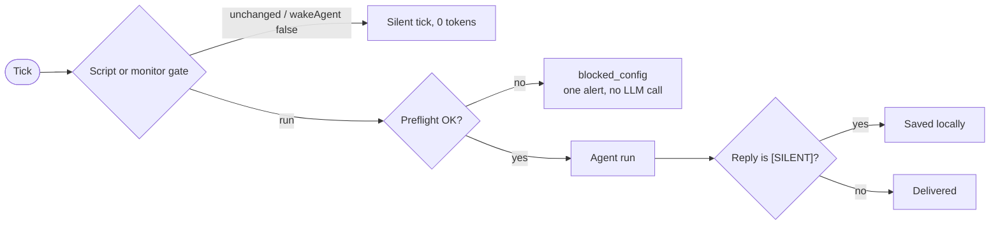

# 11 · Automation

> Make Hermes work while you're away (on a schedule, on an event, or on a loop) without paying for runs that have nothing to do.

**TL;DR**
- **Pick the trigger first.** Schedules are cron, outside events are webhooks, and "keep at it in this chat" is `/goal`, `/loop` or `/heartbeat`. For your own scripts and CI there's `hermes -z` and `hermes send`.
- **Cron only fires while a gateway runs.** `hermes cron status` tells you in one line.
- **Don't pay for empty runs.** Script-only jobs (`--no-agent`) cost zero tokens. Monitor mode and `wakeAgent` gates wake the model only when something changed.
- **Put scheduled work on a cheap model.** Use `cron.model` for the fleet, `--pin` or `--model` for exceptions, `--reasoning-effort low` for summaries, and trim the `cron` platform's toolsets (about 4,100 tokens saved per call, measured).
- **Unattended means nobody can approve.** Cron, webhooks and one-shots deny dangerous commands by default. Keep that, and allowlist specific rules instead.
- **`hermes pause` is the brake.** It stops new cron fires, Kanban dispatch and gateway turns until `hermes resume`.

## Pick the right trigger

| Trigger | Fires when | Runs in | Model cost per fire | Best for |
|---|---|---|---|---|
| Cron job | a schedule | a fresh session on the gateway | one agent run | digests, reports, maintenance |
| Cron `--no-agent` | a schedule | a script on the gateway | **zero** | watchdogs, threshold alerts, heartbeats |
| Cron + monitor or `wakeAgent` gate | a schedule, but only on change | gateway | only when the source changed | page, feed and API watchers |
| Webhook route | another service POSTs to Hermes | gateway, port 8644 | one run per event (zero with `--deliver-only`) | GitHub, CI, alerts, form hooks |
| `/goal` | the judge says "not done yet" | this session | one turn plus a small judge call | "keep going until the tests pass" |
| `/loop` | a timer, or self-paced | this session | one turn per tick | polling CI or a deploy while you work |
| `/heartbeat` | the session is idle and the interval passed | this conversation | one turn per fire | "keep an eye on X in this thread" |
| Hook | the agent does something (tool call, session end) | CLI and gateway | none, it runs your script | formatting, policy checks, notifications |
| System cron + `hermes -z` | your OS scheduler | outside Hermes | one run | CI, and jobs that must run even when the gateway is down |
| `hermes send` | your script decides | outside Hermes | **zero** | pushing a script's output to chat |

The rest of this chapter follows that table from top to bottom. For finished builds (morning briefing, watchdogs, PR reviews), see [chapter 16](./16-recipes.md).

## Cron: scheduled jobs

### The gateway runs the clock

The gateway checks the schedule every 60 seconds and starts each due job in its own fresh agent session. **A plain `hermes` chat does not fire jobs.** On the desktop app, the primary backend ticks every local profile's jobs. On a server you want the gateway installed as a service ([chapter 14](./14-production.md)).

```bash
hermes cron status     # is anything ticking?
```

On a host with no gateway, v0.21.4 answers plainly:

```text
✗ No gateway is running on this host — cron jobs will NOT fire
```

One host gateway serves every profile. Each profile keeps its own jobs, and `hermes -p work cron list` shows that profile's jobs.

### Create a job

Three ways, same result:

- **Ask in chat.** "Every weekday at 7:30, check Hacker News for agent news and send me five bullets on Telegram." The agent uses its `cronjob_manage` tool. In a messaging chat, this or a blueprint is the way in, because `/cron` is a CLI-only slash command.
- **The CLI:**

  ```bash
  hermes cron create "weekdays at 7:30am" \
    "Search the web for news from the last 24 hours about AI agents. Pick the 5 most important, one line each with the URL." \
    --name agent-news --deliver telegram --reasoning-effort low
  ```

- **A blueprint.** `/blueprint morning-brief` asks two questions and schedules it ([below](#blueprints-and-suggestions)).

In an interactive CLI session, `/cron add "every 2h" "Check server status"` does the same as `hermes cron create`.

A job starts with **no memory of the chat that created it**. The prompt must say everything: URLs, repo names, the output format, what to do when there's nothing to report.

### Schedule formats

| You write | Means |
|---|---|
| `in 30m`, `in 2h`, `in 1d` | once, that long from now |
| `30m`, `every 30m`, `every 2h` | **recurring**. A bare duration repeats. |
| `every monday 9am`, `weekdays at 9am`, `daily at 7am`, `monday, wednesday at 18:30` | recurring, at that clock time |
| `0 9 * * 1-5` | standard cron expression (named days like `MON-FRI` work) |
| `2026-10-01T09:00:00` | once, at that time |

Clock times use the `timezone` you set in `config.yaml` (or the `HERMES_TIMEZONE` env var), and otherwise the server's local zone. A VPS in UTC fires "daily at 7am" at 7:00 UTC unless you set it:

```bash
hermes config set timezone Europe/Berlin
```

### Where the output goes

The agent's final reply is delivered for you. There's no send step to write in the prompt.

| `--deliver` | Goes to |
|---|---|
| `origin` | the chat where the job was created (the default for jobs made from messaging) |
| `local` | files under `~/.hermes/cron/output/` only (the default for CLI-created jobs) |
| `telegram`, `discord`, `slack`, … | that platform's **home channel**. Send `/sethome` in the chat once, or set `TELEGRAM_HOME_CHANNEL` and similar ([chapter 10](./10-messaging.md#4-home-channel-and-topics)). |
| `telegram:-1001234567890:17585` | a specific chat, optionally a topic or thread |
| `discord:#ops` | a channel by name |
| `telegram,discord` · `all` | several targets, or every connected home channel |
| `bot-chat` · `bot-chat:research` | a profile's Bot Chat, as a message the bot acts on (each delivery costs that bot a full turn) |

Three reply conventions control what gets sent:

- **`[SILENT]`** as the whole reply, or alone on its first or last line, suppresses delivery. Tell monitors: "If nothing changed, reply with only [SILENT]." The model still runs, so you still pay, and the output is saved locally. A mention mid-sentence is delivered as normal text.
- **`[CRON_FAILURE]` on the first line** marks the run failed even though the agent finished, for example when a script it ran broke.
- **Failures always deliver.** Point them elsewhere with `--failure-deliver slack:C_OPS`, or silence them with `--failure-deliver local`.

`cron.wrap_response: false` drops the "Cronjob Response" header and footer. `cron.mirror_delivery: true` makes deliveries continuable, so you can reply to a brief and the agent has it in context.

### Which model runs it

At fire time Hermes resolves, in order: **a per-job pin → `cron.model` → your main model at that moment.** If you never set either, changing your chat model with `/model --global` changes every job's model on its next run.

```bash
hermes config set cron.model google/gemini-3-flash-preview   # fleet default for unpinned jobs
hermes config set cron.model_provider openrouter
hermes cron edit agent-news --pin                            # lock today's main model onto one job
hermes cron edit agent-news --model <model> --provider <p>   # or pin an explicit model
hermes cron edit agent-news --unpin                          # follow cron.model / main again
```

Per-job `--reasoning-effort` (`none` through `ultra`) overrides your global setting, so summaries can run at `low` while one heavy analysis runs at `high`. The agent can pin a job to *your current* model when you ask it to, but it can't point a job at a different model. Model choice stays with you. For picking the cheap model itself, see [chapter 05](./05-token-budget.md#lever-6-cheaper-models-for-work-that-doesnt-need-the-best).

### What a job knows

- **Loaded:** `SOUL.md` and your memory (`MEMORY.md`, `USER.md`), plus any skills attached with `--skill` (repeat the flag for several; they load in order).
- **Not loaded:** project context files such as `AGENTS.md`, unless you pass `--workdir /abs/path`, which also sets the directory for terminal and file tools.
- **Skipped:** the background memory/skill review. Cron runs don't pay for it.
- **Blocked:** `clarify` and messaging tools. Cron runs also can't manage cron (`cron.allow_agent_scheduling: false`), which prevents a job from scheduling copies of itself.

### Runs that cost nothing, or only on change

Most scheduled checks find nothing new. Don't wake a model to learn that.



| Pattern | Model calls | Flags |
|---|---|---|
| **Script-only.** The script's stdout *is* the message. Empty stdout sends nothing. A non-zero exit sends an error alert. | none, ever | `--no-agent --script check.sh` |
| **Pre-check gate.** The script runs first. A last line of `{"wakeAgent": false}` skips the agent. Other output becomes context for the agent. | only when the script says so | `--script gate.py` |
| **Monitor mode.** Hermes fetches a URL or runs a script and hashes the exact output. Unchanged output means no agent run. A change injects a `MONITOR CHANGE DETECTED` diff into the prompt. | only on change | `--monitor-url URL` or `--monitor-script s.sh` |
| **`[SILENT]`** | every run (delivery is skipped, not the model) | prompt instruction |

```bash
# zero-token watchdog: prints only when something is wrong
hermes cron create "every 15m" --no-agent --script disk-check.sh --name disk-watch --deliver telegram

# pay only when the page changes
hermes cron create "every 2h" "Summarize what changed on the pricing page in 3 bullets." \
  --monitor-url https://example.com/pricing --name pricing-watch --deliver telegram
```

Scripts live in `~/.hermes/scripts/`. Files ending `.sh` or `.bash` run under bash, anything else under Hermes' Python. Scripts **don't inherit your provider keys**. If one needs a credential, name it under `terminal.env_passthrough` and put the value in `.env`. Monitor output must be stable: a timestamp in it counts as a change on every tick. Worked versions of both are in [recipes 2 and 3](./16-recipes.md#2-zero-token-watchdogs).

### Memory between runs

Recurring jobs start blank each time. Three ways to carry state:

- **`--continuity`**: each run sees its own previous output, so a news scout can skip what it already reported. Turn it off with `hermes cron edit <job> --no-continuity`.
- **Chaining**: ask the agent to create a job with `context_from` another job. Job B then gets job A's latest output prepended.
- **Notepad**: a small key-value store per job (16 KB per value, 64 KB per job). Once it holds at least one key, every run sees the values and the command to update them in its prompt, and the job updates them through its terminal tool. An empty notepad adds nothing to the prompt, so seed the first key yourself:

  ```bash
  hermes cron notepad <job_id> set last_seen_issue 4812
  hermes cron notepad <job_id>          # list
  ```

### Trim what every cron run carries

By default, cron runs get the full default toolset. Measured on a fresh v0.21.4 install (the tool schemas a cron run actually receives, counted with the `o200k_base` tokenizer): **23 tools, about 9,600 tokens on every model call.** A digest job doesn't need a browser, text-to-speech, subagents or a code sandbox:

```bash
hermes tools disable --platform cron browser tts delegation code_execution
```

That leaves 14 tools, about 5,500 tokens: **4,100 tokens less per call** for every job on the host. Keep `delegation` if your jobs fan out to subagents. For a single job, ask the agent to set `enabled_toolsets` on it. That overrides the platform list for that job only. `hermes prompt-size --platform cron` shows the list. It also counts `clarify`, which cron removes at run time, so its total reads about 1.7 KB high.

### Keep an eye on the fleet

| Command | What it tells you |
|---|---|
| `hermes cron list` | every job: `[active]` or `[paused]`, schedule, pinned model, last run, failure streak, `delivery_failed` |
| `hermes cron status` | whether the scheduler is alive, when it last ticked, and any overdue job |
| `hermes cron runs <job_id> --limit 20` | the durable log of attempts (`completed`, `failed`, `unknown`) |
| `hermes cron incidents` · `hermes cron incidents ack <id>` | repeating failures, and silencing one you've accepted |
| `hermes cron doctor` | read-only health check. Exits `1` while any finding stands, so it works as a watchdog. |

Failure handling is built in, so you don't need to script it:

- **Misconfigured jobs cost nothing.** Preflight (`cron.preflight: true`) checks keys, skills and delivery targets before building an agent. A broken job becomes `blocked_config`, sends one alert, and makes no LLM call.
- **Network blips re-run for free.** A run that failed before any model call (Wi-Fi still reconnecting after sleep) retries after 5, 15 and 30 minutes (`cron.retry_unreachable`).
- **One alert per problem.** The same error repeating alerts once, then at most one reminder per `cron.failure_repeat_alert_hours` (6) while it keeps failing. After 3 failures in a row (`cron.failure_nudge_threshold`), the alert suggests pausing or fixing the job.
- **Missed slots run once.** If the gateway was down, a recurring job catches up with one run, not one per missed slot. `cron.catch_up_missed: false` skips the catch-up instead.
- **Due jobs start in parallel.** Set `cron.max_parallel_jobs: 1` to run them one at a time. Staggering heavy jobs (`0 9` and `5 9`) is still kinder to provider rate limits.

Each run's full output is saved under `~/.hermes/cron/output/<job_id>/`, keeping the newest 50 files per job (`cron.output_retention`). To see what cron costs, every agent run appends a line (job, tokens, model, duration, whether the reply was silent) to `~/.hermes/cron/usage_audit.jsonl`. That file isn't in the docs; it comes from `cron/scheduler.py` at v0.21.4.

```bash
jq -s 'group_by(.job_id) | map({job: .[0].job_id, runs: length,
       tokens: (map(.total_tokens // 0) | add)})' ~/.hermes/cron/usage_audit.jsonl
```

### Unattended safety

- **Dangerous commands are denied** (`approvals.cron_mode: deny`), and the agent has to find another way. If a job truly needs one command, add a narrow glob for it (say, `git push *`) to `command_allowlist`, which cron honors. That's far narrower than switching `cron_mode` to `approve`. Avoid broad rule keys such as `recursive delete`, which would let every job run any matching command ([chapter 13](./13-security.md#yolo-and-the-allowlist-traps)).
- **Start new jobs paused.** `hermes cron create … --paused --paused-reason "review first"` writes the job without scheduling it. Then run `hermes cron resume <job>` followed by `hermes cron run <job>` to fire it once while you watch.
- **Runaway loops stop themselves.** Unattended runs hard-stop repeating tool-failure loops by default. For turn and time ceilings, see [chapter 05](./05-token-budget.md#guardrails-against-runaway-spend).
- **Prompts are scanned** for injection and exfiltration patterns when a job is created or edited.

## Webhooks: run on events

A webhook route turns an HTTP POST from GitHub, a CI system or a monitoring tool into an agent run, a zero-token message, or a cron job fire.

### Turn it on

```bash
# ~/.hermes/.env  (or run: hermes gateway setup, and pick Webhook)
WEBHOOK_ENABLED=true
WEBHOOK_PORT=8644                 # the default
WEBHOOK_SECRET=replace-with-a-long-random-string   # e.g. from: openssl rand -hex 32
```

Restart the gateway, then check `curl http://localhost:8644/health` for `{"status": "ok", "platform": "webhook"}`. Senders POST to `http://your-host:8644/webhooks/<route-name>`.

### Create routes from the CLI

Dynamic subscriptions go live immediately, with no restart. They're stored in `~/.hermes/webhook_subscriptions.json`:

```bash
# zero-LLM push: the rendered template IS the message
hermes webhook subscribe deploy-done --events push \
  --prompt "Deployed {repository.full_name}: {head_commit.message}" \
  --deliver telegram --deliver-only

# agent triage, with a filter script that drops noise before any model call
hermes webhook subscribe new-issues --events issues \
  --prompt "New issue #{issue.number}: {issue.title}\n{issue.body}\nLabel it and suggest an owner." \
  --script issue-filter.py --deliver slack --deliver-chat-id C0123456789

hermes webhook list
hermes webhook test new-issues --payload '{"issue": {"number": 1, "title": "test"}}'
```

The subscribe command prints the URL and an auto-generated HMAC secret for the sender. `{dot.notation}` pulls fields from the JSON payload, and `{__raw__}` dumps all of it. The flags worth knowing:

| Flag | Does |
|---|---|
| `--deliver-only` | skips the agent. Zero tokens, sub-second. |
| `--script <file>` | a filter or transform in `~/.hermes/scripts/`. Empty output, `[SILENT]` or a non-zero exit ignores the event. |
| `--cron-job <id-or-name>` | fires an existing cron job instead of a fresh run ([below](#fire-a-cron-job-from-an-event)) |
| `--route-profile coder` | binds the route to a profile: only `/p/coder/webhooks/<name>` is accepted, and the run happens as that profile |
| `--skills a,b` | loads skills for the run |

Declarative `filters`, debouncing bursts with `coalesce`, and per-route `toolsets` live in `config.yaml` under `platforms.webhook.extra.routes`. See the [route reference](https://hermes-agent.nousresearch.com/docs/user-guide/messaging/webhooks#configuring-routes).

### Fire a cron job from an event

This gives you polling-free automation. Keep the job's schedule as a slow fallback sweep, and let the event fire it the moment something happens:

```bash
hermes webhook subscribe pr-feedback --events pull_request_review \
  --cron-job pr-review-sweeper \
  --prompt "PR #{number} got new review feedback from {review.user.login}: {review.body}"
```

The job's own prompt, skills, model and delivery apply. The rendered template arrives as one-time context for that run only. A burst of events can't double-fire a job that's already running, paused jobs are never fired, and the POST returns `202` immediately.

### Example: GitHub PR review

The official [walkthrough](https://hermes-agent.nousresearch.com/docs/guides/webhook-github-pr-review) plus [recipe 4](./16-recipes.md#4-pr-reviews-on-autopilot) cover the full build. The parts people get wrong:

- **The payload has no diff.** The prompt has to tell the agent to run `gh pr diff`, and `gh` has to be authenticated on the gateway host.
- **Webhook runs have no terminal by default.** The webhook toolset is four tools (`web_search`, `web_extract`, `vision_analyze`, `clarify`), because payload text is attacker-controlled. Grant `toolsets: [terminal]` on that one route in `config.yaml`. The CLI can't grant tools, so an agent can't give its own subscription a shell.
- **Filter before the model wakes.** A route `filters` entry on `action` (only `opened` and `synchronize`) is cheaper than a prompt that says "stop if the action is closed". The prompt approach still pays for a run.
- **Contain it.** Run that gateway on a container terminal backend ([chapter 13](./13-security.md#put-the-shell-in-a-box)), use a `gh` token scoped to one repo, and keep `approvals.unattended_mode: deny`.
- **No public URL?** The [cron-polling PR agent](https://hermes-agent.nousresearch.com/docs/guides/github-pr-review-agent) works behind NAT.

### What protects a webhook

Every route needs a secret: the route's own or the global `WEBHOOK_SECRET`. The only exception is `INSECURE_NO_AUTH` for testing, and the adapter refuses to start with it on anything but loopback. Each route is limited to 30 requests per minute. Delivery IDs are deduplicated for an hour, and bodies over 1 MB are rejected. Dangerous commands are denied instantly on webhook runs (`approvals.unattended_mode: deny`). A valid signature proves who *sent* the event, not who wrote the PR title inside it.

## In-session automation: `/goal`, `/loop`, `/heartbeat`

These three keep one conversation working. They fire only while the process that owns the session runs (your CLI, or the gateway for chats), and their state survives `/resume`. All three inject ordinary user-role turns, so the prompt cache stays warm, and a message you type always takes priority.

| | `/goal` | `/loop` | `/heartbeat` |
|---|---|---|---|
| Next turn fires when | the judge says "not done" | the interval passes (or self-paced) | the session is idle and the interval passed |
| Ends on | done, blocked, 20-turn budget, or you | `LOOP_COMPLETE`, `--times`, `--until`, 100 ticks, or you | `/heartbeat clear` |
| Extra model calls | one small judge call per turn | a judge call per tick only with `--until` | none |
| Minimum interval | n/a | 30 s | 60 s |
| Best for | one objective with a definition of done | polling something external | a standing check-in that needs this thread's context |

### `/goal`: keep going until it's done

```text
/goal Make tests/api pass without changing any public function signature
/goal gate add uv run pytest -q tests/api
/subgoal add a regression test for the empty-token bug
/goal status
```

- **Gates make "done" mechanical.** Each gate is a shell command that must exit 0 before the judge is even asked. A red gate feeds its output back as the next instruction. It gets 3 retries and a 5-minute timeout, then the goal pauses. On messaging platforms, `/goal gate add` needs a configured gateway admin ([admins vs users](https://hermes-agent.nousresearch.com/docs/user-guide/messaging#admins-vs-regular-users)).
- **Contracts sharpen the judge.** Add `verify:`, `constraints:`, `boundaries:` and `stop when:` lines under the goal. `/goal draft <text>` has the judge model expand a one-liner into a contract, sets it, and shows it to you.
- **The budget is `goals.max_turns` (20).** When it runs out, the goal pauses. `/goal resume` gives it another 20.
- **The judge runs on your main model** unless you route `auxiliary.goal_judge` to a cheap one. Its call is small and happens every turn ([chapter 05](./05-token-budget.md#lever-3-put-side-tasks-on-a-cheap-model)). A judge error counts as "continue", so the turn budget is the real backstop.

### `/loop`: poll on a timer

```text
/loop 5m check https://status.example.com and tell me when the deploy is green --until the deploy reports success
/loop keep an eye on the migration log and summarize progress
/loop stop
```

With an interval, it fires on that clock. Without one, it paces itself: it starts at 1 minute and backs off to 15 while replies stay the same, which makes idle waits cheap. Every tick is a full turn, so match the interval to how often the thing actually changes. `loops.max_ticks` (100) is the backstop. There's one loop per session, and an active `/goal` takes priority over it.

### `/heartbeat`: a recurring nudge in this thread

```text
/heartbeat every 15m Check whether CI for PR #1234 finished; summarize the result when it does
/heartbeat clear
```

It fires only when the session is idle, and missed ticks collapse into one. On the gateway, a heartbeat turn with nothing to say can reply `[SILENT]` and post nothing. Use it when the check needs this conversation's context. When it doesn't, a cron job is cheaper, because it doesn't re-send the whole conversation on every fire.

### Driving a busy agent

| You want | Use |
|---|---|
| A follow-up to run after this turn | `/queue <prompt>` (and `/queue list`, `edit`, `rm`) |
| To redirect without interrupting | `/steer <prompt>`. It arrives after the next tool call. |
| Enter to queue or steer instead of interrupting | `/busy queue` or `/busy steer` (config: `display.busy_input_mode`) |
| An independent task in the background | `/bg <prompt>` ([chapter 12](./12-multi-agent.md)) |
| To stop the running work and its background processes | `/stop` |

## Hooks: react to what the agent does

Hooks run *your* code at lifecycle points, not a model call. The only token cost is context a `pre_llm_call` hook injects, or a model your script calls itself. For automation, three kinds matter:

```yaml
hooks:
  post_tool_call:                    # shell hook: format every Python file the agent writes
    - matcher: "write_file|patch"
      command: "~/.hermes/agent-hooks/auto-format.sh"
  outbound:                          # signed POST to your CI when a session ends or a subagent stops
    - name: ci-notify
      url: https://ci.example.com/hermes-events
      events: [on_session_end, subagent_stop]
      secret_env: HERMES_OUTBOUND_WEBHOOK_SECRET
```

- **Shell hooks** receive JSON on stdin. `post_tool_call` reacts after a tool runs, `pre_llm_call` can inject context, and `on_session_end` or `subagent_stop` can log or notify. Blocking policy gates (`pre_tool_call`, exit code 2, `fail_closed`) are in [chapter 09](./09-tools-mcp-plugins.md#hooks).
- **Consent.** Each new `(event, command)` pair asks for approval once. In the gateway, cron and CI nobody can answer, so a new hook **stays unregistered** until you approve it: set `hooks_auto_accept: true`, or run with `--accept-hooks` or `HERMES_ACCEPT_HOOKS=1`. The approval is tied to the command string, not the file's contents, so `hermes hooks doctor` flags scripts edited since you approved them.
- **Outbound webhooks** are notify-only and can't block anything. They're signed with HMAC when you give a secret, and retried once.
- **Gateway hooks** are `~/.hermes/hooks/<name>/HOOK.yaml` plus `handler.py`, on events like `gateway:startup`, `agent:end` and `command:*`. The popular "run a `BOOT.md` checklist on every gateway start" is a documented pattern you build yourself, not a built-in.

```bash
hermes hooks list                                   # configured hooks and consent status
hermes hooks test post_tool_call --for-tool write_file  # fire matching hooks on a synthetic payload
hermes hooks doctor                                 # exec bit, consent, edits since approval, timing
```

## Blueprints and suggestions

A blueprint is a ready-made cron job with a few blanks to fill. It's the fastest route for non-technical automations, and it works from every surface:

```text
/blueprint
/blueprint morning-brief
/blueprint morning-brief time=07:30
/suggestions
/suggestions catalog
/suggestions accept 1
```

Bare `/blueprint` lists the 16 built-ins: morning brief, important-mail monitor, weekly review, price watch, competitor watch, habit check-in and more. `/blueprint <name>` has the agent ask for the blanks one at a time. Adding `slot=value` pairs skips the questions and creates the job at once. The dashboard's Cron page has the same catalog as forms. Afterwards they're ordinary cron jobs, managed like any other.

`/suggestions` is the inbox for *proposed* automations. In v0.21.4 they come from the curated catalog and from skills you install that carry a `blueprint:` block. Installing such a skill never schedules anything. Dismissed suggestions are never offered again. The important-mail monitor scores messages with the cheap `auxiliary.monitor` model and only speaks up above a threshold.

## Scripting Hermes from the shell and CI

### `hermes -z`: one prompt in, one answer out

```bash
hermes -m google/gemini-3-flash-preview --provider openrouter --usage-file ./usage.json \
  -z "Read ./CHANGELOG.md and write a 5-line release note for the latest version" > release-note.txt
echo "exit $?"
jq '.total_including_auxiliary.estimated_cost_usd' ./usage.json
```

Stdout carries only the final answer. `--usage-file` writes tokens, cost, and completion flags even when the run fails. Its `total_including_auxiliary` includes side calls like titles and compression. `-z` does **not** read stdin, so name files in the prompt and let the agent read them. For untrusted text, use `hermes chat -Q --query-file -`, which takes the prompt from stdin without any shell interpretation.

Judge a run by its exit code, not by whether it printed something:

| Exit | `hermes -z` | `hermes chat -Q` / `-q` without a TTY / `--format stream-json` |
|---|---|---|
| `0` | completed | completed |
| `1` | completed but produced no text | failed, stopped partway, hit a budget, or never started |
| `2` | failed or stopped partway (also bad flags) | n/a |
| `130` | interrupted | interrupted |
| `75` | n/a | a Kanban worker hit a provider rate or quota limit (the dispatcher requeues) |

One-shots deny dangerous commands (`approvals.single_query_mode: deny`). They can spawn at most 2 subagents in total (`delegation.oneshot_max_children`), and they wait for those subagents to finish before exiting.

### `--format stream-json`: watch it work

```bash
hermes chat -q "Run the test suite and summarize the failures" --format stream-json \
  | jq -c 'select(.type == "tool_use" or .type == "result")'
```

Each line is one JSON event: `system` (init), `text` deltas, `tool_use`, `tool_result` (output capped at 5,000 chars), and a final `result` with `exit_code`, token counts including cache reads and writes, and `duration_ms`. It requires `-q` or `--query-file` and implies quiet mode.

### `hermes send`: notify without an agent

```bash
if ./deploy.sh; then
  hermes send --to telegram "deploy finished"
else
  tail -n 50 deploy.log | hermes send --to telegram --subject "deploy FAILED"
fi
hermes send --to discord:#ops --file report.md
hermes send --list                        # every target Hermes can reach
```

It reuses the gateway's credentials. For bot-token platforms (Telegram, Discord, Slack, Signal) it doesn't need a running gateway. Put `MEDIA:<path>` in the text to attach a file. Exit codes are `0` sent, `1` delivery failed, `2` usage error. For a watchdog that alerts about the Hermes host itself (out of memory, disk full), the docs recommend a bare `curl` to your chat API instead, because Python may not start on a box that's thrashing.

### System cron or Hermes cron?

Use **Hermes cron** by default: delivery routing, incidents, `doctor`, continuity, notepads, model pinning. Use **your OS scheduler plus `hermes -z`** when the job must run even if the gateway is down, or when it belongs to an existing CI or crontab setup. Cron's `PATH` is minimal, so use full paths:

```text
15 6 * * 1-5  $HOME/.local/bin/hermes -z "Summarize yesterday's ERROR lines in /var/log/app.log in 5 bullets" | $HOME/.local/bin/hermes send --to telegram --subject "App errors"
```

`command -v hermes` prints the right path. The default per-user install links `~/.local/bin/hermes`.

## The emergency brake

```bash
hermes pause --reason "provider outage"   # no new cron fires, Kanban dispatch, or gateway turns
hermes resume
```

From a messaging chat, `/pause` does the same (it's gateway-only), and `/pause off` lifts it. Slash commands keep working while paused, so you can't lock yourself out.

- **In-flight work finishes.** Nothing is killed and nothing is lost. Due jobs catch up on the first tick after you resume.
- **Explicit runs are an override.** `hermes cron run <job>` still runs while paused.
- **Scope follows the profile.** From the default profile, the pause covers every profile on the host. `hermes -p work pause` pauses only `work`.
- It's a plain file. `touch ~/.hermes/ESTOP` engages it from any shell, even if Hermes itself won't start.

## Verify it

```bash
hermes cron status        # must NOT say "No gateway is running"
hermes cron list          # [active] jobs, pinned models, last run "ok", no failure streak
hermes cron doctor; echo $?   # 0 = no findings
hermes cron runs <job_id> --limit 5
hermes prompt-size --platform cron   # tool schemas after trimming
curl -s http://localhost:8644/health # {"status": "ok", "platform": "webhook"}
hermes webhook list
hermes hooks doctor
```

Then fire each new job once on purpose: `hermes cron run <job>` for cron, and `hermes webhook test <name>` for a dynamic webhook subscription. Check that the message arrives where you expect.

## Gotchas

- **A bare duration repeats.** `30m` means every 30 minutes, and `in 30m` means once (verified against the schedule parser in `cron/jobs.py` at v0.21.4). The [cron troubleshooting page](https://hermes-agent.nousresearch.com/docs/guides/cron-troubleshooting#check-2-confirm-the-schedule-is-correct) and the script-only guide still describe `30m` as one-shot, and the troubleshooting page's "jobs run sequentially within a tick" is also stale.
- **`hermes cron runs` and `hermes cron notepad` need the job ID.** Names don't resolve there. `notepad` given a name silently reads and writes a notepad for a job that doesn't exist (verified on v0.21.4). `pause`, `resume`, `run`, `edit` and `remove` accept names.
- **`hermes cron resume --run-now` and `--at` only work on one-shot jobs.** For a recurring job, `resume` it, then `hermes cron run` it.
- **Cron went quiet after `hermes update`.** On older builds the gateway kept running old code, and its ticker skipped every tick while `cron status` stayed green. v0.21.4 fixes both sides: `cron status` warns "Gateway is running STALE code", and `hermes update` restarts a stale gateway itself. A supervised one comes back on the new code; one you started by hand stops and needs `hermes gateway restart` ([#117275](https://github.com/NousResearch/hermes-agent/issues/117275), fixed by [PR #117501](https://github.com/NousResearch/hermes-agent/pull/117501)).
- **Unpinned jobs follow your main model.** Switching your chat model to something slow or pricey switches every unpinned job too. Set `cron.model` or `--pin` ([cron docs](https://hermes-agent.nousresearch.com/docs/user-guide/features/cron#moving-unpinned-jobs-to-a-new-global-default)).
- **Put `[SILENT]` on a line of its own.** v0.21.4 suppresses delivery only when the marker is the whole reply or its own first or last line (`cron/scheduler.py`). A report that says it mid-sentence gets delivered. The [troubleshooting page](https://hermes-agent.nousresearch.com/docs/guides/cron-troubleshooting#check-2-check-silent-usage) still describes the older any-mention rule.
- **`hermes webhook test` only knows dynamic subscriptions**, not routes in `config.yaml`. Test those with a signed `curl` ([webhook PR guide](https://hermes-agent.nousresearch.com/docs/guides/webhook-github-pr-review#local-testing-with-ngrok)).
- **Long jobs time out after 600 s of inactivity.** Raise it with `HERMES_CRON_TIMEOUT` (0 = unlimited), or better, move the collection work into a script ([troubleshooting](https://hermes-agent.nousresearch.com/docs/guides/cron-troubleshooting#check-2-common-error-patterns)).

## Go deeper

- Official: [Scheduled Tasks (Cron)](https://hermes-agent.nousresearch.com/docs/user-guide/features/cron) · [Script-only cron](https://hermes-agent.nousresearch.com/docs/guides/cron-script-only) · [Cron troubleshooting](https://hermes-agent.nousresearch.com/docs/guides/cron-troubleshooting) · [Webhooks](https://hermes-agent.nousresearch.com/docs/user-guide/messaging/webhooks) · [Persistent goals](https://hermes-agent.nousresearch.com/docs/user-guide/features/goals) · [Loops](https://hermes-agent.nousresearch.com/docs/user-guide/features/loops) · [Heartbeats](https://hermes-agent.nousresearch.com/docs/user-guide/features/heartbeat) · [Hooks](https://hermes-agent.nousresearch.com/docs/user-guide/features/hooks) · [Automation blueprints](https://hermes-agent.nousresearch.com/docs/guides/automation-blueprints) · [CLI reference: one-shots and stream-json](https://hermes-agent.nousresearch.com/docs/reference/cli-commands#hermes-chat) · [Pipe script output](https://hermes-agent.nousresearch.com/docs/guides/pipe-script-output)
- In this guide: [05 · The Token Budget](./05-token-budget.md) · [12 · Delegation & Multi-Agent](./12-multi-agent.md) · [13 · Security](./13-security.md) · [14 · Running 24/7](./14-production.md) · [16 · Recipes](./16-recipes.md)

---
[← Previous: 10 · Messaging](./10-messaging.md) · [Guide index](../README.md#the-guide) · [Next: 12 · Delegation & Multi-Agent →](./12-multi-agent.md)
