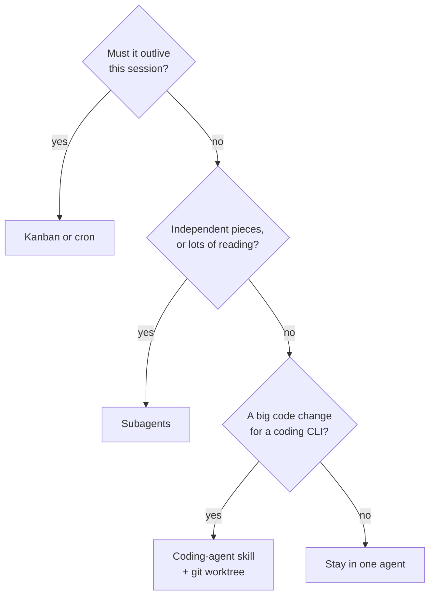

# 12 · Delegation & Multi-Agent

> Split work across agents only when it buys you something (a clean context, parallel speed, a cheaper model, or work that has to outlive the session), and pick the lightest mechanism that does the job.

**TL;DR**
- **Default to one agent.** Split when a subtask would flood your context, when independent pieces can run in parallel, or when the work has to survive a restart.
- **Subagents (`delegate_task`) are the everyday tool.** Each child gets a fresh context, only its summary comes back, and up to 10 run at once. Put them on a cheap model with `delegation.model`.
- **Every child pays for its own prompt.** A default child re-sends about 7,700 tokens of tool schemas on every call (measured). Fan out for reading and research, not for five-line tasks.
- **For code, let Hermes drive a coding CLI** (the Claude Code, Codex and OpenCode skills) and give every parallel writer its own git worktree.
- **Kanban is for durable work:** named profiles, retries, human unblocks and an audit trail. It needs a running gateway.
- **Profiles are separate agents, not sandboxes.** Bot Mode, `hermes peer` and A2A connect agents across the desktop app, machines and frameworks.

## Do you need more than one agent?

| Split when… | Because | Use |
|---|---|---|
| A subtask would dump lots of intermediate output (read 30 files, crawl 10 pages) | only the summary reaches your context | subagents |
| Independent pieces can run at the same time | wall-clock time | a subagent batch, or Kanban fan-out |
| Executing is easier than planning | the volume can run on a cheap model | `delegation.model`, cheap Kanban worker profiles |
| The work must survive restarts, wait for a human, or retry | durability | Kanban, or cron ([chapter 11](./11-automation.md)) |
| Jobs need different identities, memory, keys or permissions | isolation | profiles |

Stay with one agent when the next step depends on the last one, when the task needs your answers (subagents can't ask you anything), when it's a couple of tool calls, or when two workers would edit the same files.



One habit that applies to every pattern below: **a child's summary is a self-report.** Hermes' own tool description says so. Ask for something you can check, such as an absolute path, an ID, a test result or a URL, and check it before you build on it or tell anyone it's done.

## Subagents: `delegate_task`

### What a child gets

- **A fresh conversation** with only the `goal` and `context` the parent writes. It gets no chat history, no `SOUL.md` and no memory. When the parent has a working directory, the child also sees that project's `AGENTS.md` (or equivalent).
- **The parent's toolsets**, minus `delegate_task`, `clarify`, `memory`, `send_message` and cron management. It keeps `execute_code`. The model can't grant a child tools the parent doesn't have.
- **Its own terminal session**, with the parent's provider, keys and credential pool unless you configure otherwise.
- **Background execution.** At the top level, delegation returns immediately, you keep chatting, and the result arrives as a new message. A batch reports once, when every child has finished. Sessions with no later turn to receive results (one-shot runs and cron jobs) wait for their children instead.

Measured on a fresh v0.21.4 install (parent on the default CLI toolsets, `o200k_base` tokenizer): a child carries **21 tools, about 7,700 tokens of schemas, on every model call it makes**. That's cheap next to 30 files of output landing in *your* context. It's expensive for a task you could have done in two tool calls.

### Ask for it

You rarely name the tool. "Research these three vendors in parallel, then compare them" produces a batch like this:

```python
delegate_task(tasks=[
    {"goal": "Summarize Qdrant's limits for filtered vector search",
     "context": "Primary docs only. Max 150 words. End with the URLs you used."},
    {"goal": "Summarize pgvector's limits for filtered vector search",
     "context": "Primary docs only. Max 150 words. End with the URLs you used."},
])
```

Children know only what the goal and context say, so good delegation means full paths, exact commands, and a definition of done. For machine-readable results, each task can carry an `output_schema` (JSON Schema). The child is told the contract up front and gets one correction turn if it misses. The result then includes `schema_valid`, and on a miss the raw text is kept rather than thrown away.

### Configure it

```yaml
delegation:
  model: google/gemini-3-flash-preview   # children only; the parent keeps your main model
  provider: openrouter
  reasoning_effort: low           # children's thinking level (empty = inherit the parent's)
  max_concurrent_children: 10     # default; a larger batch is rejected, not truncated
  max_iterations: 250             # per child (default); global only, never set per call
  max_spawn_depth: 1              # 1 = children can't delegate; 2 = orchestrator children can
  subagent_auto_approve: false    # default: CLI children auto-DENY dangerous commands
  worktree_isolation: false       # true = each child works in its own git worktree
```

Or `hermes config set delegation.model <model>` for the one change most people need. The docs' rule of thumb: keep a frontier model on the parent, which plans, and put the children on an inexpensive one, since they're where the tokens go ([chapter 05](./05-token-budget.md#lever-6-cheaper-models-for-work-that-doesnt-need-the-best)). The pin covers every child in a batch. There's no per-task model. For a card that needs a stronger model, Kanban has `--model`.

More settings matter at scale. `delegation.fallback_providers` gives children their own fallback chain (`[]` turns it off). `delegation.independent_completions: true` delivers each child's result as it finishes instead of one message per batch. `delegation.request_overrides` adds API settings to every child call, such as OpenRouter routing hints. `delegation.orchestrator_enabled: false` is the kill switch for nested delegation. And `max_spawn_depth` multiplies: depth 3 with 3 children per level is 27 concurrent leaves.

### Watch it and steer it

| Where | How |
|---|---|
| Any chat, CLI or messaging | `/agents` (alias `/tasks`) lists running children with API calls, the current tool, and time since last activity |
| Classic CLI | **Ctrl+T** or **F6** opens the live roster: Enter shows the transcript tail, **s** steers, **x** then **y** stops one child |
| A shell | `tail -f ~/.hermes/cache/delegation/live/<delegation_id>/task-0.log` |
| The parent agent itself | `delegate_task` with `action: list`, `steer` or `stop`, scoped to its own children |
| Everything at once | `/stop` ends the session's background children. Each returns `interrupted` with its partial output. |

There's no wall-clock timeout by default. A stall monitor interrupts a child that shows no progress for 450 s (1,200 s inside a tool). If you want a cap on unattended runs, `delegation.child_timeout_seconds` is an *inactivity* limit.

### Know its limits

- **Not durable.** A restart doesn't resume a running child. It's recorded as `unknown`, because Hermes can't prove which side effects happened. A child that had already *finished* is still delivered after the restart. For work that must survive, use Kanban or cron.
- **One-shot runs are capped.** `hermes -z` and `hermes chat -q` may spawn **2** subagents in total (`delegation.oneshot_max_children`). Like cron jobs, they wait for their children before finishing.
- **Dangerous commands.** In the CLI a child can't ask you, so its dangerous commands are denied. `subagent_auto_approve: true` approves them instead, which is for trusted batch pipelines only. In messaging sessions, approvals route through the chat as usual.

### Side work without a subagent: `/btw`, `/bg`, `/review`

| Command | What runs | What it sees | Cost |
|---|---|---|---|
| `/btw <question>` | one auxiliary call | a read-only snapshot of this conversation | one small call. Your history and cache are untouched. |
| `/bg <prompt>` | a separate background session with your model and toolsets | only the prompt | a whole new session |
| `/review [focus]` | an independent reviewer subagent with full tools | your last 10 messages, loaded skills, and project context files | one subagent run on your main model or `auxiliary.review` |

For a genuine second opinion, pin `auxiliary.review` to a *different* strong model from your main one. The goal is independence, not savings.

## Coding agents

### Let Hermes drive Claude Code, Codex or OpenCode

Three bundled skills teach Hermes to run a coding CLI through its terminal, then read back the result:

| Skill | One-shot form it prefers | You install and log in |
|---|---|---|
| `claude-code` | `claude -p '…' --allowedTools … --max-turns …` | `npm install -g @anthropic-ai/claude-code`, then `claude` once |
| `codex` | `codex exec '…'`, inside a git repo | `npm install -g @openai/codex`, then `codex login` |
| `opencode` | `opencode run '…'` | OpenCode, with a provider key |

```text
/claude-code refactor src/auth to use the new token helper, run the auth tests, and report the diff summary
```

Long tasks run as background processes that Hermes polls. Multi-turn sessions go through tmux. The external CLI bills **its own** account (subscription or API key), and Hermes' orchestration turns come on top. The payoff is a specialist's editing loop while Hermes keeps memory, chat delivery and review. Other agents such as OpenHands are in the official optional skills (`hermes skills browse --source official`).

### Git worktrees: one writer per checkout

Two agents editing one checkout will clobber each other. Give each writer a worktree:

```bash
hermes -w                                  # this session works in .worktrees/<name> on its own branch
hermes -w -z "Fix issue 123 and commit"    # same, for a one-shot
hermes worktree list                       # leftover trees: age, size, safe to delete?
hermes worktree prune --dry-run            # then without --dry-run
```

- `hermes -w` branches from the freshly fetched remote tip (`worktree_sync: false` uses local HEAD instead). The tree is kept on exit only if it has unpushed commits. Set `worktree: true` in `config.yaml` to always use one in git repos.
- Inside a running CLI session, `/worktree new <name>` moves the session into a new tree without a restart.
- `delegation.worktree_isolation: true` gives each *subagent* its own tree and branch. The result reports commits and dirty state, and empty trees are pruned. It needs the local terminal backend and a git repo. Otherwise it quietly falls back to a shared directory.
- `hermes worktree prune` never deletes uncommitted changes, unpushed commits, or trees in use.

### Codex app-server runtime (opt-in beta)

`/codex-runtime codex_app_server` hands OpenAI and Codex turns to the Codex CLI's app-server. You get Codex's sandboxed shell and patch tools, your installed Codex plugins, and billing against your ChatGPT plan. Hermes stays the shell around it: sessions, gateway, memory and skill review.

- **You lose `delegate_task`, `memory`, `session_search` and `todo`** on this runtime. `/goal` and Kanban still work.
- **It needs a separate `codex login`.** Services that can't find `codex` on `PATH` need `model.codex_bin`.
- **Auxiliary tasks bill your plan too** unless you route them elsewhere: `auxiliary.title_generation`, `auxiliary.compression` and `auxiliary.background_review` ([chapter 05](./05-token-budget.md#lever-3-put-side-tasks-on-a-cheap-model)).
- It takes effect on the **next** session. `/codex-runtime auto` switches back. `hermes codex-runtime migrate --dry-run` previews the block Hermes manages in `~/.codex/config.toml`.

### Hermes inside your editor (ACP)

`hermes acp` runs Hermes as an Agent Client Protocol server for VS Code, Zed and JetBrains. The editor owns the conversation and renders diffs, terminal commands and approvals. You keep Hermes' memory, skills, providers and `delegate_task`, but not messaging or cron tools. It needs the `acp` extra (`cd ~/.hermes/hermes-agent && uv pip install -e '.[acp]'`). `hermes acp --check` verifies it. Setup per editor is in the [ACP docs](https://hermes-agent.nousresearch.com/docs/user-guide/features/acp).

## Kanban: durable multi-agent work

### Kanban or subagents?

| | `delegate_task` | Kanban |
|---|---|---|
| Shape | a function call: fork, wait, summary back | a work queue: cards, dependencies, retries |
| Worker | an anonymous child | a named profile with its own memory, skills and model |
| Survives a restart | no | yes: crashed workers are reclaimed and retried |
| Humans | can't step in | comment, block or unblock at any point, from chat too |
| Record | lost when the parent compresses | durable rows in `~/.hermes/kanban.db` |

They combine well: a Kanban worker can use subagents during its run.

### Set up a small board

```bash
hermes profile create researcher --description "Reads primary sources, writes cited findings"
hermes profile create writer --description "Turns research notes into short, plain posts"
hermes kanban init
R=$(hermes kanban create "Research the vector DB landscape for 50M embeddings" --assignee researcher --json | jq -r .id)
hermes kanban create "Draft a launch post from the research" --assignee writer --parent "$R"
hermes kanban watch
```

New profiles start without a model or keys, so run `hermes -p researcher setup` (and the same for `writer`) before the first card. Creating them with `--clone` copies your config and keys, and also your memory ([below](#profiles-as-separate-agents)).

The dispatcher runs **inside the gateway** and checks every 60 seconds. It spawns each ready card's assignee as `hermes -p <profile> chat -q …`, with board tools injected. The writer's card waits until the research card is done, then starts with the researcher's summary in its context. From any chat, `/kanban …` takes the same verbs as `hermes kanban …`.

### Orchestration without babysitting

- **Triage and decomposition.** Create a rough card with `--triage` and the built-in decomposer (on by default, `kanban.auto_decompose`) splits it into child cards routed by profile descriptions. Set those with `hermes profile describe <name> --text "…"`, or `--auto`. The decomposer runs on `auxiliary.kanban_decomposer`, which is your main model unless you route it.
- **An orchestrator chat.** A profile that should create and manage cards from chat needs the `kanban` toolset: `hermes -p planner tools enable kanban`, and add `--platform telegram` for a messaging platform. An orchestrator works best *without* terminal and file tools, so it can't quietly do the work itself.
- **Cheap workers, smart planner.** Workers use their own profile's model, so put worker profiles on inexpensive models. For one hard card, override just that card: `--model <model> --provider <p>` at creation, or `hermes kanban set-model <task_id> <model>` later.
- **Per-card extras.** `--skill <name>` loads a skill for that card only. `--workspace worktree` gives code cards a git worktree. `--goal` runs the worker in a `/goal` loop judged against the card body, and a card that runs out of turns is blocked for review rather than silently closed.
- **Fan-out in one command.** This builds parallel workers, then a verifier, then a synthesizer, committed as one graph:

  ```bash
  hermes kanban swarm "Design a multi-region failover plan" \
    --worker "researcher:Survey prior art" --worker "sre:List failure modes" \
    --verifier reviewer --synthesizer writer
  ```

### Worker lanes: where coding agents fit

A lane is an assignee plus a way to spawn it and a way to finish. Today the supported lane is **a Hermes profile**. Wiring Codex or Claude Code in as a direct board worker is, in the docs' words, "not yet a paved path". The working pattern is a Hermes profile that drives the CLI through its skill:

```bash
hermes kanban create "Fix the flaky checkout tests and open a PR" \
  --assignee coder --workspace worktree --skill claude-code
```

- **Review is a lane too.** A worker that calls `kanban_request_review` moves the card to review, and the dispatcher starts a review run with the bundled `sdlc-review` skill. Set `kanban.review_dispatch: false` if humans do all review.
- **Throttle slow lanes.** `kanban.max_in_progress` caps running cards board-wide. `kanban.max_in_progress_per_profile: 1` turns a GPU-bound profile into a queue.

### More than one gateway on a board

On one host, one gateway serves every profile and runs the one dispatcher ([chapter 10](./10-messaging.md#several-bots-several-profiles)). If several Hermes homes share one `kanban.db` (containers or fleet hosts mounting the same file), let **exactly one** of them dispatch (`kanban.dispatch_in_gateway: false` on the rest). Set `kanban.dispatch_profiles` on each home to list the assignees it may claim. Every home has a profile called `default`, so without that list the wrong home can claim a card. The [multi-gateway page](https://hermes-agent.nousresearch.com/docs/user-guide/features/kanban-multi-gateway) still describes per-profile gateways on one host, a layout v0.21.4 no longer runs.

### The traps

- **No gateway, no dispatch.** `hermes kanban create` warns you, and the card waits in `ready`.
- **A typo'd assignee isn't rejected.** The card sits in `ready`. `hermes kanban dispatch --dry-run` lists it as skipped (non-spawnable), `hermes kanban assignees` shows it isn't on disk, and `hermes kanban diagnostics` flags it after 30 minutes (verified on v0.21.4).
- **Scratch workspaces are deleted on completion.** Only files a worker declares as artifacts survive. Use `--workspace worktree` or `--workspace dir:/absolute/path` for anything you want to keep.
- **Don't link a helper card under the card it's meant to unblock.** Each then waits for the other. Mention the blocked card's ID in the helper card's body instead.
- **Workers can't see sibling cards.** When two parallel cards must agree on a file format or an API shape, write the decision into both card bodies.
- **Long tasks must heartbeat.** A card running past 4 hours with no heartbeat in the last hour is reclaimed (`kanban.dispatch_stale_timeout_seconds`).
- **Under systemd, workers need a user session.** Without `sudo loginctl enable-linger <user>`, spawns are refused as infrastructure failures and cards wait ([chapter 14](./14-production.md)).
- **`hermes kanban daemon` is deprecated.** Running it next to the gateway's dispatcher causes claim races.

## Profiles as separate agents

[Chapter 01](./01-how-hermes-works.md#profiles-separate-agents-on-one-machine) covers the basics. For multi-agent setups, what matters is what you copy and what stays shared.

| `hermes profile create <name> …` | Copies from the source | Leaves behind |
|---|---|---|
| (no flag) | nothing (bundled skills are seeded) | n/a |
| `--clone` | `config.yaml`, `.env`, `SOUL.md`, skills, **and `MEMORY.md` + `USER.md`** | sessions, cron jobs, bot channels |
| `--clone-all` | everything except per-profile history | sessions and `state.db`, cron jobs, bot channels |
| `--clone-from <profile>` | as `--clone`, from a named source | as above |
| `--clone-channels` (with a clone flag) | bot tokens, allowlists, platform sections too | refused while a running gateway serves the source |
| `--description "…"` | nothing; sets the role line Kanban routes by | n/a |

What a profile does **not** isolate:

- **The filesystem.** Every profile runs as the same OS user. `terminal.cwd` sets where commands start, not a boundary. Real isolation takes a container terminal backend ([chapter 13](./13-security.md#put-the-shell-in-a-box)).
- **OAuth logins** for Anthropic, OpenAI Codex and xAI. Clones don't copy these single-use refresh tokens. The profile keeps using the login in the root `auth.json`, and refreshes are written back there. `hermes -p <name> auth add <provider>` gives a profile its own login.
- **Bot tokens.** One token belongs to one profile. Two profiles holding the same token collide.

And what it doesn't *share*: memory. Agents that need common knowledge should use an external memory provider ([chapter 07](./07-memory.md)), never one profile run twice.

### Share a whole agent: distributions

```bash
hermes profile install github.com/you/research-agent --alias   # a git repo with distribution.yaml
hermes profile info research-agent                            # version, requirements, source
hermes profile update research-agent                          # pull a new version; your data stays
hermes profile export research-agent -o research-agent.tar.gz # quick one-off copy instead
```

A distribution never carries `auth.json`, `.env`, memories, sessions or logs, and its cron jobs aren't scheduled until you enable them. But **its `SOUL.md` and skills are live from your first message**, and install copies the `SOUL.md` without a scan or an approval prompt. Read them before the first chat with an agent from someone you don't know. At load time, a distribution-owned `SOUL.md` that trips the prompt-injection scanner is blocked. Your own `SOUL.md` would only warn ([context-file security](https://hermes-agent.nousresearch.com/docs/user-guide/features/context-files#security-prompt-injection-protection)).

## Agents talking to agents

### Bot Mode (desktop app)

In the desktop app, Bot Mode shows your profiles as a roster of **Bots**. Each has an avatar, a pinned forever-chat called "Bot Chat", and routines that are ordinary cron jobs named `[bot:<name>] …`. Bots share group chats, answer `@mentions`, and message each other with the `message_agent` tool. Delivery is fire-and-forget, and the reply arrives as a completion notice.

- **Every DM costs a full turn** on the receiving Bot, and so does a cron `bot-chat` delivery ([chapter 11](./11-automation.md#where-the-output-goes)).
- **Desktop keeps 3 Bot backends warm by default**, about 60 MB each (Settings → Advanced). Raise it only for fleets that are actually busy at the same time.
- **On a headless install, `message_agent` doesn't appear.** It's offered only in a session titled exactly `Bot Chat`, on an install that Bot Mode has marked. To enable it without the desktop app, create the chat and add the marker:

  ```bash
  hermes -p researcher chat -c "Bot Chat" --create-if-missing
  ```

  Then add an empty `ui_meta` block to one profile's `profile.yaml` (not `config.yaml`):

  ```yaml
  # ~/.hermes/profiles/researcher/profile.yaml
  ui_meta:
    hermes-bots: {}
  ```

### `hermes peer`: bots on another machine

Peers are other Hermes gateways, reached over their API server. The peer needs `API_SERVER_ENABLED=true`, a strong `API_SERVER_KEY`, and an `API_SERVER_HOST` you can reach over LAN, Tailscale or a VPN.

```bash
hermes peer add spark --url http://spark.lan:8642 --key <API_SERVER_KEY>
hermes peer dm spark/researcher "Did last night's backups finish? Reply in one line."
hermes peer run spark --idempotency-key nightly-report-0923 < report-task.txt
hermes peer status spark <run_id>
```

`dm` holds one HTTP connection until the remote turn ends, so use it for short questions. `run` returns a run ID at once. If a `dm` times out after the peer accepted it, the turn is still running there, so don't resend. Once a peer is registered, your Bot Chats learn about it and can `message_agent` it directly. The remote turn is billed on the remote machine.

### A2A: agents built on other frameworks

The A2A plugin speaks the open Agent2Agent protocol in both directions. Hermes can call LangChain, CrewAI or Google ADK agents as tools, and they can send tasks to Hermes. The docs' advice: on the *same* machine, prefer subagents or Kanban. A2A is for crossing process, machine or framework lines.

- **Outbound:** the `a2a` toolset is off by default. Enable it with `hermes tools enable a2a --platform cli`, or per messaging platform.
- **Inbound:** turn it on with `hermes gateway setup` (port 9900). Without a token it listens on localhost only. Remote callers need `A2A_PEER_TOKENS` (per-peer tokens) and an explicit `A2A_HOST`. Inbound text is filtered and framed as untrusted, and `A2A_MAX_PINGPONG_TURNS` (5) stops two agents from looping.

Mixture of Agents is not multi-agent orchestration. It runs several models on one turn, with a single acting model. See [chapter 03](./03-models.md).

## Pick the pattern

| You want | Use |
|---|---|
| A quick side question about this conversation | `/btw` |
| An unrelated task while you keep chatting | `/bg` |
| To read or research a lot and keep only the conclusions | subagents ("use parallel subagents for …") |
| Structured results from several parallel checks | subagents with `output_schema` |
| A second opinion on what was just built | `/review`, pinned to a different model |
| A large code change by a specialist | the `claude-code`, `codex` or `opencode` skill, in a worktree |
| Several agents on one repo at once | `hermes -w` per agent, or `delegation.worktree_isolation` |
| Your ChatGPT plan to run the agent loop | the Codex runtime |
| Hermes inside your editor | `hermes acp` |
| Multi-step work that survives restarts and gets reviewed | Kanban |
| Roles with separate memory, keys or persona | profiles, as Kanban assignees if they hand work to each other |
| Named bots that chat with each other on your desktop | Bot Mode |
| A bot on another machine | `hermes peer` |
| An agent built on another framework | A2A |
| A harder single turn from several models | MoA ([chapter 03](./03-models.md)) |

## What each pattern costs

| Pattern | What you pay for | How to pay less |
|---|---|---|
| `/btw` | one auxiliary call over a transcript snapshot | nothing to tune |
| `/bg` | a whole new session with your model and full prompt | use it only for independent work |
| Subagent | per child: about 7,700 tokens of tool schemas on every call, plus its own reading; the summary lands in your context | `delegation.model`, `delegation.reasoning_effort`, a lower `max_iterations` |
| `/review` | one full-tool subagent | pin `auxiliary.review` deliberately |
| Coding CLI via skill | Hermes' orchestration turns plus the CLI's own bill | one-shot (print) mode over interactive sessions |
| Codex runtime | turns, and auxiliary tasks unless routed, on your ChatGPT plan | route titles, compression and the background review elsewhere |
| Kanban card | a full worker session per run with that profile's prompt, plus decomposer calls, plus a judge per turn on `--goal` cards | cheap worker profiles, and `--model` only on hard cards |
| Bot DM or `bot-chat` delivery | one full turn on the receiving bot | fewer, bigger messages |
| `hermes peer` | one turn on the remote machine, billed there | `peer run` for long work |
| A2A | the remote agent's turn. `a2a_orchestrate` asks every peer with a capability. | call one named agent |
| MoA | the aggregator runs the whole tool loop, and references advise each turn | `/moa` for single turns only |

The fixed prompt behind these numbers is in [chapter 01](./01-how-hermes-works.md#whats-in-every-request). The levers that shrink it are in [chapter 05](./05-token-budget.md#lever-1-send-fewer-tool-schemas).

## Verify it

```bash
hermes config get delegation.model                    # empty = children run on your main model
hermes config get delegation.max_concurrent_children  # 10 unless you changed it
hermes profile list                                   # profiles, models, gateway state
hermes kanban assignees                               # every assignee should be "yes" ON DISK
hermes kanban dispatch --dry-run                      # what would spawn now, and what's held back
hermes kanban diagnostics                             # stranded cards, deadlocks, dispatch_profiles
hermes worktree list                                  # leftover worktrees and whether they're safe to prune
hermes peer list                                      # peers, and whether each has a key
```

In a session, run `/agents` during a fan-out. Each child should show climbing API calls and a current tool. `/context` before and after a delegation should show your own context staying small while the children do the reading.

## Gotchas

- **The concurrency default is 10, not 3.** Older guides and the [configuration page](https://hermes-agent.nousresearch.com/docs/user-guide/configuration#delegation) still say 3 and describe a 1–3 clamp on `max_spawn_depth`. The v0.21.4 defaults and source say 10 and no ceiling ([delegation docs](https://hermes-agent.nousresearch.com/docs/user-guide/features/delegation#batch-mode-details)).
- **`--clone` copies your memory.** A "work" profile cloned from your personal one starts out knowing what `MEMORY.md` and `USER.md` know. Create it blank, or delete those two files ([profiles docs](https://hermes-agent.nousresearch.com/docs/user-guide/profiles#clone-config-only---clone)).
- **Two Kanban flags in the docs don't exist in v0.21.4.** Card creation has no `--scheduled-at`, so park a card with `hermes kanban schedule <task_id> "<note>"` instead. Swarms take no `--workers a,b` list, so repeat `--worker "profile:title"` (both checked against the v0.21.4 CLI).
- **Codex's sandbox can fail under the gateway.** Run from a service, `codex exec --sandbox workspace-write` may hit user-namespace errors. The bundled `codex` skill's fallback is `--sandbox danger-full-access` with a clean worktree, a narrow prompt and a diff review ([codex skill](https://hermes-agent.nousresearch.com/docs/user-guide/skills/bundled/autonomous-ai-agents/autonomous-ai-agents-codex)).
- **`delegation.worktree_isolation` degrades silently** to a shared directory on Docker, SSH or Modal backends and outside git repos ([delegation docs](https://hermes-agent.nousresearch.com/docs/user-guide/features/delegation#worktree-isolation)).
- **Two agents on one profile corrupt each other's memory.** Run one agent per profile, and share knowledge through an external memory provider ([profiles docs](https://hermes-agent.nousresearch.com/docs/user-guide/profiles#what-are-profiles)).

## Go deeper

- Official: [Subagent delegation](https://hermes-agent.nousresearch.com/docs/user-guide/features/delegation) · [Delegation patterns](https://hermes-agent.nousresearch.com/docs/guides/delegation-patterns) · [Kanban](https://hermes-agent.nousresearch.com/docs/user-guide/features/kanban) · [Kanban tutorial](https://hermes-agent.nousresearch.com/docs/user-guide/features/kanban-tutorial) · [Worker lanes](https://hermes-agent.nousresearch.com/docs/user-guide/features/kanban-worker-lanes) · [Git worktrees](https://hermes-agent.nousresearch.com/docs/user-guide/git-worktrees) · [Codex app-server runtime](https://hermes-agent.nousresearch.com/docs/user-guide/features/codex-app-server-runtime) · [Profiles](https://hermes-agent.nousresearch.com/docs/user-guide/profiles) · [Profile distributions](https://hermes-agent.nousresearch.com/docs/user-guide/profile-distributions) · [Bot Mode](https://hermes-agent.nousresearch.com/docs/user-guide/bot-mode) · [A2A](https://hermes-agent.nousresearch.com/docs/user-guide/messaging/a2a)
- In this guide: [05 · The Token Budget](./05-token-budget.md) · [11 · Automation](./11-automation.md) · [13 · Security](./13-security.md) · [16 · Recipes](./16-recipes.md#6-coding-sessions-that-cant-wreck-your-repo)

---
[← Previous: 11 · Automation](./11-automation.md) · [Guide index](../README.md#the-guide) · [Next: 13 · Security →](./13-security.md)
