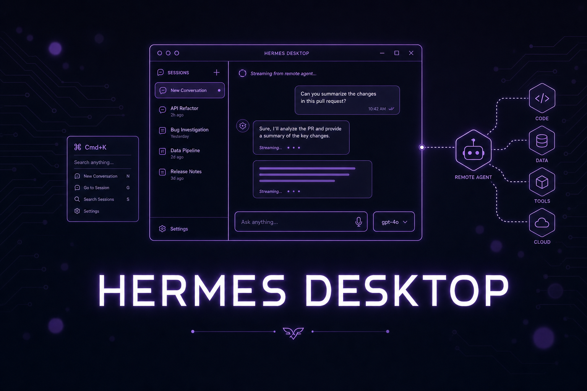

# Part 24: Hermes Desktop App — A Real GUI Over the Same Agent

<p align="center">
  
</p>

*The v0.16.0 "Surface Release" shipped **Hermes Desktop**: a native macOS/Windows/Linux app that runs the exact same agent as the CLI, TUI, and gateway. Same config, same keys, same sessions, same skills, same memory — it's "another surface over one agent, not a fork." The releases since have grown it into a genuine daily driver: v0.17 "Reach" added subagent watch-windows, native notifications, marketplace themes, and a real terminal pane; v0.18 "Judgment" turned it into a coding cockpit with first-class **Projects**, a **multi-terminal panel**, and the **memory graph**; v0.19 added per-job model pickers in the cron UI and custom endpoints; and the v0.20 "Herald" wave (current: **v0.20.4**, 2026.8.18) delivered the **Bots tab** (Bot Mode built in, on by default), **streaming voice** with barge-in and wake words, and in-app updates that push to every remote backend. Windows runs natively and is a first-class surface — no beta asterisks. If you've avoided Hermes because you didn't want to live in a terminal, this is your on-ramp.*

---

## 1. Install and Launch

If Hermes is already installed, the app is one command away:

```bash
hermes desktop
```

The first run downloads or builds the desktop bundle (e.g. `Hermes.app` on macOS) and launches it. To build the desktop app as part of a fresh install, pass the installer flag:

```bash
# macOS / Linux
curl -fsSL https://hermes-agent.nousresearch.com/install.sh | bash -s -- --include-desktop
```

On **Windows**, the native PowerShell installer ships a signed bootstrap that can include the desktop app:

```powershell
iex (irm https://hermes-agent.nousresearch.com/install.ps1)
```

Windows is a **first-class native surface** (no WSL, no Docker required) — the installer goes to `%LOCALAPPDATA%\hermes` and adds `hermes` to your user PATH. Prefer a POSIX environment anyway? The **WSL2** path coexists cleanly alongside the native install (native data under `%LOCALAPPDATA%\hermes`, WSL data under `~/.hermes` — see the [Windows (Native) and Windows (WSL2) guides](https://hermes-agent.nousresearch.com/docs/user-guide/windows-native)).

Once installed it behaves like any other desktop program — pin it to your dock/taskbar and launch it without the terminal.

> **Same brain, new face.** The desktop app talks to the same agent core as everything else. A session you start in the app shows up in `hermes sessions`, and a skill the agent wrote from Telegram is available in the app. Nothing is siloed.

---

## 2. The Chat Surface

The main window is a streaming chat with **live tool activity** — you watch tool calls run inline instead of staring at a spinner. Highlights:

- **Shared history across surfaces** — desktop, CLI, TUI, and messaging all read/write the same sessions.
- **Drag-and-drop files** — drop a file onto the composer to attach it.
- **Clipboard image paste** — paste a screenshot straight in.
- **Right-hand preview rail** — rendered output (files, images, results) opens beside the chat instead of scrolling away.
- **Composer history and queue editing** — press up/down in the composer to recall previous messages and edit a queued message before it sends.
- **Per-thread drafts** (v0.17) — half-written messages persist per conversation; switch threads without losing what you were typing.
- **PR-style diffs in chat** (v0.18) — code changes render as reviewable diffs inline.
- **Conversation timeline rail** (v0.18) — jump around long sessions from a scannable timeline instead of scrolling.
- **Subagent watch-windows** (v0.17) — pop open a live window on any running subagent and watch it work instead of waiting on a summary. The `/agents` overlay in the TUI shows the same tree with per-branch cost and kill/pause controls.
- **Native OS notifications** (v0.17) — get pinged when a long run finishes or the agent needs an approval, even when the app is backgrounded.
- **Find in page** — `Cmd/Ctrl+F` searches the rendered transcript; Enter/Shift+Enter (or `Cmd/Ctrl+G` / `Cmd/Ctrl+Shift+G`) step through matches.
- **Context-usage meter** — a live "% full" gauge of the session's context window; click it for a token breakdown by category (system prompt, tool definitions, skills, memory, MCP, …) so you see what's eating the window before compression fires.

---

## 3. Command Palette and Keyboard

- **Command palette:** `Cmd+K` / `Cmd+P` (macOS) or `Ctrl+K` / `Ctrl+P` (Windows/Linux) opens a fuzzy command palette for nearly everything — switch sessions, change model, open settings, spawn a terminal, run commands, update Hermes.
- **Rebindable shortcuts:** **Settings → Keyboard Shortcuts** (`Cmd/Ctrl+/`) remaps almost every binding — profile switching, session navigation, view toggles, even plugin-contributed shortcuts — and flags duplicate assignments. A few defaults worth knowing: `Cmd/Ctrl+N` new session, `Cmd/Ctrl+.` Command Center, `Cmd/Ctrl+,` Settings, `Cmd/Ctrl+Shift+F` search sessions, `Cmd/Ctrl+1–9` switch profiles, `Shift+X` toggle light/dark.
- **Themes from the VS Code Marketplace** (v0.17): install any VS Code theme and the whole app adopts it. Your terminal aesthetic can follow you.
- **Custom zoom:** scale the whole UI up or down.
- **Language switcher:** the desktop UI is fully internationalized. v0.16 added **Simplified Chinese (简体中文)**; English is the default. Switch via the UI language picker (`display.language`).

---

## 4. The Model Picker

Hermes is model-agnostic, and the desktop makes switching trivial. The **model picker** sits in the composer (left of the mic) and lets you change the **model**, **reasoning effort**, and **fast mode** per message:

- The picker is **sticky per device** and **never writes your profile default** — experiment freely without rewriting config.
- **MoA presets show up as their own section** (`MoA: <preset>`) in the dropdown — the desktop is a full member of the `moa` provider surfaces, and the Settings → Model pane even edits presets ([Part 26](./part26-moa-verification.md#1-mixture-of-agents--pick-a-council-like-youd-pick-a-model)).
- Set your actual default in **Settings → Model**, including per-model reasoning-effort and fast-mode presets (each model remembers its own effort/fast choice and re-applies it when picked).
- It's the same fuzzy, hourly-refreshed catalog you get in the TUI/CLI/web (see [Part 9](./part9-custom-models.md) for routing and aliases).

---

## 5. Status Bar and the YOLO Toggle

The status bar shows live session state and exposes a **per-session YOLO toggle**. Flipping YOLO on bypasses approval prompts for that session so the agent runs tools without stopping to ask.

> **Use YOLO deliberately.** It is genuinely useful for trusted, low-stakes loops on your own machine. Do **not** enable it for any session that reads untrusted input (email, webhooks, public chats) or has destructive tools wired up. Read [Part 19: Security Playbook](./part19-security-playbook.md) first, and keep the approval layer on for anything that touches production.

---

## 6. First-Run Quick Setup via Nous Portal

First launch offers two paths:

- **Quick Setup** — `hermes portal` signs you in through the [Nous Portal](https://portal.nousresearch.com) and picks a model for you. The fastest way from zero to a working agent without touching YAML or hunting for API keys.
- **Full Setup** — the complete onboarding UI: providers and keys, models, tools, MCP servers, gateway, and sessions. xAI Grok OAuth is first-class here.

You can re-open onboarding any time from Settings.

---

## 7. Connect to a Remote Hermes

The desktop app doesn't have to run the agent locally. Point it at any number of **remote Hermes backends** (a `hermes serve` process) over a secure WebSocket (`/api/ws`):

- **Auth:** OAuth (Nous Portal — the right choice for anything beyond your own network) or username/password (trusted LAN / VPN only, e.g. Tailscale).
- **The connection registry** — every backend the app knows about lives on one page: **Settings → Gateways → Registered gateways**. Add any mix of **Local**, **Remote gateway** (URL + session token or OAuth), **SSH** (the app tunnels and starts the dashboard for you), and **Hermes Cloud** connections. Each has a unique device name; **Test** probes both the HTTP and WebSocket legs before you trust it.
- **Agents across machines:** profiles are discovered *from* each gateway you connect, and the sidebar becomes gateway → profile → sessions. When the same profile name exists on several boxes, handles disambiguate as `@profile-device` (e.g. `@research-homelab`).
- **Concurrent multi-profile sessions:** run several profiles at once — including across gateways — and link them with cross-profile `@session` references.

The model is "**thin GUI local, heavy agent remote**" — keep a lightweight app on your laptop while the agent, tools, and memory live on a workstation, a DGX Spark, or a VPS. (Pair this with [Part 21: Remote Sandboxes](./part21-remote-sandboxes.md) and [Part 25: NVIDIA & Local Hardware](./part25-nvidia-local.md).) Full guide: [Connecting Desktop to Many Hermes Instances](https://hermes-agent.nousresearch.com/docs/user-guide/multi-connection-desktop).

> **The gotcha nobody warns you about:** with a remote backend, *code runs on the remote server* — file writes, terminal commands, everything. If you asked for a local script and can't find it, it's on the VPS. Want the agent working on your laptop's files? Run the backend locally (or mount/sync deliberately, e.g. via Tailscale + a shared directory).
>
> **Also: the remote process must actually be running.** "Remote backend" means a `hermes serve` server on the other machine — the app attaches to it, it doesn't start it for you (SSH connections are the exception: the app starts the dashboard over the tunnel on demand). Run it under `systemd` or your process manager of choice so it survives logout.

### 7b. Hermes Cloud — the third connection mode

Alongside *local* and *remote gateway*, the app can connect to **Hermes Cloud** — sign in with your Nous Portal account and the app auto-discovers the cloud-hosted agents on it, no VPS to babysit, no URL to paste. The pitch: one-click deploy, scale-to-zero pricing, natural-language scheduling, multi-channel attach, persistent memory, isolated sandboxes, and parallel subagents — managed. Cloud instances slot into the same connection registry and the same roster as everything else (they're skipped by self-update; the platform manages their versions).

It remains a managed service, so self-hosting (this guide's default posture) keeps full control of memory, secrets, and egress — but it's a real, supported connection mode now, not a preview. Good fit when you want the [Part 23](./part23-tenacity-stack.md) stack without owning a server.

---

## 8. Projects — the v0.18 Coding Cockpit

v0.18 made **Projects** first-class. A project is a per-profile workspace with:

- A **project sidebar** and dedicated project pages.
- A **coding rail** — the agent's plan, running checks, and file activity beside the chat.
- A **review pane** — read the diff like a PR before you accept it.
- **Worktree management** — each project's changes live in an isolated git worktree (**Cmd/Ctrl+Shift+B** or "New worktree" on a project), so parallel projects don't stomp each other; worktrees appear as their own lanes under the project.
- **Session–project association** — sessions attach to a project, so the history of a codebase stays in one place.
- **Repository discovery** — for the Projects sidebar, the app scans your home directory to a bounded depth for local git repos; tune it per profile in **Settings → Workspace** or via `desktop.repo_scan_*` keys in `config.yaml`, and **Hide from sidebar** curates the list by hand.

Combined with the **multi-terminal panel** (multiple named terminals per project) this is the closest thing to an IDE the Hermes desktop has — except the agent drives. Pair it with verification and completion contracts from [Part 26](./part26-moa-verification.md#2-verification--done-means-proven-not-claimed) so "accept" means "checks passed," not "looks plausible."

---

## 9. Bot Mode — the Bots Tab (Built In, On by Default)

**Bot Mode ships with the app and is on from day one.** The left sidebar gets a **Sessions | Bots** tab strip, and the Bots pane shows a roster where *every Hermes profile appears as a bot* — avatar, its own canonical **Bot Chat** conversation, and its own **Routines** (recurring tasks backed by normal Hermes cron).

There's no new primitive to learn — **a Bot IS a profile** (`~/.hermes/profiles/<name>/`), and Bot Mode is a UI over that. Everything you do in the roster is visible from the terminal: `hermes -p <bot> chat` opens the same agent, and a Bot's routines show up in `hermes cron list` as `[bot:<name>] …` jobs. Register another machine's gateway as a *peer* (`hermes peer add`) and your bots learn to DM teammates on that box on their own.

- **Create an agent** from the roster: Name / Title / Description in seconds; an **Advanced** disclosure opens the full capabilities surface — clone from an existing profile, model & provider pin, custom `SOUL.md`, per-skill / per-toolset / per-MCP enablement, and shared credential pools.
- **Avatars** — blob faces derived from the name, geometric faces, an uploaded image, an AI-generated portrait, or a pixel pet from the petdex gallery (browse it with `hermes pets`).
- **Routines dock beside the chat** while the Bots tab is active — a schedule picker builds the cron string, results land in the Bot's own chat history.
- **Group chats** — seat 2–6 bots in a shared room (right-click → Manage groups, or New Group Chat). Your message triggers up to three serial rounds of member turns; bots pull each other in with `@name` and escalate judgment calls to you with `@user` (the row shows a "needs you" badge). Rooms follow your gateways, not one desktop: open the app on another machine against the same backend and the room appears with its history.
- **Bots message each other** — `@researcher have a look at this` in any chat hands the message off and reports back; mention names validate against the live roster, and renamed bots keep their tags in sync. The backend teaches each bot's canonical Bot Chat the messaging protocol automatically (`agent.bot_mode_protocol`, default on), so bot-to-bot replies work without touching your `SOUL.md`.
- **Cross-machine** — with several connections registered, the New Agent dialog grows a **Create on** picker (create the bot on the machine you choose), and the roster shows bots from every connection; same-name agents disambiguate as `@name-device`.
- **Hide bots you don't use** — right-click → Hide Bot; hidden bots keep working (@mentions still resolve, routines keep running) and an eye toggle in the header reveals them again. Hidden state lives in the bot's profile, so it follows the bot across machines.
- **Turn it off?** Settings → Plugins → Bots disables the roster, routines pane, and composer middleware live — no restart. Your profiles and sessions are untouched; Bot Mode only renders them.

Full guide: [Bot Mode — A Roster of Agents](https://hermes-agent.nousresearch.com/docs/user-guide/bot-mode). For multi-machine roster behavior: [Part 7](#7-connect-to-a-remote-hermes) plus the multi-connection doc linked there.

---

## 10. The Memory Graph

The **memory graph** (command palette → *Memory Graph*, or the status-bar item) is an interactive map of what Hermes has learned for you: **skills and memories laid out as a zoomable node graph with a timeline**, filterable by **All / Used / Learned**. It's the GUI counterpart of `/journey` ([Part 26](./part26-moa-verification.md#3-learn-and-journey--self-improvement-you-can-see)) — type `/journey` (aliases `/learning`, `/memory-graph`) in chat to open it as the Star Map. Click any node to edit it (memories removed, skills archived) right from the panel; a share control exports the *layout* as a compact code you can paste to someone. Do a pruning pass monthly; wrong memories compound.

---

## 11. Sessions, Files, and Voice

- **Sessions:** archive, search, and **search-by-id** (with `Cmd/Ctrl+Shift+F`); run concurrent multi-profile sessions with cross-profile `@session` links; pop any session into its own window (`Cmd/Ctrl+Shift+N`).
- **Terminal panel:** `Ctrl+\`` opens a real terminal in the right sidebar, `Ctrl+Shift+\`` spawns another; shells persist while hidden, and you can select output and send it straight into the composer (**Add to chat**).
- **Artifacts:** the sidebar's Artifacts view gathers everything sessions generate — images, files, links — into one searchable gallery, each tagged with the session that produced it.
- **File browser:** set the initial working directory with `hermes desktop --cwd PATH` or the `HERMES_DESKTOP_CWD` environment variable.
- **Voice:** click the mic to talk, and hear **streaming TTS** — it plays per sentence as it's synthesized, with **barge-in** (interrupt mid-sentence and it stops) and hands-free **wake words** ("hey hermes", configurable) for opening a voice session without touching the app. Tune it via `voice.barge_in` and friends in `config.yaml`. macOS prompts for microphone permission once.
- **Quick Entry:** a global hotkey (`Ctrl/Cmd+Shift+Space`, remappable) summons a mini-composer from anywhere on your system — fire off a prompt without opening the main window.
- **HUD mode:** `Cmd/Ctrl+Shift+H` detaches the chat into a chrome-free, always-on-top bar; its position tells Hermes which app you're asking about, so "this" and "here" resolve to what's underneath it.
- **Remote media relay** (v0.17): when connected to a remote gateway, images and files generated on the remote box stream back to the app instead of being stranded on the server.

### Management Panes

Beyond chat, the app has dedicated panes for **Skills**, **Cron**, **Profiles**, **Messaging**, **Agents**, and **Bots** (the Bot Mode roster — see §9), plus a **Command Center** — the same surfaces you'd otherwise drive from the [web admin panel](./part12-web-dashboard.md), now native. Settings covers the rest: the Gateways page for connections, Keyboard Shortcuts for keybindings, and Plugins for desktop/agent plugins.

---

## 12. Updating

The app and the backend it talks to update on **separate clocks** — the app package on your machine, the backend wherever it runs. On a single-machine install it stays one-button: the app checks in the background and offers a **one-click update**, and `hermes update` covers the rest.

With a remote backend (or several registered gateways), the regular update affordances — **Update now** on the About panel, the `Cmd+K` **Update Hermes** row, the update-ready toast — push to **everything**: the connected backend first, then every other eligible registered gateway (Hermes Cloud instances are skipped: the platform manages them), and the desktop app itself last, since applying the client update relaunches the app. After any backend update the app re-checks its own version and offers an **Update desktop app** action if the GUI is stale — updating the remote can never silently strand your local UI. The same fan-out is available manually from **Settings → Gateways → Update all instances**. This mirrors the gateway's **check-before-update** flow (verify before pulling) from the web admin panel — see [Part 12](./part12-web-dashboard.md).

---

## 13. Uninstalling

Remove the app from **Settings → About → Danger zone**, or from the CLI:

```bash
hermes uninstall --gui    # remove the desktop GUI only
hermes uninstall          # remove GUI + agent, keep your data
hermes uninstall --full   # remove everything, including data
```

---

## 14. `hermes desktop` Flags

For development and troubleshooting, `hermes desktop` accepts:

| Flag | What it does |
|------|--------------|
| `--skip-build` | Launch without rebuilding the bundle |
| `--force-build` | Force a rebuild before launch |
| `--build-only` | Build the bundle and exit (no launch) |
| `--source` | Run from source instead of a packaged build |
| `--cwd PATH` | Set the initial working directory |
| `--hermes-root PATH` | Point at a specific Hermes install root |
| `--ignore-existing` | Ignore an already-running instance |
| `--fake-boot` | Boot the UI without starting the agent (UI dev) |

---

## When to Use Desktop vs CLI/TUI

- **Desktop** — you want a real GUI: drag-and-drop, image paste, a preview rail, Projects with reviewable diffs, the memory graph, point-and-click model switching, one-click updates, streaming voice with wake words, and the Bots tab for multi-agent life. Great for non-terminal users and for connecting to a fleet of remote agents.
- **TUI** (`hermes --tui`) — you live in the terminal but want live tool cards, `/steer`, queueing, and a sticky composer. See [Part 22](./part22-latest-power-moves.md).
- **CLI** (`hermes`) — scripting, cron, CI, and quick one-shots.

It's the same agent underneath — pick the surface that fits the moment and switch whenever you want.
