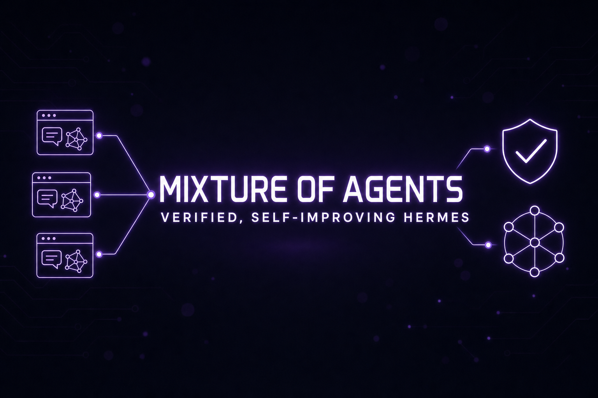

# Part 26: Mixture-of-Agents, Verification & Self-Improvement — The Judgment Stack

<p align="center">
  
</p>

*Hermes v0.18.0 (v2026.7.1, "The Judgment Release") set the direction, and the v0.19/v0.20 wave (current: **v0.20.4**, 2026.8.18) kept sharpening it. This part is about how well the agent thinks and how it knows its work is actually done. Three big ideas anchor it: **Mixture-of-Agents as a first-class model** (selectable like any other model — with per-slot reasoning effort and fan-out cadence controls), **evidence-based verification** for coding work and `/goal` (completion contracts, deterministic quality gates), and a visible, steerable **self-improvement loop** (`/learn`, `/journey`, and the desktop Star Map). This part shows how to actually use them.*

---

## 1. Mixture-of-Agents — Pick a Council Like You'd Pick a Model

MoA used to be a mode you toggled. Since v0.18 every named MoA preset is a **selectable virtual model** under a `moa` provider — it shows up in the fuzzy model picker on the CLI, TUI, desktop (an **MoA presets** section in the dropdown), dashboard, and gateway right alongside Claude, GPT, and Grok. Configure presets from the dashboard's Models pane, the desktop's Settings → Model, `hermes moa configure [name]`, or `config.yaml` — which stores explicit provider/model pairs, so you can mix providers freely:

```yaml
# ~/.hermes/config.yaml
moa:
  default_preset: default
  presets:
    deep_review:
      reference_models:        # the models that each answer independently
        - provider: openai-codex
          model: gpt-5.6-sol
          reasoning_effort: low      # per-slot effort — same model at different depths
        - provider: openrouter
          model: deepseek/deepseek-v4-pro
      aggregator:               # acts as the main model: writes the answer, emits tool calls
        provider: openrouter
        model: anthropic/claude-opus-4.8
        reasoning_effort: high  # so the aggregator thinks harder than the advisors
      reference_max_tokens: 600 # optional: cap advisor output — concise advice, faster turns
      fanout: user_turn         # user_turn (default) | per_iteration | every_n:3
```

Then just:

```text
/model review --provider moa   # persistent — route the whole session through the ensemble
/moa design a migration plan   # one-shot — run one prompt through the DEFAULT preset,
                               # then restore your previous model; the whole argument
                               # is the prompt (it is no longer parsed as a preset name)
```

Terminal management: `hermes moa list`, `hermes moa configure [name]` (walks the provider → model picker for each slot), `hermes moa delete <name>`.

What you get now:

- **Every reference model's full output renders as its own labelled block** — you read what each model thought *before* the aggregator's synthesis. The committee deliberates in the open.
- **The aggregator's answer streams live** instead of appearing whole after a long silence.
- **References see full tool state** on the cadence you choose: `fanout: user_turn` (default — advisors run once per user turn, cheapest), `per_iteration` (advisors refresh on every tool call, priciest), or `every_n:3` (refresh every 3rd tool iteration in between).
- **Per-slot reasoning effort** — `reasoning_effort: none|minimal|low|medium|high|xhigh|max|ultra` on any reference or the aggregator, so the same model can pitch in at different depths.
- **Opt-in trace persistence** — set `moa.save_traces: true` to dump full-turn traces to JSONL for debugging and evals; `moa.privacy_filter: display|full` redacts emails/phone numbers from the rendered blocks, traces, and (with `full`) the aggregator prompt.
- **Prompt cache stays intact** — selecting a MoA preset is a normal model selection: the conversation/system-prompt prefix stays byte-stable, references cache normally, and only the freshly appended advisor tail is new. Its real cost is extra reference calls per iteration, not broken caches.

### When to use it (and when not to)

| Use MoA for | Skip MoA for |
|---|---|
| High-stakes decisions (architecture, irreversible ops) | Routine tool-heavy agent loops |
| Hard reasoning where models disagree | Cheap bulk tasks, cron jobs |
| Reviewing another agent's plan or diff | Anything latency-sensitive |
| "Second opinion" one-shots via `/moa` | Long sessions (you pay N models per turn) |

Cost scales with the number of reference models — an ensemble of three frontier models is roughly 4× the tokens of one *in the worst case*. But a July community measurement complicates the intuition in MoA's favor: a single Opus turn cost ~27.9k tokens / ~$0.14 vs a **full 4-reference + aggregator MoA turn at ~28.6k / ~$0.15** — nearly identical, because the system prompt and tool schemas dominate the bill and reference models run on stripped context. Quality on that user's eval: **0.8202 for Opus+GPT-5.5 MoA vs 0.7607 / 0.7412 for either alone**. It's still 5 API calls per turn (and scales with session length), so the advice stands — council for judgment calls, single model for the grind — but the cost objection is weaker than it looks.

> **Gotcha:** the context window resolves from the **aggregator**, and auxiliary tasks route to the aggregator too. Pick an aggregator with a window at least as large as your references' outputs combined.

---

## 2. Verification — "Done" Means Proven, Not Claimed

Since v0.18 Hermes judges completion against **evidence** instead of vibes:

- **Coding context** (`agent.coding_context`) — detects your project's canonical checks (tests, lint, build) and gives the agent a workspace brief plus a branch/dirty-state snapshot. Modes: `auto` (default — on interactive coding surfaces in a git repo), `focus` (additionally collapses the toolset to the coding set and demotes non-coding skills in the index), `on` / `off`.
- **Verify-on-stop** (`agent.verify_on_stop`) — when enabled, Hermes refuses to accept a final answer on a turn where it edited code but produced no fresh verification evidence (passing test run, build, lint…) and injects a bounded follow-up asking it to verify or explain why it can't. **Off is the default everywhere** (fresh installs ship `false`; `"auto"` restores the old surface-aware behavior: on for CLI/TUI/desktop, off for messaging). Doc/markdown/skill-only edits never trigger it.
- **`pre_verify` hook** — a directive/control hook (plugin or shell) that runs at the verify gate and can keep the turn going with your own checks when the agent edited code. This is a hook, not a config string.
- **`HERMES_VERIFY_ON_STOP`** env var overrides the config value; `agent.max_verify_nudges` caps how many consecutive continue-nudges can fire per turn (default 3):

```yaml
agent:
  coding_context: focus        # auto (default) | focus | on | off
  verify_on_stop: true         # still opt-in: true | false (default) | "auto"
  verify_guidance: true        # append evidence-gathering guidance to the nudge
  max_verify_nudges: 3         # cap the built-in + pre_verify continue nudges
```

### Completion contracts for `/goal`

`/goal` ([Part 23](./part23-tenacity-stack.md#3-use-goal-for-do-not-stop-until-it-is-done)) gained **completion contracts**: state what "done" looks like, and the standing-goal loop judges against that evidence instead of the model's say-so. A bare `/goal <text>` works, but a vague goal makes for vague judging — so name the end state, the proof, and the boundaries:

```text
/goal Migrate the auth service to JWT
verify: pytest tests/auth passes
constraints: keep the /login response shape unchanged
boundaries: only touch services/auth and its tests
stop when: a DB schema migration is required
```

- Recognized fields: `outcome` / `verify:` (or `verified by:`) / `constraints:` (or `preserve:`) / `boundaries:` (or `scope:`) / `stop when:` — all optional. A plain goal with an incidental colon is not mangled; only known prefixes are pulled out.
- **Let Hermes draft it:** `/goal draft <one-liner>` expands your objective into a full contract via the `goal_judge` auxiliary model, sets it, and shows you the result to tighten. Falls back to a plain goal if the aux model is unavailable.
- **Inspect it:** `/goal show` prints the active contract; contracts persist in `SessionDB.state_meta`, so they survive `/resume` and compaction.
- **Add criteria mid-loop:** `/subgoal <text>` appends an acceptance criterion; the judge won't mark the goal done until the original objective *and* every subgoal are met (`/subgoal`, `/subgoal remove <N>`, `/subgoal clear`).
- **Quality gates beat prose:** `/goal gate add <command>` attaches a *deterministic* shell gate (e.g. `scripts/run_tests.sh tests/auth`). Gates run **before** the judge each turn — a red gate is proof the goal isn't done, and its exit code + output tail become the continuation prompt. Defaults: 3 retries, 5-minute timeout, auto-pause on exhaustion (`/goal gate`, `/goal gate remove <N>`, `/goal gate clear`).
- **Parking on long processes is automatic now.** The judge sees the agent's live background processes every turn; when progress is genuinely gated on one, it returns a `wait` verdict and the loop goes quiet until the process exits (or its `watch_patterns` fire) — no more re-poking "is it done yet?" busywork. Manual override: `/goal wait <pid> [reason]`, `/goal unwait`.

```text
/goal Fix the flaky auth test
/goal gate add pytest tests/auth -x     # deterministic: gate runs before the judge
/goal wait <pid>                        # manual park (usually unnecessary — see above)
```

Judge the budget with `goals.max_turns` in `config.yaml` (default 20) and route judging to a cheap fast model via `auxiliary.goal_judge` — the judge call is ~200 output tokens per turn. The difference between "I think I fixed it" and "the tests pass, here's proof." If you run unattended `/goal` sessions or Kanban workers, adopt contracts + gates everywhere — it's the single best defense against confident non-completion.

---

## 3. `/learn` and `/journey` — Self-Improvement You Can See

Two commands turn the skill/memory system from a black box into something you steer:

```text
/learn <anything>      # distill a reusable skill from a directory, a URL,
                       # or the workflow you just walked the agent through
/journey               # a timeline of every memory + skill Hermes has
                       # accumulated — edit or delete any of them in place
```

- `/learn` honors your repo's CONTRIBUTING.md skill standards automatically. Teaching Hermes a workflow is now one command, not a manual `skill_manage` authoring session (see [Part 5](./part5-creating-skills.md) for what a good skill looks like — that still matters).
- **Give `/learn` output a haircut.** Generated skills routinely ship 123–202-char descriptions — and every skill description loads into context *every session, forever*. Open the new `SKILL.md`, trim the description to **≤60 chars**, and fix the author before sharing.
- **Check the built-ins first.** Memory, web search, browser control, cron, and sub-agents are native — don't `/learn` or install a skill for a capability the agent already has.
- For shared or production agents, pair with `/skills approval on` and `/memory approval on` so self-improvement stays supervised ([Part 7](./part7-memory-system.md)).
- `/journey` works in the CLI and TUI; the desktop app adds the **memory graph / Star Map** — a zoomable node graph of skills and memories over time with a playback scrubber and All/Used/Learned filters ([Part 24](./part24-desktop-app.md#10-the-memory-graph)).
- The post-turn self-improvement fork (the loop that decides whether to save a memory or skill after your turns) now routes to an **auxiliary model**, digests context instead of replaying the whole conversation, and adapts its cadence — it costs a fraction of what it used to. Keep it on.

Monthly hygiene: open `/journey`, prune wrong or stale memories, and check that auto-learned skills match how you actually work. Pair with Curator ([Part 22](./part22-latest-power-moves.md#1-turn-on-curator-before-your-skill-library-becomes-noise)) for the skill side.

---

## 4. Background Fan-Out — Delegate a Fleet and Keep Working

`delegate_task` grew up across v0.17 → v0.18:

```python
# v0.17: one background subagent — returns a handle immediately,
# result re-enters the conversation as a new turn when done
delegate_task(goal="Deep-dive the competitor's pricing page", background=True)

# v0.18: background fan-out — parallel subagents, one consolidated
# turn when ALL of them finish
delegate_task(
    tasks=[
        {"goal": "Audit src/auth for the token-refresh bug"},
        {"goal": "Audit src/billing for the same pattern"},
        {"goal": "Check upstream issues for known reports"},
    ],
    background=True,
)
```

Your chat is never blocked; the CLI/TUI status bar tracks running background subagents. Watch a **live tree of them** with `/agents` in the TUI (per-branch cost/token rollups, kill and pause controls) or check per-child activity on the classic CLI — even after they've returned, you can step through each subagent's turn-by-turn history (v0.19+). Use fan-out for independent research/audit legs, and keep [Kanban](./part23-tenacity-stack.md) for work that must survive restarts. Full delegation patterns: [Part 8](./part8-subagent-patterns.md).

---

## 5. Small Things You'll Use Every Day

- **`/prompt`** — opens `$EDITOR` to compose a long multi-line prompt in real markdown, queued as your next message. Stop fighting the one-line input box.
- **`/reasoning <level>`** — set reasoning effort up to `high` / `xhigh` / `max` / `ultra` (`--global` persists it to config); `/reasoning full` toggles showing the full reasoning trace.
- **`/timestamps`** + timestamps in `/history` — see when turns actually happened.
- **`/version`**, **`/topup`**, and **`/subscription`** — version info, Nous balance/billing, and plan management from inside the TUI/CLI.
- **In-place compaction** is now the default — compression rewrites the session under a single session id instead of rotating to a new one, so `@session` links and integrations stop breaking on long sessions.
- **Blank Slate setup** — a minimal-agent onboarding mode: start with nothing enabled and opt in tool by tool. The right choice for locked-down or compliance-sensitive boxes.

---

## 6. Running Hermes for a Team — Scale-to-Zero and Managed Scope

v0.17/v0.18 shipped the fleet layer and the v0.20 wave made the headline items **real, not experimental**:

- **Scale-to-zero** — the gateway sleeps when idle and wakes on demand; disruptive lifecycle actions (restart, migration, auto-update) coordinate an **external drain** so nobody is cut off mid-turn. The cron trigger is pluggable (`cron.provider`, with the NAS-managed `chronos` provider for scale-to-zero hosted gateways) — see the docs' cron-internals page.
- **Managed scope** — administrator-pinned, user-immutable config and secrets from a system-level managed directory. Pin the security posture; let users own the rest.
- **Multiplexed gateway** (opt-in) — run all profiles over one gateway process via `gateway.multiplex_profiles: true` on the default profile.
- **Multi-profile gateways** — several gateways on one machine, or one desktop connected to several machines ([Part 24](./part24-desktop-app.md#7-connect-to-a-remote-hermes)); documented as a first-class topology now.
- **Automation Blueprints** — parameterized automations that render as a form in the dashboard, a slash command in chat, or a conversation — "daily briefing at 8am" without cron syntax.
- **Cron continuations** — scheduled jobs can continue in a thread (with DM-mirror fallback), so a cron report becomes a conversation instead of a dead-end message.

Pair with the hardened dashboard auth ([Part 12](./part12-web-dashboard.md)) and the [Part 19 security playbook](./part19-security-playbook.md) before exposing anything to a network.

---

## Upgrade Checklist (v0.18 → v0.20)

```bash
hermes update --check
hermes backup            # now includes projects.db + kanban boards
hermes update
hermes --version         # expect 0.20.x
```

Then:

1. **Refresh your MoA presets**: older presets used the pre-provider `references:` schema — migrate yours to `reference_models:`/`aggregator:` provider/model pairs with `hermes moa configure`, add per-slot `reasoning_effort`, and try `/moa` on a real decision.
2. **Turn on verification** for your main coding repo (`agent.verify_on_stop: true` — it's opt-in everywhere, default off) and restate your standing `/goal`s as contracts: `/goal draft`, then add a deterministic `/goal gate add <command>`.
3. **Run `/journey` once** — prune anything wrong before it compounds (desktop users: the Star Map).
4. **Try `/learn`** on the last workflow you explained to the agent by hand.
5. If you used the **Gemini CLI OAuth** provider, migrate: it's removed. Use a Gemini API key, or **Vertex AI** if your org runs Gemini through GCP ([Part 9](./part9-custom-models.md)).
6. **Desktop:** Bot Mode is on by default — browse the Bots tab and make sure your profiles look right. Windows native needs no beta caveats anymore.
7. Re-check platform config: Telegram rich messages are on by default; iMessage has a no-Mac path via Photon ([Part 15](./part15-new-platforms.md)).

---

*The theme of mid-2026 Hermes: stop trusting single-model vibes. Ensemble the judgment calls, verify the claims, and audit what your agent thinks it learned.*

**Next:** [Part 27 — Power Secrets](./part27-power-secrets.md), the field manual of non-obvious mechanics that make everything in this guide cheaper and more reliable.
