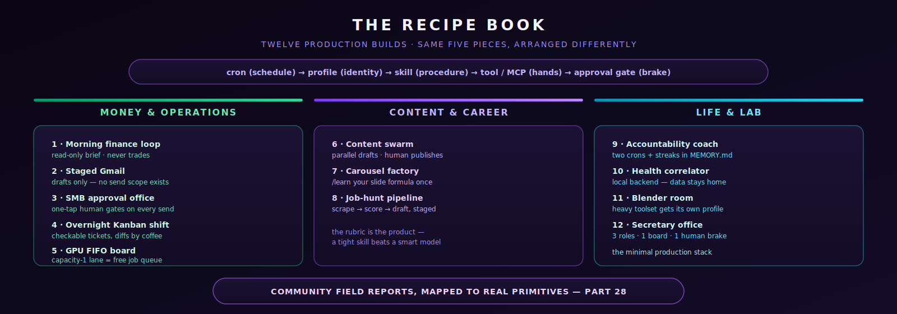

# Part 28: The Recipe Book — Twelve Production Builds People Actually Run

<p align="center">
  
</p>

*Twelve end-to-end builds observed running in the wild in July 2026 — each mapped onto the real Hermes primitives this guide teaches. These are community-reported architectures (labelled as such); treat the configs as starting points and re-verify anything that touches money, email, or production systems against [Part 19](./part19-security-playbook.md) before going live.*

---

## How to read a recipe

Each recipe lists: **the loop** (what runs), **the primitives** (which Hermes features carry it), and **the trap** (what bit the people who built it first). Every recipe assumes the baseline from [Part 1](./part1-setup.md) and the approval posture from [Part 19](./part19-security-playbook.md).

**The common skeleton** — most of these are the same five pieces arranged differently:

```text
cron (schedule) → profile (identity) → skill (procedure) → tool/MCP (hands) → approval gate (brake)
```

---

## Lane 1 — Money & Operations

### Recipe 1: The Morning Finance Loop

**The loop:** a cron fires pre-market; the agent pulls positions and watchlist data, compares against your thesis notes in `MEMORY.md`, and DMs you a brief — *it never trades*.

- **Primitives:** no-agent cron ([Part 23](./part23-tenacity-stack.md)) → cheap auxiliary model for the summary → Telegram DM delivery ([Part 4](./part4-telegram-setup.md)).
- **The brake:** this recipe is read-only by design. The moment an agent can *execute* trades you need an external spend kernel ([Part 19](./part19-security-playbook.md#external-spend-kernels-when-the-agent-touches-money)) — community consensus is unambiguous that policy caps must live *outside* the model.
- **The trap:** running the brief on your frontier model. It's a summarization job — route it to a Flash-class aux model and save the frontier calls for when you reply with a question.

### Recipe 2: Staged Gmail — Drafts, Never Sends

**The loop:** inbound email lands; the agent triages, drafts replies into the **Drafts folder**, and posts a daily digest of what's waiting. A human sends.

- **Primitives:** Gmail MCP server with `tools.include` narrowed to read + draft (no send scope at all) ([Part 17](./part17-mcp-servers.md)), `approvals:` as a second net.
- **Why drafts:** *send* is a decision boundary (Layer 2). Removing the send scope entirely is stronger than approving each send — the capability doesn't exist to misuse. Inbound email is also the classic prompt-injection vector ([Part 19](./part19-security-playbook.md)): the drafting agent must be treated as reading untrusted input.
- **The trap:** giving the MCP server a full-scope OAuth token "to keep it simple." Separate token, minimum scopes, always.

### Recipe 3: The SMB Approval Office

**The loop:** a small business runs invoicing, follow-ups, and scheduling through one Hermes profile; every outbound action (invoice send, payment link, calendar change on a client) queues for a one-tap human approval in a Telegram operations group.

- **Primitives:** one profile + `approvals:` on every system-of-record write, an ops group chat as the approval surface, Kanban board for pending work ([Part 23](./part23-tenacity-stack.md)).
- **The insight:** approvals at *decision boundaries* (send / spend / commit) — not on reads — keeps the human load to a few taps a day while removing the entire class of "the agent sent a client something weird" incidents.
- **The trap:** Telegram group privacy mode — the bot can't see group messages until you `/setprivacy` → Disable at BotFather **and remove/re-add the bot** ([Part 4](./part4-telegram-setup.md)).

### Recipe 4: The Overnight Kanban Shift

**The loop:** before signing off, load a Kanban board with well-specified tickets; workers grind through them overnight; you review diffs over coffee.

- **Primitives:** `toolsets: [kanban]` on the worker profile (it's **not** in `all` — [Part 23](./part23-tenacity-stack.md)), `--workspace dir:/abs/path` so output survives, verification contracts per ticket ([Part 26](./part26-moa-verification.md)).
- **The insight:** overnight work only pays when tickets are *checkable* — "make it better" tickets produce morning archaeology; "make `pytest tests/auth` pass" tickets produce merged PRs.
- **The trap:** the default scratch workspace is wiped on completion. Absolute `dir:` workspace or your night's work is gone.

### Recipe 5: The GPU FIFO Board

**The loop:** one local GPU, many jobs. A capacity-1 Kanban lane serializes fine-tunes / renders / batch inference; each ticket claims the GPU, runs, reports, releases.

- **Primitives:** Kanban lane with capacity 1 as a mutex ([Part 23](./part23-tenacity-stack.md)), local backend ([Part 25](./part25-nvidia-local.md)), cron to enqueue recurring jobs.
- **The insight:** the board *is* the queue — you get ordering, retry, and an audit trail for free instead of writing a job scheduler.

---

## Lane 2 — Content & Career

### Recipe 6: The Content Swarm

**The loop:** an orchestrator takes one idea → parallel subagents draft platform-specific variants (thread, post, script) → orchestrator consolidates → **you approve before anything publishes**.

- **Primitives:** `delegate_task` fan-out ([Part 8](./part8-subagent-patterns.md)), cheap models for drafting with one frontier pass for the final edit, `approvals:` on publish.
- **The insight:** this is rung 4 of the [agent ladder](./part8-subagent-patterns.md#the-seven-rung-agent-ladder) — parallel drafts are independent, so fan-out is nearly free time-wise.
- **The trap:** publish without an approval gate exactly once and you'll add the gate forever after.

### Recipe 7: The Carousel Factory

**The loop:** long-form source (blog post, transcript) → agent extracts the narrative spine → generates slide copy + image prompts → renders a carousel draft for review.

- **Primitives:** a `/learn`-distilled skill capturing *your* slide formula ([Part 26](./part26-moa-verification.md)), image tooling via MCP, output to a reviewed folder — never straight to the platform.
- **The trap:** `/learn`'s auto-generated skill description will be a paragraph. Trim it to ≤60 chars or it taxes the tool-selection prompt on every turn ([Part 27](./part27-power-secrets.md)).

### Recipe 8: The Job-Hunt Pipeline

**The loop:** daily cron scrapes target-company postings → agent scores them against your `USER.md` profile and a criteria skill → drafts tailored cover letters into a review folder → weekly summary of the funnel.

- **Primitives:** sequential pipeline (rung 3): scrape → score → draft, each stage checkable; `MEMORY.md` for standing criteria; drafts-not-sends posture from Recipe 2.
- **The insight:** the *scoring* stage is where the value is — a tight rubric in a skill beats a smart model with no rubric.

---

## Lane 3 — Life & Lab

### Recipe 9: The Accountability Coach

**The loop:** morning cron asks for your top-3; evening cron asks what happened; the agent tracks streaks in `MEMORY.md` and gets progressively less polite about slippage (personality via `SOUL.md`).

- **Primitives:** two crons, memory writes with `/memory approval on` if you don't want it editorializing your record, one profile whose `SOUL.md` you tune for the tone you'll actually respond to.
- **The trap:** memory snapshot semantics — the evening session won't *see* the morning's memory writes in its prompt unless it's a fresh session ([Part 27, Secret #1](./part27-power-secrets.md)). Cron sessions are fresh by default, which is why this works.

### Recipe 10: The Health Correlator

**The loop:** daily export from wearable/health apps into a local folder → agent appends to a running log → weekly job looks for correlations (sleep × training × mood) and writes a hypotheses note — *explicitly framed as hypotheses, not medical advice*.

- **Primitives:** local backend for privacy ([Part 25](./part25-nvidia-local.md)) — this is the recipe where "your data never leaves the machine" stops being a slogan; file-based ingestion, no third-party MCP.
- **The insight:** local models are fully adequate here — the job is pattern-flagging over small structured data, not frontier reasoning.

### Recipe 11: The Blender Room

**The loop:** a dedicated `blender` profile drives Blender through its MCP server — scene setup, parametric edits, render queue — while your main profile stays clean of 3D tool definitions.

- **Primitives:** separate profile as a "room" ([Part 8](./part8-subagent-patterns.md)), Blender MCP pinned to an exact version ([Part 17](./part17-mcp-servers.md)), GPU FIFO board (Recipe 5) if renders queue up.
- **The insight:** this is *the* case for profile separation — a heavy, niche toolset that would tax every prompt of your daily driver ([Part 27, Secret #7](./part27-power-secrets.md)) gets its own room instead.

### Recipe 12: The Secretary Office

**The loop:** the full stack — one VPS gateway, a default profile you talk to, an orchestrator profile that routes, implementer profiles that do; Telegram DM for you, an ops group for approvals; shared folder as the common filesystem; Kanban as the work ledger.

- **Primitives:** everything above, composed: profiles ([Part 8](./part8-subagent-patterns.md)) + Kanban dispatch ([Part 23](./part23-tenacity-stack.md)) + approval gates ([Part 19](./part19-security-playbook.md)) + `loginctl enable-linger` so it survives logout ([Part 11](./part11-gateway-recovery.md)).
- **The insight:** this is the "minimal production stack" — most people who think they need a fleet need exactly this: three roles, one board, one human brake.
- **The trap:** profiles are identity isolation, **not** filesystem isolation — all of them can read each other's files unless you add a real OS boundary ([Part 19](./part19-security-playbook.md)).

---

## Picking your first recipe

| You are | Start with | Then add |
|---------|-----------|----------|
| A developer | Recipe 4 (overnight Kanban) | Recipe 12 as the work grows |
| Running a small business | Recipe 3 (approval office) | Recipe 2 (staged Gmail) |
| A creator | Recipe 6 (content swarm) | Recipe 7 (carousel factory) |
| Optimizing yourself | Recipe 9 (coach) | Recipe 10 (correlator, local) |
| A trader / finance person | Recipe 1 (read-only brief) | *Nothing that executes without a spend kernel* |

---

## What's Next

- [Part 27: Power Secrets](./part27-power-secrets.md) — the mechanics that make every recipe here cheaper and more reliable
- [Part 19: Security Playbook](./part19-security-playbook.md) — the approval and containment patterns every recipe leans on
- [Part 23: Tenacity Stack](./part23-tenacity-stack.md) — the Kanban machinery behind the ops recipes

---

*These builds are community field reports from July 2026, mapped onto documented Hermes primitives. Where an original build used custom external code (spend kernels, action APIs), that's noted — Hermes orchestrates them but doesn't replace them.*
