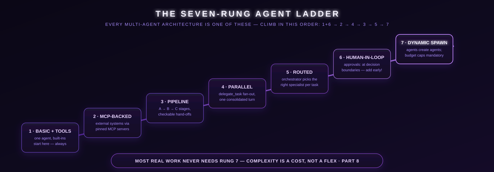

# Part 8: Subagent & Orchestrator Patterns (Stop Doing Everything Yourself)

*One agent can't do everything well. Delegate.*

---

## The Core Idea

Hermes is the orchestrator. It decides what to do, then delegates execution to specialized subagents. Each subagent runs in isolation — own context, own tools, own session.

**When to delegate:**
- Reasoning-heavy tasks (debugging, code review, research)
- Tasks that would flood your context with intermediate data
- Parallel independent workstreams (research A and B simultaneously)

**When NOT to delegate:**
- Single tool calls (just call the tool directly)
- Simple tasks that need 1-2 steps
- Tasks needing user interaction (subagents can't use clarify)

## delegate_task — The Main Tool

```python
# Single task
delegate_task(
    goal="Debug why the API returns 403 on POST requests",
    context="File: src/api/client.py. Error started after adding auth headers. Token is valid.",
)

# Parallel batch
delegate_task(
    tasks=[
        {
            "goal": "Research LightRAG alternatives for graph RAG",
        },
        {
            "goal": "Benchmark current LightRAG search latency",
            "context": "Path: ~/.hermes/skills/research/lightrag/",
        },
        {
            "goal": "Check if our embedding model has a newer version",
        }
    ]
)
```

**Key details:**
- Subagents have NO memory of your conversation. Pass everything via `context`.
- Results come back as a summary. Intermediate tool calls never enter your context.
- Each subagent gets its own terminal session.
- **No per-call `toolsets` parameter** — children inherit the parent's enabled toolsets (the model cannot grant a child capabilities the parent lacks); configure the parent's toolsets if delegated work needs more.
- Default max iterations: 50. Lower it for simple tasks (`max_iterations=10`).

## Background Delegation and Fan-Out

Top-level `delegate_task` calls (single *and* batch) **run in the background automatically** — since v0.19 there is no opt-in: the old `background=True` parameter is deprecated and ignored. Hermes returns a handle immediately, your chat keeps moving, and the result re-enters the conversation as a new turn when the child (or the whole batch) finishes:

```python
delegate_task(goal="Deep-dive the competitor's pricing page")   # background by default
```

Batches dispatch in parallel — 3 concurrent by default (`delegation.max_concurrent_children`) — and return **one consolidated turn when all of them finish**:

```python
delegate_task(
    tasks=[
        {"goal": "Audit src/auth for the token-refresh bug"},
        {"goal": "Audit src/billing for the same pattern"},
        {"goal": "Check upstream issues for known reports"},
    ],
)
```

**Live transcripts (v0.19+).** Every dispatch pre-creates an append-only, human-readable log per task under `~/.hermes/cache/delegation/live/<delegation_id>/task-<n>.log`. `tail -f` on it shows the child's turns and tool calls in real time — no need to wait for the summary. The dispatch response hands you the paths (`live_transcripts`), the CLI/TUI status bar tracks running background subagents, the TUI's `/agents` overlay (alias `/tasks`) shows the whole fan-out as a live tree with per-branch cost and kill/pause controls, and the desktop app can open a live watch-window ([Part 24](./part24-desktop-app.md)).

**Steering a running child:** rather than interrupting (which throws away in-flight work), you can redirect — the parent agent calls `delegate_task(action="list")`, then `action="steer"` with `subagent_id` + `message`, or `action="stop"`; from the CLI/TUI `/steer <prompt>` injects a mid-run note that arrives after the next tool call.

Rules of thumb:

- **Wait for the result** when the next step depends on it — the result arrives as a new turn either way, so the session is never blocked.
- **Fan out** research, audits, and monitoring legs you'd otherwise wait on.
- **Kanban** ([Part 23](./part23-tenacity-stack.md)) when the work must survive restarts or involve humans — subagents die with their process (a restart marks a running child `unknown`, since Hermes can't prove what side effects it did or didn't have).

## Leaf vs Orchestrator Subagents

Delegation is **flat by default**: a parent (depth 0) spawns children (depth 1), and children cannot delegate further — no runaway recursion. For multi-stage pipelines (research → synthesis), spawn **orchestrator** children that can delegate their own workers:

```python
delegate_task(
    goal="Survey three code review approaches and recommend one",
    role="orchestrator",       # allows this child to spawn its own workers
    context="...",
)
```

- `role="leaf"` (default) — child cannot delegate; `delegate_task` is blocked for it.
- `role="orchestrator"` — child keeps the delegation toolset, gated by `delegation.max_spawn_depth` (default **1 = flat**, so orchestrator children are a no-op until you raise it). Raise to 2 to allow them to spawn leaf grandchildren; 3+ for deeper trees — no ceiling, cost is the limit.
- `delegation.orchestrator_enabled: false` — global kill switch forcing every child to `leaf`.

**Cost warning:** `max_spawn_depth: 3` with 3 concurrent children per level can reach 3×3×3 = **27 concurrent leaves** — every level multiplies spend. Raise depth intentionally.

Leaf subagents cannot call `delegate_task`, `clarify`, `memory` (no writes to shared persistent memory), `send_message`, or `cronjob`. Both roles keep `execute_code`, so children can batch mechanical steps programmatically.

## Delegation Tuning (config.yaml)

```yaml
delegation:
  max_concurrent_children: 3      # parallel children per batch (default 3, no hard ceiling)
  max_iterations: 50              # per-child tool-call turns cap (default 50)
  max_spawn_depth: 1              # tree depth (default 1 = flat); 2+ enables orchestrator trees
  orchestrator_enabled: true      # false = force every child to leaf
  child_timeout_seconds: 0        # 0 (default) = no wall-clock cap; a progress-based
                                  # stall monitor catches wedged children instead
  worktree_isolation: false       # true = each child gets its own git worktree + branch
  model: ""                       # optional cheaper model for all children
  provider: "openrouter"          # optional separate provider for subagents
```

Notes: batches larger than `max_concurrent_children` return a tool error rather than being truncated. There is **no default wall-clock timeout** — children fail only from API/tool/iteration errors; if you opt into `child_timeout_seconds`, a fired cap returns structured timeout metadata. With `worktree_isolation: true`, each child starts in `<repo>/.worktrees/subagent-<id>` on its own branch and its result reports commits/dirty state, which you merge or review per branch. **Cost strategy:** children are where most tokens go, so keep the parent on a frontier model and pin `delegation.model` to an inexpensive worker model — the pin is global (per-task model overrides go via Kanban, [Part 23](./part23-tenacity-stack.md)).

## The Seven-Rung Agent Ladder

<p align="center">
  
</p>

The community pedagogy that stuck this July: seven agent architectures, each mapping to a concrete Hermes mechanism. Don't build rung 7 on day one — the taught progression is **1+6 first**, then climb as the work demands it.

| # | Type | Hermes mechanism | When |
|---|------|------------------|------|
| 1 | Basic + tools | Enable tools in Desktop/Dashboard | Single tasks |
| 2 | MCP-backed | MCP → Add Server ([Part 17](./part17-mcp-servers.md)) | Multi-platform work |
| 3 | Sequential pipeline | Cron + wake gates + file handoffs; one profile per step | Dependent multi-step |
| 4 | Parallel | `delegate_task` batch (default 3 subagents, clean contexts, summaries only) | Research / analysis |
| 5 | Routed specialists | Kanban decompose ([Part 23](./part23-tenacity-stack.md)) or a Chief-of-Staff profile | Inbox triage / multi-role |
| 6 | Human-in-the-loop | `approvals.mode: manual` (default) or `smart`; 60s fail-closed | Send / deploy / spend / post |
| 7 | Dynamic spawn | Orchestrator + `max_spawn_depth: 2` → up to 9 workers | Complex discovery |

**Progression:** 1+6 → 2 → 4 → 3 → 5 → 7. Most workloads never need past rung 5.

## One Agent vs Many Profiles

Two legitimate architectures — the community is genuinely split, so pick on the shape of your work:

- **One agent + skills + subagents** (subagents only for parallelism): best when your domains overlap and shared memory is the point. For the same brain on many chat platforms, use **one profile with many gateways** — shared SOUL and memory everywhere.
- **Profiles as rooms** (coder / research / private / cron): each profile is a *whole separate agent* — own memory, sessions, skills, and bot token. Best for long-running multi-domain setups where a coding session polluting your research memory is a real cost. Clone a starting point with `hermes profile create <name> --clone-all`.

**The boundary that surprises people:** profiles isolate Hermes state, **not the filesystem** — every profile is the same OS user. Real isolation needs Docker/SSH/ACLs ([Part 19](./part19-security-playbook.md)). More in [Part 27](./part27-power-secrets.md#3-profiles-files--identity).

## The CEO/COO/Worker Pattern

```
CEO (you + Hermes main agent)
  │
  ├── COO (delegate_task for planning/review)
  │     └── Returns: strategy, plan, review notes
  │
  └── Workers (delegate_task for execution)
        ├── Worker 1: Build feature A
        ├── Worker 2: Build feature B
        └── Worker 3: Write tests
```

**CEO:** Makes decisions, assigns tasks, reviews results.
**COO:** Researches, plans, reviews code. One subagent, reasoning-heavy.
**Workers:** Execute specific tasks in parallel. Multiple subagents, action-heavy.

## ACP Subagents (Claude Code, Codex)

For coding tasks, delegate to dedicated agent CLIs over ACP (Agent Client Protocol). In current versions the model no longer passes `acp_command` / `acp_args` per call — those fields are hidden from the tool schema. ACP transport is configured instead:

- **Inherited:** when the parent agent itself runs over ACP (e.g. Copilot-mode sessions), children automatically inherit the parent's ACP command and args.
- **Pinned:** set the transport in the delegation config (`delegation.command` / `delegation.args` in `config.yaml`) to route children through a specific external CLI — the command is validated to exist on PATH before the spawn.
- **`hermes acp`** runs Hermes itself as an ACP server for editor integration — the other direction.

**When to use ACP vs regular delegate_task:**
- ACP agents (Claude Code, Codex) are better at coding — tool calling, file editing, running tests
- Regular delegate_task is better for research, analysis, and multi-tool workflows
- ACP agents are faster for single-file edits

## Other Coding Agents (Windsurf, Gemini CLI, …)

Anything with a CLI or ACP endpoint can be a worker — see [Part 18: Delegating to Coding Agents](./part18-coding-agents.md) for the full routing pattern (Claude Code, Codex, Gemini CLI, and friends, each bound to a persistent thread).

## Parallelization Rules

| Scenario | Approach |
|----------|----------|
| 3 independent research tasks | Batch `delegate_task` with a `tasks` array (background by default — keep working) |
| 1 complex coding task | ACP subagent (Claude Code or Codex) |
| Single API call | Just call the tool, don't delegate |
| Task needs user input | Do it yourself, can't delegate interactive work |

## Common Mistakes

| Mistake | Fix |
|---------|-----|
| Delegating a single tool call | Just call the tool directly |
| Not passing enough context to subagent | Subagents know nothing — pass file paths, error messages, constraints |
| Delegating sequential tasks in parallel | If task B depends on task A's output, run them sequentially |
| Setting max_iterations too high | Simple tasks don't need 50 iterations — use 10-15 |
| Passing `background=True` | Deprecated/ignored — top-level delegations run in the background automatically |
| Forgetting subagents can't use clarify | If a task might need clarification, do it yourself |

---

## What's Next

The subagent system has grown rapidly. Continue with:

- **[Part 18: Delegating to Coding Agents](./part18-coding-agents.md)** — the OpenClaw pattern (thread-bound Telegram topics → persistent Claude Code / Codex / Gemini CLI runtimes). Print-mode vs interactive, ACP-as-server, git branch isolation, routing rules.
- **[Part 17: MCP Servers](./part17-mcp-servers.md)** — give subagents tools that stay in sync across Hermes, Claude Code, and Cursor.
- **[Part 21: Remote Sandboxes](./part21-remote-sandboxes.md)** — run your subagents on Modal/Daytona/SSH so a $5 VPS can drive a beefy workspace.
- **[Part 20: Observability](./part20-observability.md)** — trace every subagent call in Langfuse, with per-skill cost breakdown.

---

*The orchestrator pattern is how you scale. One brain, many hands.*
